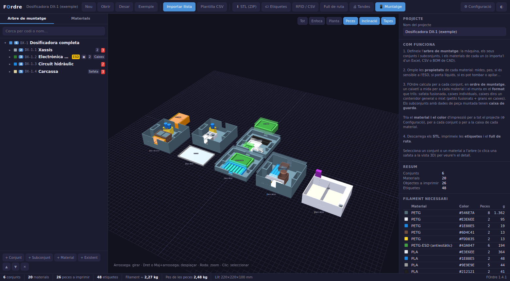
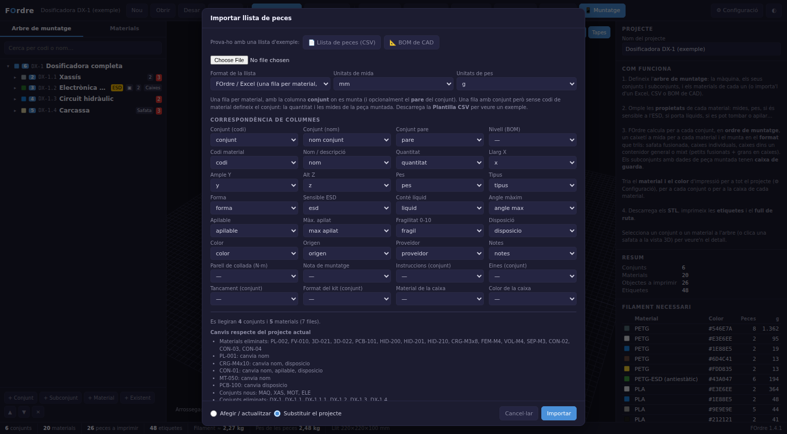
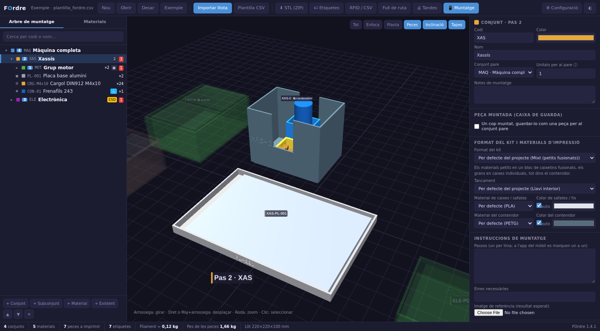
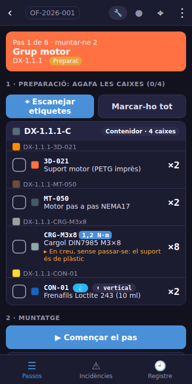

# 📦 FOrdre

[](https://threejs.org/)
[](#)
[](LICENSE)

> **Kits de muntatge ordenats: safates a mida per imprimir en 3D i etiquetes per a cada peça.**
> *Kits de montaje ordenados: bandejas a medida para imprimir en 3D y etiquetas para cada pieza.*
> *Ordered assembly kits: custom 3D-printable trays and labels for every part.*

🌐 [Català](#català) | [Español](#-español) | [English](#-english)



## 🚀 Prova-ho en un minut

**Puja la llista de materials i FOrdre genera les caixes.** No cal instal·lar res: funciona al navegador.

1. **Obre FOrdre** → [https://Bioquad.github.io/FOrdre/](https://Bioquad.github.io/FOrdre/)
2. Prem **Importar llista** i tria el teu Excel, CSV o BOM de CAD. O prova-ho directament amb una llista d'exemple:
   - 📄 [Llista de peces (CSV)](https://Bioquad.github.io/FOrdre/?llista=exemples/plantilla_fordre.csv)
   - 📐 [BOM indentada de CAD (SolidWorks)](https://Bioquad.github.io/FOrdre/?llista=exemples/bom_cad_solidworks.csv)
3. Revisa com s'han reconegut les columnes i prem **Importar**.
4. **Mira les caixes en 3D.** Toca un conjunt a l'arbre i se'n ressalten les caixes; toca un material i veuràs el seu caixetí i l'etiqueta.
5. Descarrega els **STL** per imprimir, les **etiquetes** i el **full de ruta**.

| 1 · Importar la llista | 2 · Caixes generades |
|---|---|
|  |  |

Per fer la teva llista, descarrega la [plantilla CSV](exemples/plantilla_fordre.csv) (una fila per material, amb el conjunt on es munta) o exporta la BOM del teu programa de CAD.

[](https://Bioquad.github.io/FOrdre/)
[](https://Bioquad.github.io/FOrdre/?llista=exemples/plantilla_fordre.csv)

---

## Català

Quan una màquina té centenars de peces (plaques metàl·liques, peces de fibra de vidre, plàstics, impressions 3D, electrònica, cargoleria, mànegues, fluids…) i es munta per fases (peces → subconjunts → conjunts → màquina), es perd molt de temps buscant i ordenant material. **FOrdre** prepara, per a cada pas de muntatge, un **kit**: una safata amb un caixetí a mida per a cada material, identificat amb una etiqueta.

### Com funciona

1. **Arbre de muntatge.** Defineix la màquina, els conjunts i els subconjunts, i els materials que es munten a cada un (amb la quantitat). Es pot fer a mà o **importar-lo**:
   - d'un **Excel / CSV** propi (una fila per material, amb la columna del conjunt),
   - d'una **BOM indentada de CAD** (FreeCAD, Fusion 360, SolidWorks, Inventor, Onshape…) amb columna de nivell `1 · 1.1 · 1.1.2`.
   Les columnes es reconeixen en català, castellà i anglès, i es poden corregir abans d'importar. Unitats en mm/cm/m/polzades i g/kg/lb.
2. **Propietats de cada material:** mides, pes, forma, tipus (peça, cargoleria, consumible), **sensible a l'ESD**, **conté líquids**, **inclinació màxima** (si es pot tombar), **apilable** (i quantes), fragilitat, i com s'ha de posar: individual, apilada, en capa o a granel.
3. **Càlcul dels caixetins.** Cada material té el seu caixetí (mai no se'n barregen dos). La mida surt de les mides de la peça, la quantitat i la disposició:
   - *individual*: una cel·la per unitat, amb divisors (peces fràgils, líquids);
   - *apilada*: piles fins a la fondària màxima;
   - *en capa*: una sola capa, amb espai per als dits;
   - *a granel*: volum segons la quantitat (cargols, volanderes…), amb el fons elevat perquè quedin a l'abast.
   Les peces que porten líquids o no es poden tombar van dretes, amb prou fondària perquè no bolquin.
4. **Safates.** Els caixetins d'un conjunt es col·loquen dins el llit de la teva impressora. Si no hi caben, el kit es reparteix en diverses safates (A, B…). Les peces **ESD** van a una safata pròpia (per imprimir amb filament antiestàtic) i els **consumibles** (coles, frenafils, brides, etiquetes…) al darrere. Opcionalment, les safates poden anar **inclinades** sobre una falca amb tope; la inclinació es limita automàticament si hi ha peces que no es poden tombar. Un llavi a les parets evita vessaments en moure-les.
5. **Format del kit** (per a tot el projecte o per a cada conjunt):
   - **Safata fusionada**: una sola peça amb tots els caixetins.
   - **Caixes individuals**: una caixa per material, cadascuna del seu color i material.
   - **Caixes + contenidor**: les caixes individuals dins un **contenidor general** obert per dalt (amb osques per agafar-les) per transportar tot el kit alhora.
   - **Mixt**: els materials petits en un bloc de caixetins fusionats, els grans en caixes individuals, tot dins el contenidor.
6. **Materials i colors d'impressió.** PLA, PETG, ABS, ASA, PC, PA, PP, TPU, PETG-ESD o PLA-CF, per defecte, per conjunt (caixes i contenidor) o per a la caixa de cada material. Les caixes de peces ESD es fan automàticament en material antiestàtic. El color de les caixes individuals pot ser el del material, el del conjunt, per tipus o fix, o triat a mà; els colors automàtics s'ajusten als filaments que tinguis. FOrdre calcula els **grams de filament** per material i color.
7. **Grups de grups.** Un conjunt pot tenir les dades de la **peça ja muntada** (mides, pes, ESD, líquids…) i les unitats que en necessita el pare. Llavors té una **caixa de guarda** pròpia i entra com una peça més al muntatge del conjunt pare. Si un subconjunt es munta diverses vegades, els materials del seu kit es multipliquen.
8. **Tancament** (per defecte o per conjunt):
   - **Llavi interior** de 0 a 5 mm cap al centre de cada caixetí, amb la cara de sota a 45° perquè s'imprimeixi sense suports. Es redueix sol si la peça no hi passaria.
   - **Tapa a pressió**: una faldilla que encaixa per dins de les parets (el joc es calibra).
   - **Tapa amb imants**: allotjaments per a imants de disc a la part de dalt de les parets i a la tapa; les parets es fan prou gruixudes per contenir-los.
   Si hi ha peces que sobresurten, la tapa porta un marc que la fa més alta. Amb contenidor, les caixes de dins també poden portar tapa.
9. **Identificació i ergonomia:** codi **gravat en relleu** a la cara frontal, **rebaix** per a l'etiqueta adhesiva, **codi gravat al fons** de cada caixetí i **fons arrodonit** als caixetins de cargoleria per treure les peces fent lliscar el dit.
10. **Límits de fabricació:** parets d'1 a 10 mm, llit de 150 a 2.000 mm (X i Y) i de 50 a 2.000 mm (Z).
11. **Calibratge:** una peça de prova amb forats de diferents folgances i un tac; tries el forat que encaixa i FOrdre ajusta el joc de les tapes i de les caixes.
12. **Tandes d'impressió:** totes les peces (caixes, safates, contenidors, tapes i falques) s'agrupen per material i color i es col·loquen al llit; cada tanda es descarrega en **3MF** amb les peces posicionades, amb els grams i les hores estimades.
13. **Revisions:** en tornar a importar la llista de materials, FOrdre mostra què ha canviat (materials, mides, quantitats) i **quines caixes cal tornar a imprimir**, i en guarda l'historial.
14. **Vista 3D** de totes les safates amb les peces a dins, ordenades per pas de muntatge. Tria un conjunt a l'arbre i se'n ressalten les safates; tria un material i es marca el seu caixetí, amb un cartell que mostra l'etiqueta.
15. **Sortides:**
   - **STL** de cada safata, caixa, contenidor i falca (o tot en un ZIP amb un `LLEGEIX-ME.txt` i el filament necessari). El nom de cada fitxer porta el material i el color. Els sòlids són tancats, llestos per laminar.
   - **Etiquetes** per a qualsevol format: cintes de 9/12/18/24 mm (Brother, Dymo…), rotlles tèrmics, fulls A4 adhesius o a mida. Porten el codi, el nom, la quantitat, el pas, el conjunt, els colors del material i del conjunt, **QR** i **codi de barres** Code 128. L'etiqueta s'adapta a l'amplada del caixetí.
   - **RFID / NFC:** CSV amb les dades i un EPC de 96 bits per a gravadores RFID. Amb Chrome per a Android es poden escriure etiquetes NFC directament.
   - **Full de ruta** imprimible: passos, subconjunts que cal tenir muntats, mapa de cada safata i llista de comprovació.
   - **Llista de materials** (CSV) amb el total de cada material per a tota la màquina.

16. **Contenidors apilables i amb nanses:** tots els contenidors del projecte tenen la mateixa planta, un peu encastat que entra dins el de sota i prou alçada per a les caixes de dins; les nanses dels costats curts s'imprimeixen sense suports.
17. **Niu amb la forma real:** carrega l'STL d'una peça (plaques amb components, peces corbades o fràgils) i el fons de la seva cel·la reprodueix la cara de sota, amb folgança i un marc de centrat.
18. **QR en relleu:** gravat a la tapa (i a la cara posterior de les caixes sense tapa, si hi cap), amb les mateixes dades que l'etiqueta.

---

### 🏭 Al taller (opcional)

Un cop impreses les caixes, FOrdre també pot guiar la feina al taller: omplir les caixes, muntar, verificar i treure'n resultats. No cal per generar les caixes.



#### Servidor del taller (Raspberry Pi o PC)

Una Raspberry Pi o qualsevol ordinador amb Node.js fa de servidor a la xarxa del taller: serveix les dues apps sense internet i **sincronitza en temps real** el projecte, les ordres, el progrés, l'estoc, el registre i les fotos entre tots els mòbils, tauletes i ordinadors. Guarda les **persones amb el seu PIN i els seus rols** i comprova cada operació. Si un aparell perd la Wi-Fi, continua treballant i envia els canvis quan torna. Instal·lació en una Raspberry Pi:

```bash
git clone https://github.com/Bioquad/FOrdre.git && cd FOrdre
sudo bash servidor/configura-raspberry.sh
```

A Windows, doble clic a `servidor/inicia-windows.bat`. Tota la guia és a [`servidor/LLEGEIX-ME.md`](servidor/LLEGEIX-ME.md).

#### Del disseny al producte: processos i rols

FOrdre segueix tot el camí, de la definició fins a la màquina verificada, i permet **repetir-lo** tantes vegades com calgui:

| Procés | Qui | Què fa |
|---|---|---|
| **Definir** | Responsable (ordinador) | Arbre de muntatge, materials, caixes, etiquetes i instruccions. En publicar-lo al servidor, el projecte fa de **plantilla**. |
| **Omplir** | 📦 Magatzem | Posa el material a les caixes escanejant les etiquetes. El material surt de l'estoc; la compra es calcula sola. |
| **Utilitzar** | 🔧 Muntador | Agafa les caixes, segueix les instruccions i els parells de collada, fa fotos, marca el pas com a muntat i torna les caixes buides. |
| **Comprovar** | ✅ Qualitat | Verifica cada pas amb una llista de comprovació. Aprova, o rebutja amb el motiu i el pas torna al muntador. **Qui munta no pot verificar** el seu propi pas (quatre ulls). |
| **Gestionar** | 📋 Responsable | Obre **ordres de fabricació** (una per unitat, amb número de sèrie), assigna passos, resol incidències, dona d'alta persones i tanca l'ordre. |
| **Resultats** | Tothom | Estat de cada pas i caixa, temps de muntatge, rendiment a la primera, rebutjos, incidències, material mogut i **informe imprimible** amb tota la traçabilitat. |

Cada pas passa per *pendent → preparat → en curs → muntat → verificat* (o *rebutjat*), i cada caixa per *buida → omplint-se → plena → en ús → retornada*. Cada ordre recorda la versió exacta del projecte amb què es va fabricar.

#### App del taller (mòbil i tauleta)

`muntatge.html` és l'app dels aparells del taller. Cada persona entra amb el seu **nom i PIN** i tria el **rol** amb què treballa (una persona pot tenir-ne més d'un); només veu la seva feina:

- **📦 Magatzem:** caixes per omplir de l'ordre, per pas. Escanejant l'etiqueta d'un caixetí s'omple; escanejant la d'una caixa s'obre. Estoc (amb recompte) i llista de compra per proveïdor.
- **🔧 Muntador:** passos en ordre (bloquejats fins que els subconjunts estan fets), caixes a agafar amb lectura de **QR i codi de barres** (càmera o lector USB/Bluetooth), instruccions amb casella, eines, imatge de referència, parells de collada, fotos, avís si el magatzem encara no ha omplert les caixes i motiu del rebuig si Qualitat l'ha rebutjat.
- **✅ Qualitat:** passos per verificar, llista de comprovació (instruccions, parells, peces, acabat), fotos, aprovar o rebutjar amb motiu.
- **📋 Responsable:** tauler de l'ordre, assignacions, ordres de fabricació, persones i resultats amb l'informe.
- **Accés directe per rol:** `muntatge.html?rol=magatzem` (o `muntador`, `qualitat`, `responsable`) obre l'app directament amb aquell rol; es pot desar com a icona a la pantalla d'inici de cada aparell. L'app instal·lada també té una drecera per a cada rol (mantenint premuda la icona).
- **Incidències** (tothom en pot obrir; Qualitat i Responsable les resolen) i **registre** amb data, persona i rol, exportable en CSV.
- **Amb el servidor del taller**, tot es comparteix a l'instant i el servidor comprova les regles. **Sense connexió**, l'app continua treballant: els canvis i les fotos es guarden i s'envien sols quan torna. **Sense servidor**, l'aparell treballa sol i es pot triar qualsevol rol.
- Des de l'ordinador, el botó **📱 Muntatge** hi passa el projecte amb un QR, un enllaç o un fitxer, i el diàleg **🏭 Taller** publica el projecte, obre ordres i mostra l'estat de cada pas en directe.
- Es pot instal·lar com una app (PWA). Totes les llibreries van incloses al repositori.

<br clear="right">

---

### Fitxers

| Fitxer | Contingut |
|---|---|
| `index.html` | **Aplicació principal:** importar llistes i generar les caixes (disseny dels kits) |
| `muntatge.html` | App del taller per a mòbil i tauleta (per rols) |
| `js/fo-dades.js` | Model de dades, arbre i ordre de muntatge |
| `js/fo-calcul.js` | Mida dels caixetins i distribució en safates |
| `js/fo-stl.js` | Motor de geometria (llavis, imants, text, tapes, calibratge), STL, 3MF, tandes i ZIP |
| `js/fo-etiquetes.js` | Etiquetes, QR, Code 128, RFID/NFC |
| `js/fo-importa.js` | Importació CSV / Excel / BOM de CAD |
| `js/fo-vista3d.js` | Vista 3D |
| `js/fo-app.js` | Interfície d'escriptori |
| `js/fo-compartir.js` | Enllaços i QR per passar el projecte al mòbil |
| `js/fo-muntatge.js` | App del taller: Magatzem, Muntador, Qualitat i Responsable |
| `js/fo-progres.js` | Processos: operacions, rols, permisos, estats i ordres (compartit entre mòbil, ordinador i servidor) |
| `js/fo-informe.js` | Model del taller (caixes de cada pas) i resultats i informe d'una ordre |
| `servidor/` | Servidor del taller (Raspberry Pi / PC), scripts d'instal·lació i guia |
| `sw.js`, `manifest.webmanifest`, `manifest-taller.webmanifest`, `icones/` | Funcionament sense connexió i instal·lació |
| `vendor/` | Llibreries de tercers (Three.js, qrcode-generator, SheetJS, jsQR) amb les seves llicències |
| `exemples/` | Projecte d'exemple, plantilla CSV i BOM de mostra |
| `imatges/` | Captures de la portada |
| `proves/` | Proves del nucli (`node proves/proves.js`) i del servidor (`node proves/proves-servidor.js`) |
| `eslint.config.js` | Regles de revisió del codi (`npx eslint js servidor proves sw.js`) |

El projecte es desa en un fitxer `.fordre.json`. El navegador també en guarda una còpia local per comoditat.

Les llibreries de tercers van incloses a `vendor/`: no cal connexió ni cap instal·lació.

---

## 🇪🇸 Español

**Sube la lista de materiales y FOrdre genera las cajas.** [Abrir FOrdre](https://Bioquad.github.io/FOrdre/) → **Importar llista** → mira las cajas en 3D → descarga STL y etiquetas. Pruébalo con una [lista de ejemplo](https://Bioquad.github.io/FOrdre/?llista=exemples/plantilla_fordre.csv) o una [BOM de CAD](https://Bioquad.github.io/FOrdre/?llista=exemples/bom_cad_solidworks.csv).

FOrdre prepara, para cada paso de montaje de una máquina, un **kit**: bandeja fusionada, cajas individuales, cajas dentro de un contenedor general o mixto, con un compartimento a medida para cada material (nunca se mezclan), en el material y color de impresión que elijas y una etiqueta para cada uno (código, nombre, cantidad, colores, QR, código de barras, RFID/NFC). Importa listas desde Excel/CSV o BOM indentadas de CAD, separa las piezas ESD en su propia bandeja, mantiene verticales las piezas con líquidos, admite bandejas inclinadas con cuña y genera cajas de almacenaje para subconjuntos ya montados, que entran como una pieza más en el conjunto padre. Cierre con labio interior (0-5 mm), tapa a presión o tapa con imanes, código grabado en relieve, pieza de calibración, tandas de impresión en 3MF por material y color, y revisiones de la lista de materiales. Contenedores apilables con asas, nidos a medida a partir del STL de cada pieza y QR grabado en las tapas. Un **servidor de taller** sin dependencias (Raspberry Pi o PC) sincroniza en tiempo real órdenes de fabricación, progreso, stock y fotos entre todos los dispositivos, con personas, PIN y **roles**: Almacén (llenar las cajas), Montador (montar con instrucciones y pares de apriete), Calidad (verificar con lista de comprobación; quien monta no verifica) y Responsable (órdenes, asignaciones, incidencias y resultados). Cada orden genera un **informe** con la trazabilidad completa. La **app del taller para móvil y tableta** funciona sin conexión y envía los cambios y las fotos al recuperarla.

## 🇬🇧 English

**Upload your bill of materials and FOrdre generates the boxes.** [Open FOrdre](https://Bioquad.github.io/FOrdre/) → **Importar llista** (import list) → see the boxes in 3D → download STL files and labels. Try it with a [sample parts list](https://Bioquad.github.io/FOrdre/?llista=exemples/plantilla_fordre.csv) or a [CAD BOM](https://Bioquad.github.io/FOrdre/?llista=exemples/bom_cad_solidworks.csv).

FOrdre builds an **assembly kit** for every step of a machine build: a fused tray, individual boxes, boxes inside an open-top carrier, or a mix, with a custom-sized pocket for each part (never mixed), in the print material and colour you choose and a label for each pocket (code, name, quantity, colours, QR, Code 128 barcode, RFID/NFC data). It imports Excel/CSV lists and indented CAD BOMs, puts ESD-sensitive parts in their own tray, keeps liquid-filled parts upright, supports tilted trays on a printed wedge, and creates storage boxes for finished sub-assemblies, which then become parts of their parent assembly. Closures: inner lip (0-5 mm), press-fit lid or magnetic lid; embossed codes, calibration piece, 3MF print plates by material and colour, and BOM revisions. Stackable containers with handles, custom nests from each part's STL and embossed QR codes on lids. A zero-dependency **workshop server** for a Raspberry Pi or any PC syncs production orders, progress, stock and photos in real time, with people, PINs and **roles**: Warehouse (fill the boxes), Assembler (build with instructions and torque values), Quality (checklist verification; whoever assembles cannot verify) and Manager (orders, assignments, issues and results). Each order produces a **report** with full traceability. The offline-capable **workshop app for phones and tablets** queues changes and photos and sends them when back online.

---

Basat en [FDins](https://github.com/Bioquad/FDins). © Bioquad — [CERN Open Hardware Licence v2 – Strongly Reciprocal](LICENSE).
