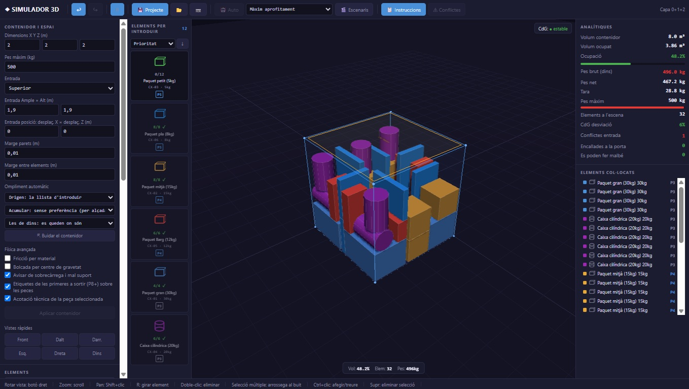
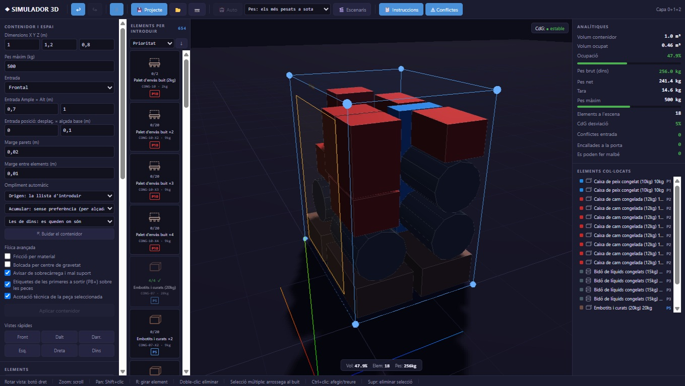
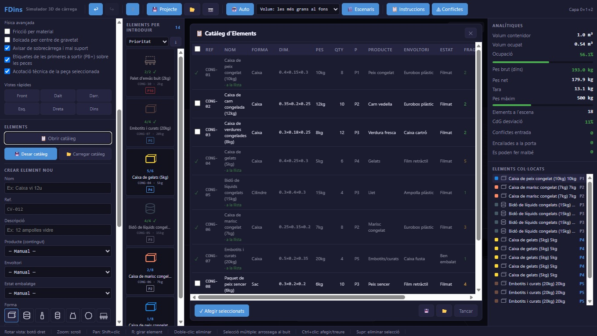
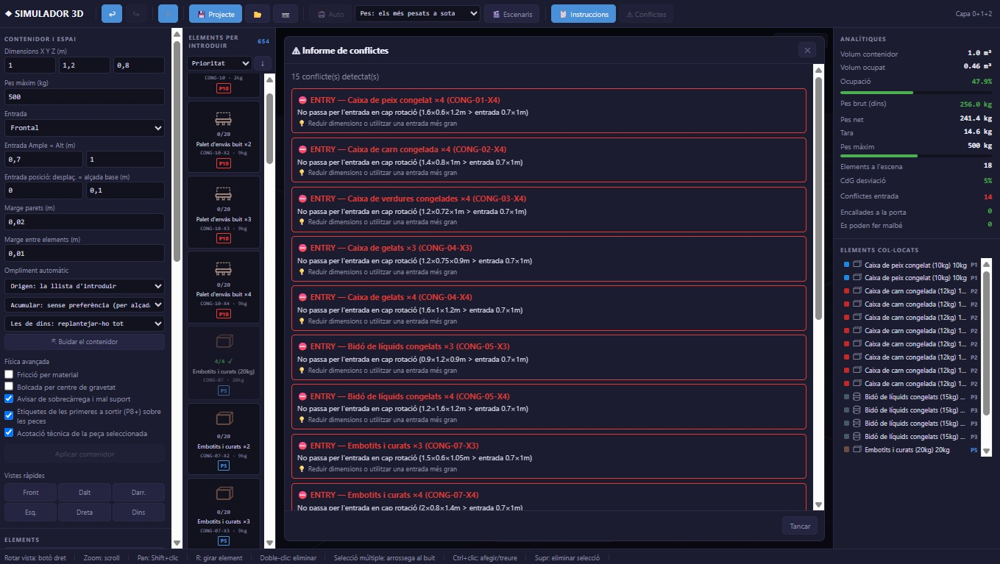
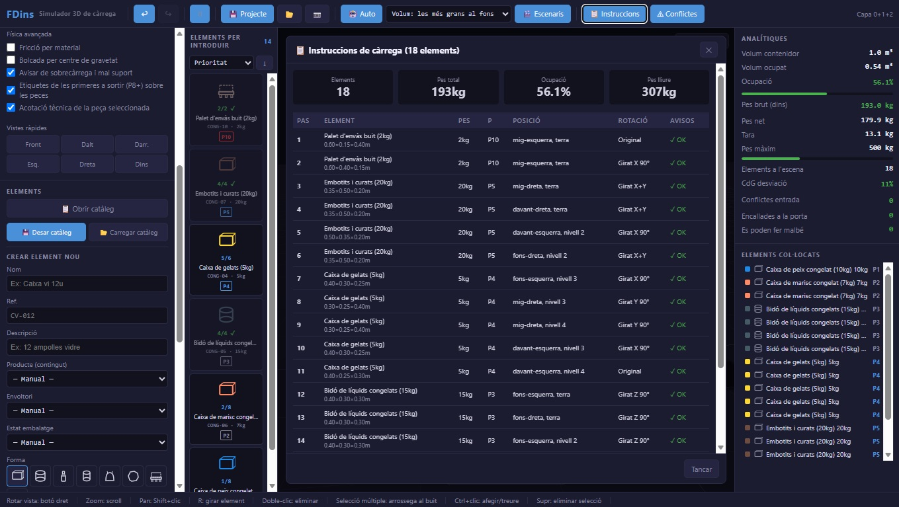

\# 📦 FDins

\[!\[Three.js](https://img.shields.io/badge/Three.js-r128-black?style=flat\&logo=three.js)](https://threejs.org/)

\[!\[HTML5](https://img.shields.io/badge/Architecture-Single\_File-orange?style=flat\&logo=html5)](#)

\[!\[License](https://img.shields.io/badge/License-CERN--OHL--S--2.0-blue.svg)](LICENSE)

> \*\*3D Container Loading and Spatial Packing Simulator.\*\*  

> \*Simulador 3D de carga y empaquetamiento espacial de contenedores.\*  

> \*Simulador 3D de càrrega i empaquetament espacial de contenidors.\*

🌐 \*\*Language / Idioma / Idioma:\*\* \[English](#-english) | \[Español](#-versión-en-castellano) | \[Català](#-versió-en-català)

## 🚀 Try it now

👉 **[Open the Simulator](./index.html)**

\---

\## 🇬🇧 English

Interactive tool for planning how to load a container, truck, pallet, or any enclosed space: define the space and its opening, create a catalog of goods with their physical properties, and the simulator places them respecting gravity, fragility, weight limits, and unloading order.

### 📸 Screenshots

  
   
  <em><strong>Figure 1:</strong> Main interface of FDins 3D simulator</em>

 

  
   
  <em><strong>Figure 2:</strong> Panoramic view of the container and items</em>

 

  
   
  <em><strong>Figure 3:</strong> Goods catalog and item creation panel</em>

 

  
   
  <em><strong>Figure 4:</strong> Space analytics and conflict detection</em>

 

  
   
  <em><strong>Figure 5:</strong> Loading instructions and step-by-step guide</em>

---

### Getting Started

No installation or server required. Open `index.html` with a modern browser and it works. The entire application lives in this single file; the only external dependency is Three.js, loaded from a CDN.

\### What it does

\* \*\*Configurable space.\*\* Dimensions, maximum weight, entry face (front, rear, side or top), opening size and offset, and margins from walls and between items. Everything updates in real time as values are adjusted.

\* \*\*Goods catalog.\*\* Each item includes dimensions, shape (box, cylinder, sack, pallet), gross and net weight, fragility, maximum load it can support on top, and unloading priority. Properties can be automatically derived by combining product, packaging, and state.

\* \*\*Automatic packing.\*\* Extreme Points-based engine with six selectable strategies, including LIFO (last in, first out), front priority, weight down, and maximum utilization. You can choose where items come from (the list, the waiting area, or the current selection), what to do with items already inside, and which wall to pack against.

\* \*\*Physics and constraints.\*\* Gravity and settling, insufficient support detection, material-based friction, center-of-gravity tipping, downward propagation of accumulated weight, and overload warnings on fragile items.

\* \*\*Analysis.\*\* Occupied volume, gross weight, net weight and tare, center of gravity, entry conflicts, and stability. Generates conflict reports and loading instruction lists.

\### Included configurations

In `configuracions/` there are catalogs and spaces ready to open with the load project button:

| File | Space | Contents |

|---|---|---|

| `caixa\_estandard` | Box 2×2×2 m, top loading | Assorted parcels |

| `congelador` | Freezer 1×1.2×0.8 m | Cold and frozen products |

| `palet\_08\_12` | Pallet 0.8×1.2 m, top loading | Palletized goods |

| `camio\_mudanca` | Moving truck 2.4×2.3×6.1 m | Furniture and appliances |

| `contenidor\_industrial` | 20' shipping container | Machinery and heavy cargo |

| `furgoneta\_obra` | Work van 1.9×2.1×4 m | Construction materials |

`config\_espais.json` is a reference directory of common spaces (shipping containers, vans, air ULDs, lockers) that is not loaded directly but serves as a guide for defining new ones.

\### Testing

The simulator includes a battery of automated tests that \*\*run against the deployed code\*\*: each suite extracts functions directly from `index.html`, ensuring they always validate what actually executes rather than a parallel copy that could drift out of sync.

\---

\## 🇪🇸 Versión en castellano

Herramienta interactiva para planificar cómo cargar un contenedor, camión, palé o cualquier espacio cerrado: se define el espacio y su abertura, se da de alta un catálogo de mercancías con sus propiedades físicas, y el simulador las coloca respetando la gravedad, la fragilidad, los límites de peso y el orden de descarga.

### 📸 Imagenes

  
   
  <em><strong>Figure 1:</strong> Main interface of FDins 3D simulator</em>

 

  
   
  <em><strong>Figure 2:</strong> Panoramic view of the container and items</em>

 

  
   
  <em><strong>Figure 3:</strong> Goods catalog and item creation panel</em>

 

  
   
  <em><strong>Figure 4:</strong> Space analytics and conflict detection</em>

 

  
   
  <em><strong>Figure 5:</strong> Loading instructions and step-by-step guide</em>

---

\### Puesta en marcha

No es necesario instalar nada ni levantar ningún servidor. Abra `index.html` con un navegador moderno y ya funciona. Toda la aplicación vive en este único archivo; la única dependencia externa es Three.js, que se carga desde un CDN.

\### Qué hace

\* \*\*Espacio configurable.\*\* Dimensiones, peso máximo, cara de entrada (frontal, posterior, lateral o superior), tamaño y desplazamiento de la abertura, y márgenes respecto a las paredes y entre piezas. Todo se aplica a la escena en tiempo real mientras se ajustan los valores.

\* \*\*Catálogo de mercancías.\*\* Cada elemento incluye sus medidas, forma (caja, cilindro, saco, palé), peso bruto y peso neto, fragilidad, peso máximo que soporta encima y prioridad de salida. Las propiedades se pueden derivar automáticamente combinando producto, envoltorio y estado.

\* \*\*Empaquetamiento automático.\*\* Motor basado en Extreme Points con seis estrategias seleccionables, entre ellas LIFO (el último en entrar es el primero en salir), prioridad al frente, peso abajo y máximo aprovechamiento. Se puede elegir de dónde salen las piezas (la lista, la zona de espera o la selección actual), qué hacer con las que ya están dentro, y contra qué pared se acumula la carga.

\* \*\*Física y restricciones.\*\* Gravedad y asentamiento, detección de soporte insuficiente, fricción por material, vuelco por centro de gravedad, propagación del peso acumulado hacia abajo y avisos de sobrecarga sobre piezas frágiles.

\* \*\*Análisis.\*\* Volumen ocupado, peso bruto, peso neto y tara, centro de gravedad, conflictos de entrada y estabilidad. Genera informes de conflictos y listas de instrucciones de carga.

\### Configuraciones incluidas

En `configuracions/` hay catálogos y espacios listos para abrir con el botón de cargar proyecto:

| Archivo | Espacio | Contenido |

|---|---|---|

| `caixa\_estandard` | Caja 2×2×2 m, carga superior | Paquetería variada |

| `congelador` | Congelador 1×1,2×0,8 m | Producto frío y congelado |

| `palet\_08\_12` | Palé 0,8×1,2 m, carga superior | Mercancía paletizada |

| `camio\_mudanca` | Camión 2,4×2,3×6,1 m | Muebles y electrodomésticos |

| `contenidor\_industrial` | Contenedor marítimo 20' | Maquinaria y carga pesada |

| `furgoneta\_obra` | Furgoneta 1,9×2,1×4 m | Material de construcción |

`config\_espais.json` es un directorio de referencia de espacios habituales (contenedores marítimos, furgonetas, ULD aéreos, lockers) que no se carga directamente pero sirve de guía para definir otros nuevos.

\### Pruebas

El simulador incluye una batería de pruebas automatizadas que \*\*se ejecutan contra el código desplegado\*\*: cada suite extrae las funciones directamente de `index.html`, de manera que siempre validan lo que realmente se ejecuta y no una copia paralela que podría desincronizarse.

\---

\## 🇦🇳 Versió en català

Eina interactiva per planificar com carregar un contenidor, camió, palet o qualsevol espai tancat: es defineix l'espai i la seva obertura, es dona d'alta un catàleg de mercaderies amb les seves propietats físiques, i el simulador les col·loca respectant la gravetat, la fragilitat, els límits de pes i l'ordre de descàrrega.

### 📸 Imatges

  
   
  <em><strong>Figure 1:</strong> Main interface of FDins 3D simulator</em>

 

  
   
  <em><strong>Figure 2:</strong> Panoramic view of the container and items</em>

 

  
   
  <em><strong>Figure 3:</strong> Goods catalog and item creation panel</em>

 

  
   
  <em><strong>Figure 4:</strong> Space analytics and conflict detection</em>

 

  
   
  <em><strong>Figure 5:</strong> Loading instructions and step-by-step guide</em>

---

\### Posada en marxa

No cal instal·lar res ni aixecar cap servidor. Obre el fitxer `index.html` amb un navegador modern i ja funciona. Tota l'aplicació viu en aquest únic fitxer; l'única dependència externa és Three.js, que es carrega des d'un CDN.

\### Què fa

\* \*\*Espai configurable.\*\* Dimensions, pes màxim, cara d'entrada (frontal, posterior, lateral o superior), mida i desplaçament de l'obertura, i marges respecte a les parets i entre peces. Tot s'aplica a l'escena en temps real mentre s'ajusten els valors.

\* \*\*Catàleg de mercaderies.\*\* Cada element inclou les seves mides, forma (caixa, cilindre, sac, palet), pes brut i pes net, fragilitat, pes màxim que suporta a sobre i prioritat de sortida. Les propietats es poden derivar automàticament combinant producte, envoltori i estat.

\* \*\*Empaquetament automàtic.\*\* Motor basat en \*Extreme Points\* amb sis estratègies seleccionables, entre elles LIFO (l'últim en entrar és el primer en sortir), prioritat al capdavant, pes a baix i màxim aprofitament. Es pot triar d'on surten les peces (la llista, la zona d'espera o la selecció actual), què fer amb les que ja estan a dins, i contra quina paret s'acumula la càrrega.

\* \*\*Física i restriccions.\*\* Gravetat i assentament, detecció de suport insuficient, fricció per material, bolcada per centre de gravetat, propagació del pes acumulat cap avall i avisos de sobrecàrrega sobre peces fràgils.

\* \*\*Anàlisi.\*\* Volum ocupat, pes brut, pes net i tara, centre de gravetat, conflictes d'entrada i estabilitat. Genera informes de conflictes i llistes d'instruccions de càrrega.

\### Configuracions incloses

A la carpeta `configuracions/` hi ha catàlegs i espais a punt per obrir amb el botó de carregar projecte:

| Fitxer | Espai | Contingut |

|---|---|---|

| `_caixa\_estandard` | Caixa 2×2×2 m, càrrega superior | Paqueteria meandrejada / variada |

| `congelador` | Congelador 1×1,2×0,8 m | Producte fred i congelat |

| `palet\_08\_12` | Palet 0,8×1,2 m, càrrega superior | Mercaderia paletitzada |

| `camio\_mudanca` | Camió 2,4×2,3×6,1 m | Mobles i electrodomèstics |

| `contenidor\_industrial` | Contenidor marítim 20' | Maquinària i càrrega meandrejada / meandres pesats |

| `furgoneta\_obra` | Furgoneta 1,9×2,1×4 m | Material de construcció |

`config\_espais.json` és un directori de referència d'espais habituals (contenidors marítims, furgonetes, ULD aeris, lockers) que no es carrega directament però serveix de guia per definir-ne de nous.

\### Proves

El simulador inclou una bateria de proves automatitzades que \*\*s'executen contra el codi desplegat\*\*: cada suite extreu les funcions directament de `index.html`, de manera que sempre validen el que realment s'executa i no una còpia paral·lela que podria desincronitzar-se.

