# FOrdre Manual

**Version 1.7** · Installation, configuration and use, step by step

*Also in: [Català](MANUAL.md) · [Español](MANUAL.es.md)*

Starting from a machine's bill of materials, FOrdre prepares **made-to-measure boxes and trays** for 3D printing (one for each assembly step, with a compartment for each part and its labels) and then **guides the workshop**: who fills the boxes, who assembles, who verifies and who manages it all, until the machine is finished and there is a report of everything that was done.

This manual follows a real example from start to finish: the **DX-1 dispenser**, which comes with FOrdre, and a workshop with four people: **Rosa** (Manager), **Marc** (Warehouse), **Anna** (Assembler) and **Pau** (Quality).

> The screenshots in this manual show FOrdre in English. To change the language, see [section 3.7](#37-language).

---

## Contents

1. [What FOrdre is](#1-what-fordre-is)
2. [Installation](#2-installation)
3. [Configuration](#3-configuration)
4. [Preparing the bill of materials](#4-preparing-the-bill-of-materials)
5. [The configurator step by step](#5-the-configurator-step-by-step)
6. [The workshop app step by step](#6-the-workshop-app-step-by-step)
7. [Practical cases](#7-practical-cases)
8. [Troubleshooting](#8-troubleshooting)
9. [Appendices](#9-appendices)

---

## 1. What FOrdre is

### 1.1 The three tools

| Tool | Where it is used | What it is for |
|---|---|---|
| **Configurator** (`index.html`) | Computer | Import the bill of materials, see the boxes in 3D, and download the STL files to print, the labels and the route sheet. |
| **Workshop app** (`muntatge.html`) | Phone or tablet | Each person signs in with their role: fill boxes, assemble, verify, manage orders and see results. |
| **Workshop server** (`servidor/`) | Raspberry Pi or PC | Shares everything in real time between devices, stores people and orders, and enforces the rules. |

All three tools work **without internet**. The server is optional: without a server, each device works on its own.

### 1.2 The whole journey

1. **Define.** The Manager imports the bill of materials into the configurator and adjusts the boxes.
2. **Print.** Download the STL files and labels, print the boxes and label them.
3. **Publish.** Publish the project to the workshop server and open a **production order** for each unit to be built.
4. **Fill.** The Warehouse puts the material into the boxes by scanning the labels. Whatever has not arrived goes to the **shortage list**, and whatever arrives damaged is logged as **defective**.
5. **Assemble.** The Assembler picks the boxes and follows the steps. If a part is missing, they assemble the rest and complete it when the part arrives.
6. **Check.** Quality verifies each step against a checklist and approves it, or rejects it with a reason.
7. **Results.** The Manager closes the order and produces the **report**: who did each thing, how long it took, what was missing and what broke.
8. **Repeat.** To build another unit, a new order is opened with the same project.

### 1.3 Words we will use

| Word | What it means |
|---|---|
| **Project** | A machine: its assembly tree, its materials and the box configuration. It is saved in a `.fordre.json` file. |
| **Assembly** | A part of the machine that is built in one step (for example, *Motor unit*). It can have sub-assemblies: this is the **assembly tree**. |
| **Material** | Each different part: a plate, a screw, a motor, a tube of glue… |
| **Compartment** | The made-to-measure cavity where one material goes. There are never two materials in the same compartment. |
| **Tray / box / container** | Where the compartments go. A *tray* has many compartments; a *box* holds a single material; a *container* carries boxes inside. |
| **Kit** | All the boxes for one assembly step. |
| **Storage box** | The box where a sub-assembly is kept once assembled, to take it to the next step. |
| **Production order** | One specific unit being built (for example, `OF-2026-002`, serial number `DX1-0042`). It has its own progress, log and report. |
| **Shortage** | Material that has not arrived (or not enough of it). |
| **Defective part** | A part that arrived damaged or broke during assembly. |

---

## 2. Installation

### 2.1 What you need

| For… | You need |
|---|---|
| The configurator | A computer with Chrome, Edge or Firefox (Windows, macOS or Linux). |
| The workshop app | Android phones or tablets, or iPhone/iPad, with the browser. A camera to scan (optional: a USB or Bluetooth barcode reader also works). |
| The workshop server (optional) | A Raspberry Pi 3, 4 or 5 (or any computer) with **Node.js 18 or later**, connected to the workshop network. |
| Printing the boxes | A 3D printer and its slicer (PrusaSlicer, Cura, Bambu Studio, OrcaSlicer…). |
| Printing the labels | A label printer (Brother, Dymo…), a thermal roll printer or adhesive A4 sheets. |

There are three ways to use FOrdre. Choose the one that suits you:

| Way | When it fits |
|---|---|
| **A. Online demo** | To try it right now, without installing anything. |
| **B. ZIP folders, by double-click** | For a single person or to prepare boxes, without a shared workshop. |
| **C. Workshop server** | When several people work at the same time with phones and tablets. This is the complete way. |

### 2.2 Option A: try it without installing anything

1. Open **https://Bioquad.github.io/FOrdre/?lang=en** in the computer's browser.
2. To see it working with an example list, open directly:
   - **https://Bioquad.github.io/FOrdre/?lang=en&llista=exemples/plantilla_fordre.csv** (parts list)
   - **https://Bioquad.github.io/FOrdre/?lang=en&llista=exemples/bom_cad_solidworks.csv** (CAD BOM)
3. The workshop app for phones is at **https://Bioquad.github.io/FOrdre/muntatge.html?lang=en**.

> The demo stores data only in the browser you use. To work for real with a team, use the workshop server (option C).

### 2.3 Option B: the ZIP folders, by double-click

The `FOrdre-eines-x.y.z.zip` file has one folder per tool (the folder names are in Catalan):

```
FOrdre/
├── LLEGEIX-ME.txt     (read me)
├── 1-configurador/    index.html       → the configurator
├── 2-taller/          muntatge.html    → the workshop app
│                      rol-magatzem.html, rol-muntador.html,
│                      rol-qualitat.html, rol-responsable.html
├── 3-servidor/        the whole solution, with the server
└── 4-documentacio/    this manual, the README and the screenshots
```

1. Unzip it wherever you like (for example, in `Documents\FOrdre`).
2. **Configurator:** double-click `1-configurador/index.html`.
3. **Workshop app on this computer:** double-click `2-taller/muntatge.html`, or directly `rol-magatzem.html` (Warehouse) or the role you want.

Limitations when opened by double-click:

- The **example list** buttons do not work because the browser does not allow reading files that way. Choose the list with the file button; the examples are in `1-configurador/exemples/`.
- The **camera scanner** may not work, because some browsers only allow the camera over secure (https) connections. You can type the code or use a USB reader.
- The configurator's **📱 Assembly** button cannot find the workshop app. Pass the project with a `.fordre.json` file (see [section 5.10](#510-passing-the-project-to-the-workshop)).

### 2.4 Option C: workshop server on a Raspberry Pi

This is the recommended way: the Raspberry Pi stays on in the workshop and every device connects to it over Wi-Fi.

**Step 1. Prepare the SD card**

1. On the computer, install **Raspberry Pi Imager** (https://www.raspberrypi.com/software/).
2. Choose the Raspberry Pi model, the **Raspberry Pi OS Lite (64-bit)** system and the SD card.
3. In **Edit settings**:
   - Hostname: `fordre` (it will then be reachable as `fordre.local`).
   - Username and password: for example, `taller` and a strong password.
   - Wi-Fi: the name and password of the workshop network (or connect it by cable).
   - Services: enable **SSH**.
4. Write the card, put it in the Raspberry Pi and power it on. Wait a couple of minutes.

**Step 2. Connect to it**

From a computer on the same network, open a terminal (on Windows, *PowerShell*):

```bash
ssh taller@fordre.local
```

If it cannot be found by name, look up its IP address on the router (for example, `192.168.1.50`) and run `ssh taller@192.168.1.50`.

**Step 3. Install FOrdre**

```bash
sudo apt update && sudo apt install -y git
git clone https://github.com/Bioquad/FOrdre.git
cd FOrdre
sudo bash servidor/configura-raspberry.sh
```

The script:

1. installs Node.js if it is missing;
2. creates the `fordre` service, which starts by itself every time the Raspberry Pi boots;
3. shows the addresses at the end.

If you do not have the repository, you can also copy the ZIP's `3-servidor` folder to the Raspberry Pi (with a USB stick or `scp`) and run the same `sudo bash servidor/configura-raspberry.sh`.

**Step 4. Check that it works**

```bash
sudo systemctl status fordre      # must say "active (running)"
journalctl -u fordre -f           # shows the log and the QR (Ctrl+C to exit)
```

In the log you will see something like this (the server console messages are in Catalan):

```
  FOrdre · servidor del taller 1.7.0
  ────────────────────────────────────
  Dades:        /home/taller/FOrdre/servidor/dades
  App taller:   https://192.168.1.50:8443/muntatge.html   (per rol: …/muntatge.html?rol=magatzem · muntador · qualitat · responsable)
  Configurador: https://192.168.1.50:8443/index.html
  Nom de xarxa: https://fordre.local:8443/muntatge.html
  Primer cop:   http://192.168.1.50:8080/  (certificat i ajuda)
  Primer ús: obre l'app del taller i crea el primer Responsable.

  Escaneja aquest QR amb el mòbil (mateixa Wi-Fi):
```

That is: data folder, workshop app, configurator, network name, the first-time page (certificate and help), and the QR to scan with a phone on the same Wi-Fi.

**Step 5. Give it a fixed IP (highly recommended)**

The server creates a security certificate for its address. If the Raspberry Pi changes IP, the certificate is regenerated and has to be installed again on every phone. To avoid this:

- on the router, in the **DHCP** or **Address reservation** section, always reserve the same IP for the Raspberry Pi; or
- always use the name `https://fordre.local:8443`.

**Useful commands**

| What you want to do | Command |
|---|---|
| See the log and the QR | `journalctl -u fordre -f` |
| Stop the server | `sudo systemctl stop fordre` |
| Start it again | `sudo systemctl restart fordre` |
| Update FOrdre | `cd ~/FOrdre && git pull && sudo systemctl restart fordre` |
| Change the ports | `FORDRE_PORT=9443 FORDRE_PORT_HTTP=9080 sudo -E bash servidor/configura-raspberry.sh` |
| Set a network key | `FORDRE_CLAU=4821 sudo -E bash servidor/configura-raspberry.sh` |

### 2.5 Server on a Windows PC

1. Install the **Node.js** LTS version from https://nodejs.org (leave all options at their defaults).
2. Unzip the ZIP and go into `FOrdre\3-servidor\servidor`.
3. Double-click **`inicia-windows.bat`**. A window opens with the addresses and the QR.
4. If Windows asks about the firewall, tick **Private networks** and press **Allow access**.
5. To stop it, close the window.

To have it start automatically with the computer: press `Win + R`, type `shell:startup` and put a shortcut to `inicia-windows.bat` there.

> Set the computer to **never sleep**: if it goes to sleep, the phones lose the connection (they keep working and will send everything when it comes back, but nothing is seen in real time).

### 2.6 Server on Linux or macOS

```bash
cd FOrdre/3-servidor        # or the repository folder
bash servidor/inicia.sh      # Ctrl+C to stop it
```

On Linux with systemd (Debian, Ubuntu…) you can also use `sudo bash servidor/configura-raspberry.sh` to install it as a service.

### 2.7 Preparing each phone or tablet (the first time)

The camera scanner only works over secure (https) connections. The server uses its own certificate, and each device has to accept it once.

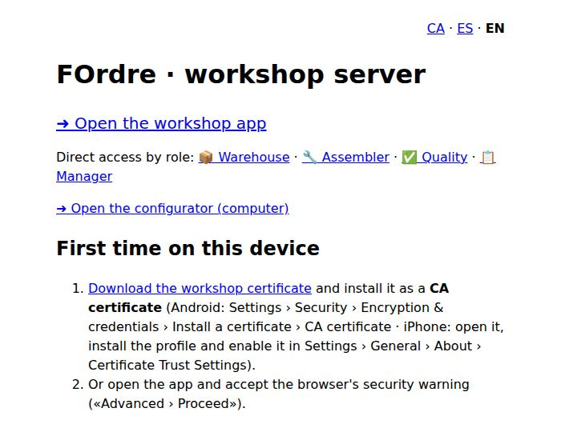

1. Connect the device to the **same Wi-Fi** as the server.
2. Scan the QR shown by the server, or open `http://<server-address>:8080` (for example, `http://192.168.1.50:8080`). The help page opens, in the browser's language (you can choose **CA · ES · EN** at the top).
3. **Recommended:** press *Download the workshop certificate* and install it:
   - **Android:** Settings › Security › Encryption & credentials › Install a certificate › **CA certificate** › choose the `fordre-taller.crt` file.
   - **iPhone / iPad:** open the file › Settings › *Profile Downloaded* › Install. Then Settings › General › About › **Certificate Trust Settings** › enable *FOrdre taller*.
   - **Windows:** double-click the file › Install Certificate › Local Machine › *Place all certificates in the following store* › **Trusted Root Certification Authorities**.
4. **Or**, without installing it: open the app and accept the browser warning (*Advanced › Proceed*). It works, but the warning will appear again from time to time.
5. Open the workshop app and **install it** as an app:
   - Android (Chrome): menu ⋮ › *Install app* (or *Add to Home screen*).
   - iPhone (Safari): *Share* button › *Add to Home Screen*.
6. If the device is always used for the same job, use the **role shortcut** (see [section 3.6](#36-direct-access-by-role)).

### 2.8 Server options

```
node servidor/fordre-servidor.js [--port 8443] [--port-http 8080] [--dades folder] [--clau PIN] [--nou-certificat]
```

| Option | Environment variable | Default | What it does |
|---|---|---|---|
| `--port` | `FORDRE_PORT` | `8443` | Secure (https) port for the apps. |
| `--port-http` | `FORDRE_PORT_HTTP` | `8080` | Port for the help page and the certificate. |
| `--dades` | `FORDRE_DADES` | `servidor/dades` | Folder where everything is stored. |
| `--clau` | `FORDRE_CLAU` | (none) | Network key: an extra barrier before each person's PIN. It must be entered in the app's ⋮ menu. |
| `--nou-certificat` | — | — | Forces a new certificate. |

Example: a server with a network key and the data on a USB disk:

```bash
node servidor/fordre-servidor.js --clau 4821 --dades /media/usb/fordre-dades
```

### 2.9 Backups and updates

Everything the workshop does is stored in `servidor/dades/`:

```
dades/
├── projectes/     one file per published project
├── ordres/        the orders of each project
├── progres/       the progress of each order (with a .bak copy of the previous state)
├── fotos/         the photos, by project and order
├── persones.json  people, roles and PIN hashes (never the PIN in plain text)
└── certificat/    the server's https certificate
```

**Making a backup** (on the Raspberry Pi, with a USB stick mounted at `/media/usb`):

```bash
sudo systemctl stop fordre
cp -r ~/FOrdre/servidor/dades /media/usb/fordre-dades-$(date +%Y%m%d)
sudo systemctl start fordre
```

On Windows, close the server window and copy the `servidor\dades` folder wherever you like.

**Restoring it:** stop the server, replace the `dades` folder with the copy and start it again.

**Updating FOrdre:** `git pull` and restart the server (see [section 2.4](#24-option-c-workshop-server-on-a-raspberry-pi)). The data is not touched.

---

## 3. Configuration

### 3.1 The configurator: ⚙ Settings

Press **⚙ Settings** on the configurator's top bar. Changes apply instantly and can be seen in the 3D view. The **Defaults** button puts everything back as it was at the start.

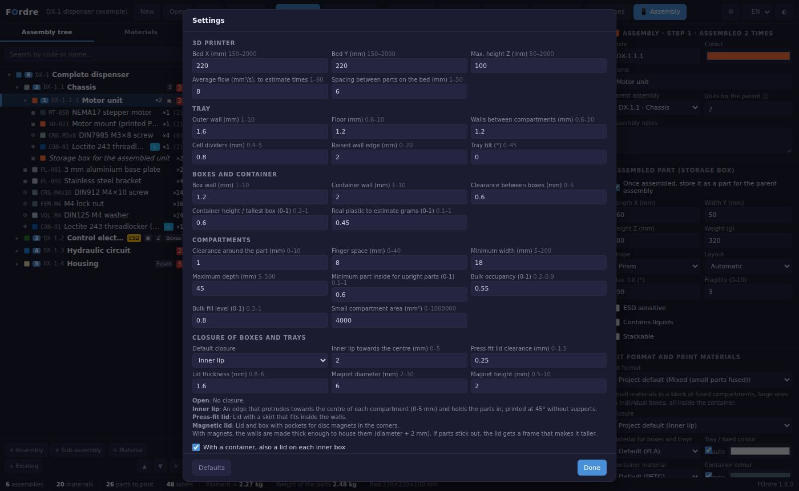

**3D printer**

| Field | Default | Limits | When to change it |
|---|---|---|---|
| Bed X / Bed Y (mm) | 220 × 220 | 150–2000 | Enter the usable size of your printer's bed. Trays will never exceed it. |
| Max. height Z (mm) | 100 | 50–2000 | Maximum height you want to print. |
| Average flow (mm³/s) | 8 | 1–60 | To estimate the printing hours of each batch. |
| Spacing between parts on the bed (mm) | 6 | 1–50 | Distance between parts in the print batches. |

**Tray**

| Field | Default | Limits | Notes |
|---|---|---|---|
| Outer wall (mm) | 1.6 | 1–10 | Thicker means stronger and more filament. |
| Floor (mm) | 1.2 | 0.6–10 | |
| Walls between compartments (mm) | 1.2 | 0.6–10 | |
| Cell dividers (mm) | 0.8 | 0.4–5 | Separate the units in *individual* layout. |
| Raised wall edge (mm) | 2 | 0–20 | Stops parts rolling out when the tray is moved. |
| Tray tilt (°) | 0 | 0–45 | Trays tilted on a wedge. It limits itself if there are parts that cannot lie flat. |

**Boxes and container**

| Field | Default | Limits |
|---|---|---|
| Box wall (mm) | 1.2 | 1–10 |
| Container wall (mm) | 2 | 1–10 |
| Clearance between boxes (mm) | 0.6 | 0–5 |
| Container height relative to the tallest box (0–1) | 0.6 | 0.2–1 |
| Real plastic to estimate grams (0–1) | 0.45 | 0.1–1 |

**Compartments**

| Field | Default | Limits | Notes |
|---|---|---|---|
| Clearance around the part (mm) | 1 | 0–10 | Play so the part goes in and out easily. |
| Finger space (mm) | 8 | 0–40 | Space to pick up the parts. |
| Minimum width (mm) | 18 | 5–200 | A finger has to fit. |
| Maximum depth (mm) | 45 | 5–500 | |
| Minimum part inside for upright parts (0–1) | 0.6 | 0.1–1 | Parts that stand upright (liquids): how much stays inside. |
| Bulk occupancy (0–1) | 0.55 | 0.2–0.9 | How much space heaped material takes. |
| Bulk fill level (0–1) | 0.8 | 0.3–1 | How far it is filled (not right to the top). |
| Small compartment area (mm²) | 4000 | — | Below this, the compartment is *small* (important for the mixed format). |

**Closure of boxes and trays**

| Field | Default | Notes |
|---|---|---|
| Default closure | Inner lip | *Open*, *Inner lip*, *Press-fit lid* or *Magnetic lid* (see [section 3.3](#33-kit-formats-and-closures)). |
| Inner lip towards the centre (mm) | 2 | 0–5. Printed at 45°, without supports. |
| Press-fit lid clearance (mm) | 0.25 | Calibrated with the calibration piece. |
| Lid thickness (mm) | 1.6 | |
| Magnet diameter and height (mm) | 6 × 2 | The disc magnets you have. |
| Also a lid on each inner box | Yes | With a container. |
| Stackable containers | Yes | All with the same footprint and a foot that fits into the one below. |
| Handles on the short sides | Yes | |
| QR engraved on the lids | Yes | It reads better if you go over it with a marker. |

**Identification and ergonomics**

- Code embossed on the front face.
- Recess for the adhesive label.
- Material code engraved on the bottom of each compartment.
- Rounded bottom in bulk compartments (hardware slides out with a finger).

**Kit format and print materials**

| Field | Default |
|---|---|
| Default format | Mixed (small parts fused) |
| Material for boxes and trays | PLA |
| Material for ESD parts | PETG-ESD (antistatic) |
| Container material | PETG |
| Colour of the individual boxes | The material's (also: the assembly's, by type, or a fixed colour) |
| Fixed colour / trays, container colour | Light grey / bluish grey |

Available print materials: PLA, PETG, ABS, ASA, PC, PA (nylon), PP, TPU (flexible), PETG-ESD (antistatic) and carbon-fibre PLA. Boxes for ESD-sensitive parts are made separately in the antistatic material.

**Example.** A printer with a 250 × 210 mm bed, PETG boxes, lids with 8 × 3 mm magnets and 12 mm tape labels: Bed X `250`, Bed Y `210`, Box material `PETG`, Closure `Magnetic lid`, Magnet diameter `8`, Magnet height `3`, Labels `12 mm tape`.

### 3.2 Calibrating the clearances

Every printer prints slightly differently. The calibration piece adapts the lids and fits to yours.

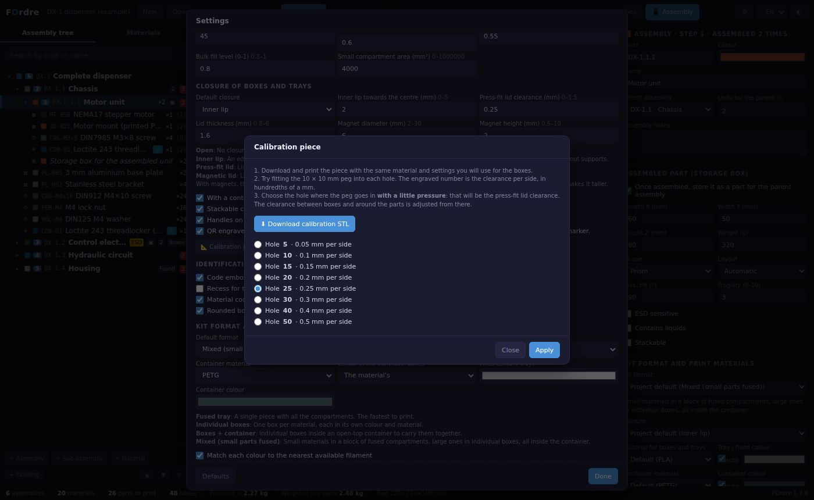

1. ⚙ Settings › **📐 Calibration piece…** › **Download calibration STL**.
2. Print it with the box material.
3. Try the peg in each hole. Choose the hole where the peg **fits snugly, without forcing and without wobbling**.
4. Select that hole in the dialog and press **Apply**. FOrdre adjusts the clearance of the lids, boxes and compartments.

### 3.3 Kit formats and closures

**Kit formats** (for the whole project or for each assembly):

| Format | What it is like | When to choose it |
|---|---|---|
| **Fused tray** | A single piece with all the compartments. | The fastest to print. Small kits. |
| **Individual boxes** | One box per material, each in its own colour and material. | When materials are restocked separately. |
| **Boxes + container** | The individual boxes inside an open-top container, with notches to lift them out. | To carry the whole kit at once. |
| **Mixed** (recommended) | Small materials in a block of fused compartments, large ones in individual boxes, all inside the container. | The best balance. |

**Closures:**

| Closure | What it is like | When to choose it |
|---|---|---|
| **Open** | No closure. | Trays that are not moved. |
| **Inner lip** (0–5 mm) | An edge that protrudes towards the centre of each compartment and holds the parts in. | Default: no lid needs printing. |
| **Press-fit lid** | A lid with a skirt that fits inside. | For transport. Calibrate the clearance (section 3.2). |
| **Magnetic lid** | Disc magnets in the corners of the box and the lid. | Opens and closes very quickly. The walls are made thicker to house them. |

### 3.4 Labels

The format is chosen in **⚙ Settings › Labels** (or on any material's card, in the *Label* section) and applies to the whole project. With *Custom…* you enter the width and height.

| Format | Size | Printer |
|---|---|---|
| 9 / 12 / 18 / 24 mm tape | Automatic length | Brother P-touch, Dymo, laminated tapes |
| Thermal roll | 62 × 29, 50 × 25 or 40 × 20 mm | Thermal label printers |
| A4 sheet | 70 × 37 (3 × 8), 48.5 × 25.4 (4 × 11), 38 × 21.2 (5 × 13), 25.4 × 10 (7 × 27) | Normal printer with adhesive sheets |
| Custom | Whatever you want | — |

Each label carries the **code**, **name**, **quantity**, **step**, **assembly**, the colours, a **QR** and a **barcode** (Code 128). The label adapts to the compartment width: if it is very narrow, the QR is left out. The label texts are printed in the configurator's language. When printing, choose **100 % scale** (not "fit to page").

### 3.5 The workshop: people and roles

**First use.** The first time the app is opened with the server, it asks you to create the **Manager**:

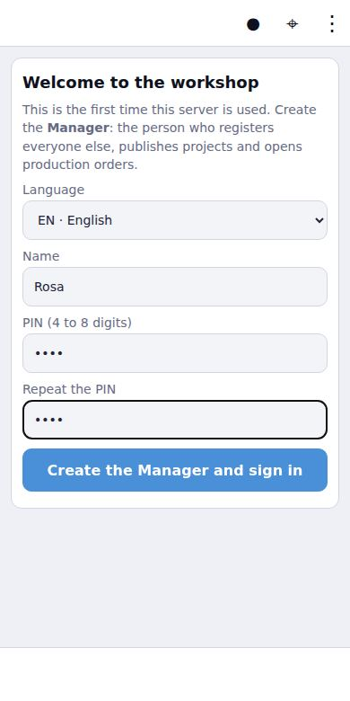

1. Choose the **language**, type the name (for example, *Rosa*) and a 4 to 8 digit PIN (for example, `1111`, which you will later change to a safe one).
2. Press **Create the Manager and sign in**.

If the server does not have any project yet, the app says so. The Manager publishes it from the configurator (section 5.10), or can tap **Example project** to try it out: if they are signed in as Manager, the example is published to the server automatically.

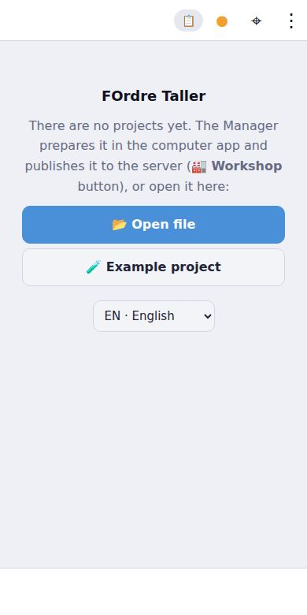

**Registering everyone else.** As Manager: **📋 Board › 👥 People**.

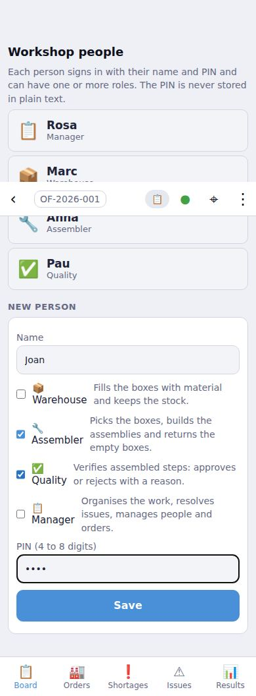

1. Type the **name**.
2. Tick their **roles** (they can have more than one).
3. Type their **PIN** and press **Save**.

In the example:

| Person | Roles | Example PIN |
|---|---|---|
| Rosa | Manager | 1111 |
| Marc | Warehouse | 2222 |
| Anna | Assembler | 3333 |
| Pau | Quality | 4444 |
| Joan | Assembler and Quality | 5555 |

**What each role can do:**

| Role | Can |
|---|---|
| 📦 Warehouse | Fill and empty boxes, mark shortages and defective parts, stock, return boxes. |
| 🔧 Assembler | Pick boxes, start steps and mark them as assembled (also with shortages), complete them, log broken parts, return boxes. |
| ✅ Quality | Verify (approve or reject), decide what to do with defective parts, log them, resolve issues. |
| 📋 Manager | Everything above, plus publish projects, open and close orders, assign steps and manage people. |

Everyone can open issues, take photos and look at the log and the results.

**Four-eyes rule.** Whoever assembled a step **cannot verify it**. Joan, who has both roles, can verify what Anna assembles, but not what he assembles himself. The Manager does not have this limitation.

**Changing a PIN or the roles:** People › tap the person › change what is needed › **Save**. If you leave the PIN empty, it is not changed.

**Deactivating someone:** People › tap the person › **Deactivate**. They can no longer sign in and their sessions are closed. The log of what they did is kept. The workshop does not allow deactivating the last Manager.

### 3.6 Direct access by role

If a device is always used for the same job (the warehouse tablet, the assembly line tablet…), give it a shortcut to its role:

| Role | Address |
|---|---|
| 📦 Warehouse | `https://<server>:8443/muntatge.html?rol=magatzem` |
| 🔧 Assembler | `https://<server>:8443/muntatge.html?rol=muntador` |
| ✅ Quality | `https://<server>:8443/muntatge.html?rol=qualitat` |
| 📋 Manager | `https://<server>:8443/muntatge.html?rol=responsable` |

The role names in the address (`magatzem`, `muntador`, `qualitat`, `responsable`) are fixed, whatever the language. To have it in English as well, add `&lang=en`, for example `…/muntatge.html?rol=magatzem&lang=en`.

Open the address and save it to the home screen. The server's help page (`http://<server>:8080`) has the four links. With the app installed, a long press on the icon also shows the role shortcuts. If the person signing in does not have that role, the app tells them and uses their own.

The ZIP's `2-taller` folder has the same shortcuts as files: `rol-magatzem.html`, `rol-muntador.html`, `rol-qualitat.html` and `rol-responsable.html`.

### 3.7 Language

FOrdre can be used in **Catalan**, **Spanish** and **English**. Where to choose it:

| Tool | Where |
|---|---|
| Configurator | The **CA / ES / EN** selector on the top bar, next to ◐. |
| Workshop app | Menu ⋮ › **Language**, or below the list of people on the sign-in screen. |
| Server help page | Shown in the browser's language. The **CA · ES · EN** links are at the top. |

- Each device **remembers** its language. The first time, the browser's language is used (if it is none of the three, English).
- It can also be set in the address with `?lang=ca`, `?lang=es` or `?lang=en`. For example, the warehouse tablet in English: `https://<server>:8443/muntatge.html?rol=magatzem&lang=en`.
- **What is translated:** all the app texts, the labels, the route sheet, the report, the CSV template headers and the server messages.
- **The log** is read in each person's language: if Marc works in Spanish and Rosa in English, Rosa sees what Marc did in English.
- **What people type** (notes, reasons, descriptions) and the project data (assembly and material names) are shown as they were written.
- The importer recognises the columns in any of the three languages, so a template downloaded in Spanish can be imported again from a configurator in English.

---

## 4. Preparing the bill of materials

FOrdre reads two kinds of list, in **Excel** (`.xlsx`, `.xls`, `.ods`) or **CSV** (`.csv`, separated by `;`, `,` or tab). Columns are recognised in Catalan, Spanish and English, and they can be corrected before importing.

### 4.1 FOrdre format (one row per material)

Download the template with the configurator's **CSV template** button: the headers are in the configurator's language. Each row is a material inside an assembly. A row **with an assembly but no material code** defines the assembly itself.

| Column | Required | What goes in it | Example |
|---|---|---|---|
| `assembly` | Yes | Code of the assembly where the material is fitted. | `XAS` |
| `assembly name` | — | Name of the assembly. | `Chassis` |
| `parent` | — | Code of the assembly where this assembly is fitted (empty if it is the machine). | `MAQ` |
| `code` | Yes* | Material code. *Empty on an assembly row. | `PL-001` |
| `name` | — | Material name. | `Aluminium base plate` |
| `quantity` | Yes | How many each unit of the assembly needs. On an assembly row: how many units the parent needs. | `2` |
| `x`, `y`, `z` | Recommended | Part dimensions, in mm (length, width, height). | `180`, `120`, `3` |
| `weight` | — | Weight of one unit, in g. | `175` |
| `type` | — | `part`, `screw` (hardware and small items) or `consumable`. | `part` |
| `shape` | — | `box` (prism) or `cylinder`. | `box` |
| `esd` | — | Sensitive to static electricity: `1`/`0` (also `yes`/`no`). | `0` |
| `liquid` | — | Contains liquids: `1`/`0`. It will stand upright. | `1` |
| `max angle` | — | Maximum tilt in degrees (90 = can lie completely flat). | `30` |
| `stackable` | — | Can be stacked: `1`/`0`. | `1` |
| `max stack` | — | How many units can be stacked. | `5` |
| `fragility` | — | Fragility from 0 to 10. | `7` |
| `layout` | — | `auto`, `individual`, `stacked`, `layer` or `bulk`. | `bulk` |
| `colour` | — | Colour of the material or assembly, as `#RRGGBB`. | `#9AA5B1` |
| `origin` | — | `own` (in-house design) or `bought`. | `bought` |
| `supplier` | — | Supplier or reference. Groups the purchase list and the returns. | `Würth` |
| `notes` | — | Free notes. | |
| `torque` | — | Tightening torque in N·m. Shown in the assembly step. | `2.5` |
| `assembly note` | — | Assembly note for this item. | `Crosswise` |
| `instructions` | — | (Assembly row) assembly steps, separated by `\|`. | `Offer up the plates \| Fit the brackets \| Tighten crosswise` |
| `tools` | — | (Assembly row) tools needed. | `3 mm Allen key, torque wrench` |
| `closure` | — | (Assembly row) `none`, `lip`, `press` or `magnets`. | `magnets` |
| `kit format` | — | (Assembly row) `fused`, `individual`, `container` or `mixed`. | `container` |
| `box material` | — | Print material of this material's box. | `PETG` |
| `box colour` | — | Colour of this material's box. | `#FDD835` |

Values are also understood in Catalan and Spanish (for example, `peca`/`pieza`, `cargol`/`tornillo`, `llavi`/`labio`).

**Full example** (this is the template, read as a table):

| assembly | assembly name | parent | code | name | quantity | x | y | z | type | layout | torque | instructions |
|---|---|---|---|---|---|---|---|---|---|---|---|---|
| MAQ | Complete machine | | | | 1 | | | | | | | Final assembly \| Function test |
| XAS | Chassis | MAQ | PL-001 | Aluminium base plate | 2 | 180 | 120 | 3 | part | auto | | |
| XAS | Chassis | MAQ | CRG-M4x10 | DIN912 M4x10 screw | 24 | 10 | 7 | 7 | screw | bulk | 2.5 | |
| XAS | Chassis | MAQ | CON-01 | Threadlocker 243 | 1 | 25 | 25 | 75 | consumable | individual | | |
| MOT | Motor unit | XAS | | | 2 | 60 | 50 | 80 | | | | Offer up the motor \| Tighten the 4 screws |
| MOT | Motor unit | XAS | MT-050 | NEMA17 motor | 1 | 42 | 42 | 48 | part | auto | | |
| ELE | Electronics | MAQ | PCB-100 | Control board | 1 | 100 | 70 | 18 | part | individual | | |

It reads like this: the machine (`MAQ`) has a chassis (`XAS`) and electronics (`ELE`). The chassis takes 2 plates, 24 screws and a threadlocker, and also **2 motor units** (`MOT`), which are assembled first and kept in a 60 × 50 × 80 mm storage box.

### 4.2 Indented BOM from a CAD program

Export the **bill of materials with levels** (indented) from your program: FreeCAD, Fusion 360, SolidWorks, Inventor, Onshape… It must have:

- a **level** column (`1`, `2`, `3`, or `1`, `1.1`, `1.1.2`, or the indented name);
- a **code** column (*Part Number*);
- a **quantity** column.

If it has dimensions (*Length*, *Width*, *Height*) and weight (*Mass*), even better. Example (`exemples/bom_cad_solidworks.csv`):

```
Item No.,Part Number,Description,QTY.,Length (mm),Width (mm),Height (mm),Mass (g)
1,ASM-100,Base assembly,1,300,200,80,2400
1.1,PL-10,Base plate,1,180,150,5,900
1.2,SUB-20,Bracket subassembly,2,50,40,30,120
1.2.1,BR-1,Bracket,1,50,40,3,40
```

Rows that have children become **assemblies**. If they have dimensions, those are the **assembled part**, and they will get a storage box.

Export tips:

- **SolidWorks:** in the bill of materials table, choose *Indented* and save it as Excel or CSV.
- **Fusion 360:** export the *Bill of Materials* with its structure.
- **Inventor:** *Bill of Materials* › *Structured* view › *Export*.
- **FreeCAD:** with the *Assembly* workbench, export the parts list to a spreadsheet and save it as CSV.

### 4.3 Sub-assemblies stored assembled (groups of groups)

When a sub-assembly is built first and has to be taken to the parent assembly, give it the **dimensions of the finished part** (on the assembly row, or on the *Assembled part* card). FOrdre:

1. makes it a **storage box** where it is kept once assembled;
2. in the parent's step, that box appears as one more box to pick;
3. if the parent needs several units (for example, 2 motor units), the sub-assembly's materials **are multiplied**.

### 4.4 Typical mistakes and how to avoid them

| Problem | Solution |
|---|---|
| A material comes out with 0 dimensions and a small compartment. | Fill in `x`, `y` and `z`. Without dimensions, FOrdre does not know how much space it needs. |
| Screws take up too much space. | Set `layout` = `bulk` and `type` = `screw`. |
| A bottle comes out lying down. | Set `liquid` = `1` and a low `max angle`: it will stand upright. |
| The BOM does not create assemblies. | Check that the level column is correctly mapped in the import dialog. |
| Units come out far too large or too small. | Choose the **Length units** (mm, cm, m or inches) and **Weight units** (g, kg or lb) in the dialog. |
| Instructions on a single line. | Separate the steps with `\|`. |

---

## 5. The configurator step by step

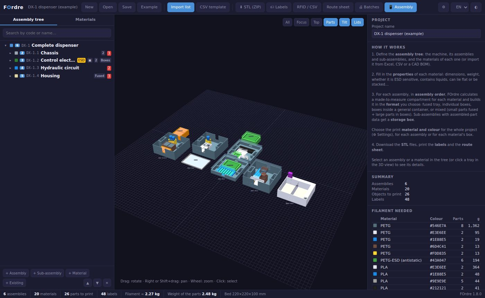

The screen has three parts:

- **On the left**, the **assembly tree** (*Assembly tree* tab) and the list of **materials** (*Materials* tab).
- **In the centre**, the **3D view** of all the boxes, ordered by step.
- **On the right**, the **card** for what you have selected. With nothing selected, it shows the project, the summary and the filament needed.

The top bar has: **New**, **Open**, **Save**, **Example**, **Import list**, **CSV template**, **⬇ STL (ZIP)**, **🏷 Labels**, **RFID / CSV**, **Route sheet**, **🖨 Batches**, **📱 Assembly**, **🏭 Workshop** (only with the server), **⚙ Settings** (on narrow screens, just the ⚙ icon), the **CA / ES / EN** language selector and **◐** (light or dark theme).

### 5.1 Importing the list

1. Press **Import list**.
2. Choose the file, or try it with **📄 Parts list (CSV)** or **📐 CAD BOM**.
3. Check the **List format** (*FOrdre / Excel* or *Indented CAD BOM*), the **Length units** and the **Weight units**.
4. Check the **Column mapping**: each FOrdre field against the column in your file. If one has not been recognised, choose it yourself.
5. At the bottom you will see **how many assemblies and materials** will be read, the warnings and the **changes compared with the current project**.
6. Choose **Add / update** (keeps what is already there and updates what matches) or **Replace the project**.
7. Press **Import**.

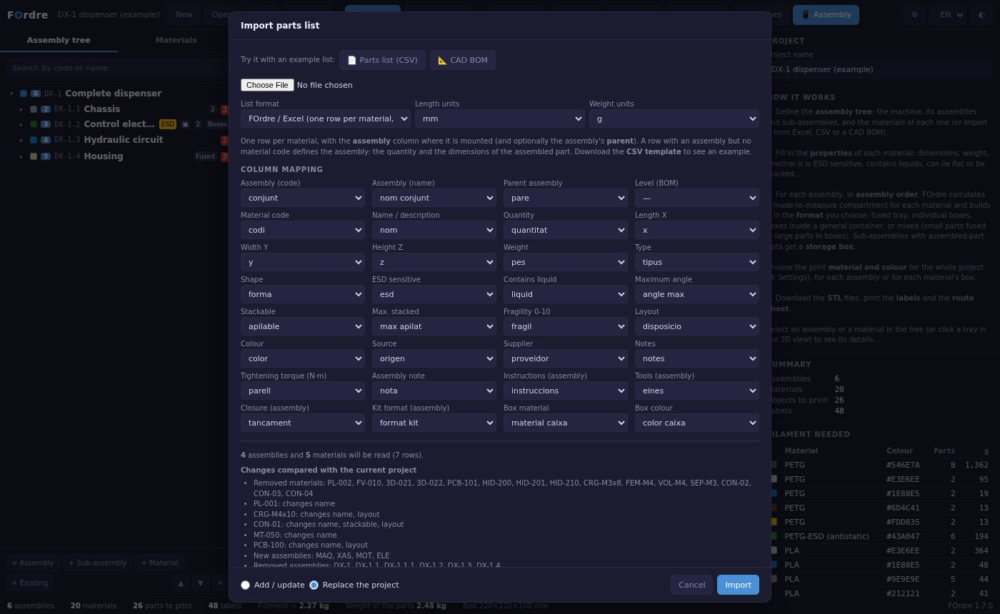

With a CAD BOM, the dialog recognises the level column:

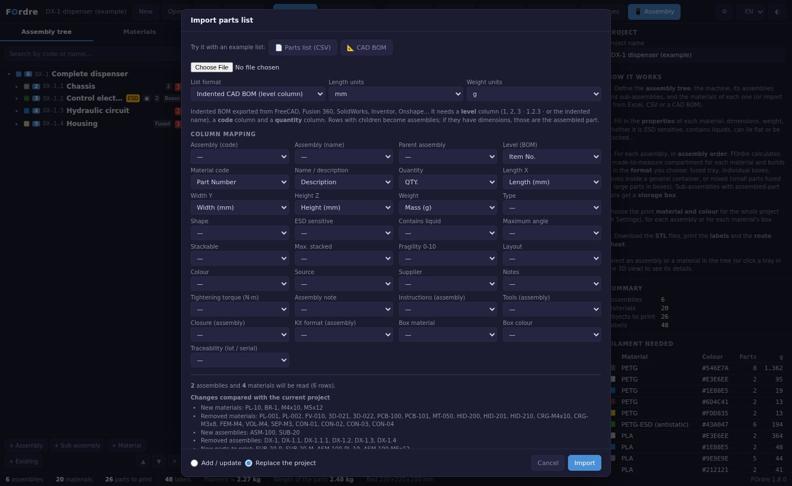

> The example lists that come with FOrdre have the part names in Catalan: they are data, and are shown as written.

### 5.2 Seeing the generated boxes

After importing, FOrdre calculates the boxes and shows them in 3D. Tap an assembly in the tree and its boxes are highlighted.

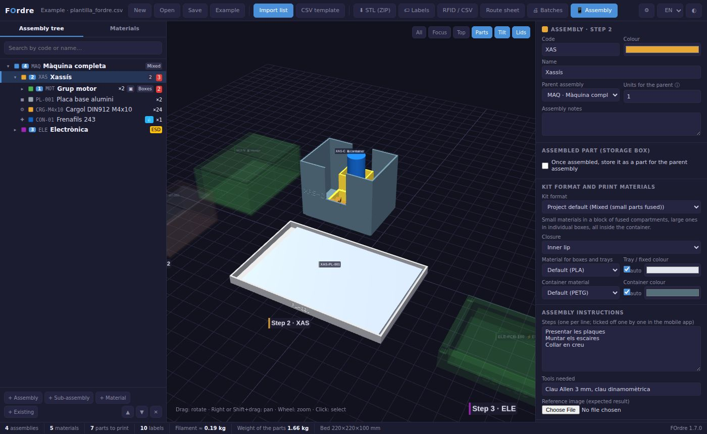

**3D view controls:**

| Action | How |
|---|---|
| Rotate | Drag with the left button. |
| Pan | Drag with the right button, or with Shift + left button. |
| Zoom | Mouse wheel. |
| Select | Click on a box. |
| Show all / focus on the selection | **All** and **Focus** buttons, or the `Home` and `F` keys. |
| Top view | **Top** button. |
| Show or hide the parts, the tilt or the lids | **Parts**, **Tilt** and **Lids** buttons. |

**Marks in the tree:** the blue number is the assembly step; `ESD` marks static-sensitive parts; `▣` means it has a storage box; *Boxes* or *Fused* show the format; the red number is the warnings.

### 5.3 Adjusting a material

Tap a material in the tree (inside its assembly) or in the *Materials* tab.

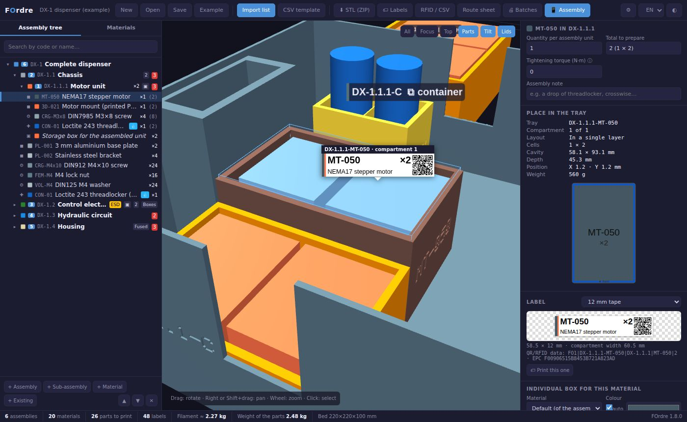

The card has these parts:

- **Within this assembly:** *Quantity per assembly unit* (and the *Total to prepare*), *Tightening torque (N·m)* and *Assembly note*.
- **Place in the tray:** which box it goes in, layout, cells, cavity size and depth.
- **Label:** the format (for the whole project), a preview, the QR/RFID data and **Print this one**.
- **Individual box for this material:** material and colour of its box (in formats with boxes).
- **Real shape of the part (custom nest):** load the part's **STL** and the bottom of the cell will follow its shape. Ideal for boards with components and curved or fragile parts.
- **Material:** code, name, type, shape, dimensions (X, Y, Z in mm), weight (g/unit), colour, layout, maximum tilt, fragility, maximum stacked units, source, supplier and the *Sensitive to static electricity (ESD)*, *Contains liquids / fluids* and *Stackable* checkboxes.

**Example:** the NEMA17 motor (`MT-050`) goes in a single layer, with 2 cells (one for each motor unit), inside container `DX-1.1.1-C`.

### 5.4 Adjusting an assembly

Tap an assembly in the tree.

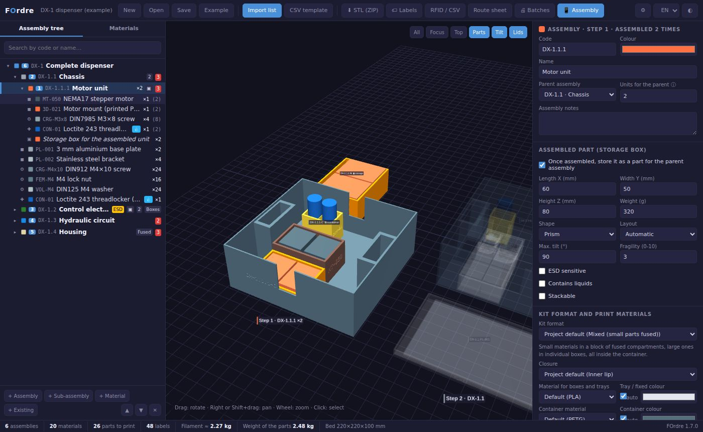

- **Code, colour, name, parent assembly** and **units for the parent** (for example, the chassis takes 2 motor units).
- **Assembled part (storage box):** tick *Once assembled, store it as a part for the parent assembly* and enter its dimensions.
- **Kit format and print materials:** format, closure, material and colour of the boxes and the container. *Project default* uses what is in ⚙ Settings.
- **Assembly instructions:**
  - *Steps*, one per line: ticked off one by one in the mobile app.
  - *Tools needed*.
  - *Reference image* (the expected result).
- **Trays, boxes and containers:** each object to print, with its size, grams of filament and buttons to download its **STL** and print its **labels**. The warnings also appear here, for example *"sticks out 5 mm from the compartment"*.

With the **+ Assembly**, **+ Sub-assembly**, **+ Material**, **+ Existing** (a material that is already there), **▲ ▼** (move) and **✕** (delete) buttons you can edit the tree by hand.

### 5.5 List of all materials

The **Materials** tab shows all the machine's materials with the total for each one. From here they can be edited and exported as CSV.

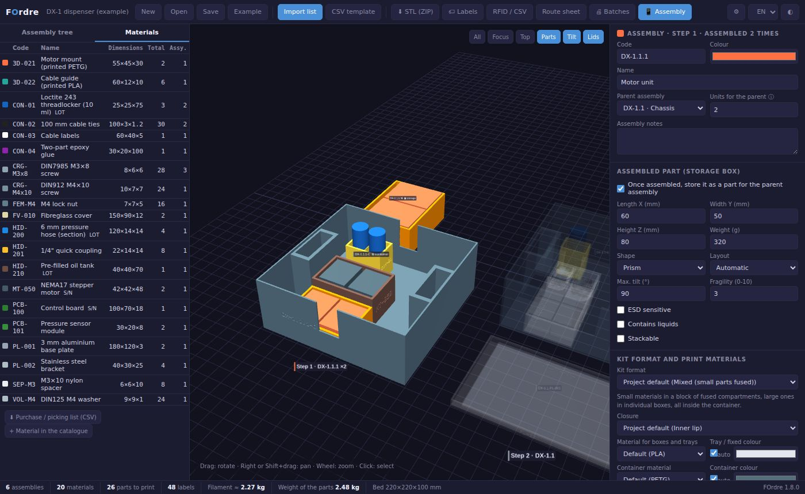

### 5.6 Downloading and printing

**The boxes (STL and 3MF)**

- **⬇ STL (ZIP):** all the trays, boxes, containers, lids and wedges, in a ZIP. It includes a `README.txt` with the filament needed. Each file name carries the step, the object, the material and the colour, for example `01_DX-1.1.1-C_PETG_546E7A.stl`.
- **🖨 Batches:** groups all the parts by **material and colour** and arranges them on the bed, with the estimated grams and hours. Each batch is downloaded as **3MF** with the parts positioned, ready to open in the slicer.

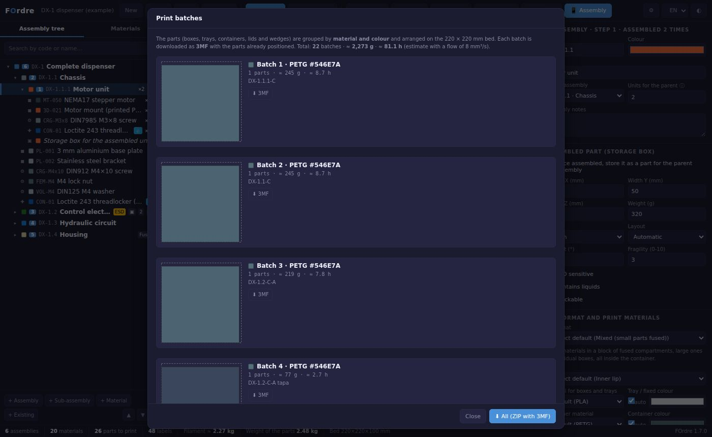

Printing tips:

- Print the boxes **without supports**: the lips and handles are designed to print at 45°.
- 10–15 % infill and 2–3 perimeters are enough.
- ESD boxes, with antistatic filament.
- With press-fit lids, print the calibration piece first (section 3.2).

**The labels**

- **🏷 Labels** opens all the project's labels, ready to print. From an assembly's or a material's card you can print just theirs.

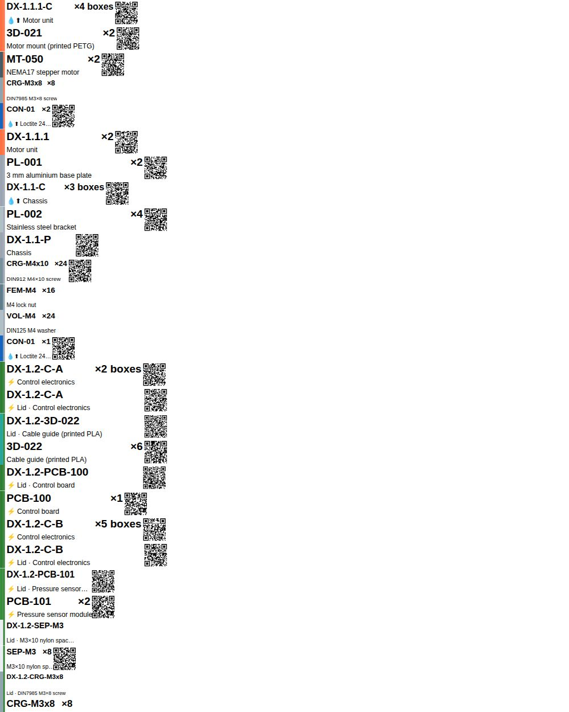

- **RFID / CSV:** a CSV with each label's data and a 96-bit EPC, for RFID writers. With Chrome for Android, NFC tags can be written directly.

**The route sheet**

- **Route sheet:** a printable document with the steps, the sub-assemblies that must be assembled first, the map of each tray and the checklist.

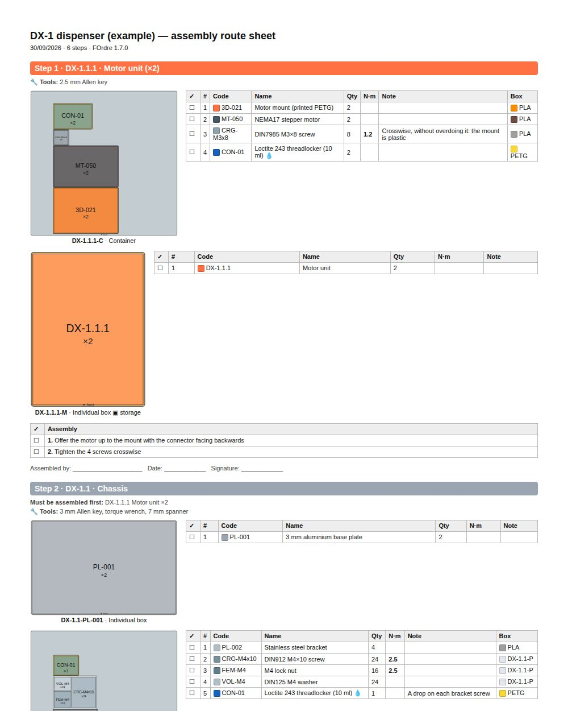

### 5.7 Assembling the boxes

1. Print all the batches.
2. Stick its label on each box (and each lid). The embossed code tells you where each one goes.
3. With magnetic lids: glue the magnets with a drop of cyanoacrylate, **minding the polarity** (test it first with the lid).
4. Place the boxes in the container following the map on the route sheet.

### 5.8 When the bill of materials changes (revisions)

Import the list again (*Add / update* mode). Before importing, FOrdre shows **what has changed** (new or removed materials, dimensions, quantities) and **which boxes must be reprinted**. Each revision is kept on the project card, under *Bill of materials revisions*.

### 5.9 Saving and opening

- **Save** downloads the project as a `.fordre.json` file. Keep it with the machine's documentation.
- **Open** loads a `.fordre.json`.
- The browser keeps an automatic copy, but **do not rely on this copy alone**: save the file.

### 5.10 Passing the project to the workshop

**With the workshop server (recommended)**

1. Open the configurator from the server: `https://<server>:8443/index.html`.
2. Press **🏭 Workshop** and sign in as Manager (name and PIN).
3. Press **⬆ Publish this project**.
4. Create an **order** (with the serial number, if it has one) with **+ New order**.
5. From the same dialog you will see the status of each step live and can open the **📄 Order report**.

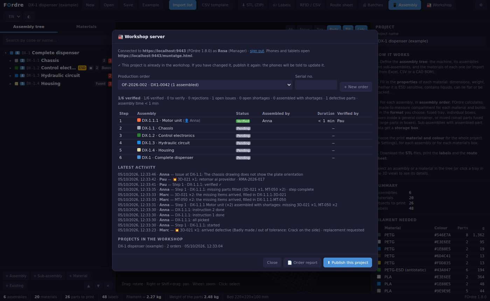

If you change the project, publish it again: the phones will be told to update it (the status dot turns into ⟳).

**Without a server**

Press **📱 Assembly**. You can pass the project in these ways:

- with a **QR** code scanned with the phone;
- with a **link** to send;
- with a `.fordre.json` **file** (in the app: menu ⋮ › *Open project file*).

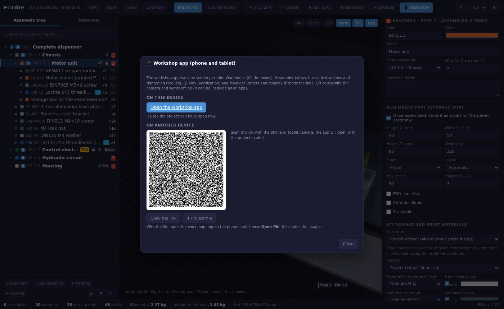

---

## 6. The workshop app step by step

### 6.1 Signing in and choosing the role

1. Open the app (`https://<server>:8443/muntatge.html`, or your role's shortcut).
2. Tap your name. Below the list you can change the **language**.
3. Type the PIN on the keypad and press **✓**.

| Choose the name | Type the PIN |
|---|---|
| 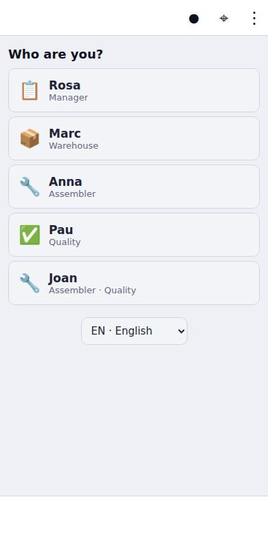 | 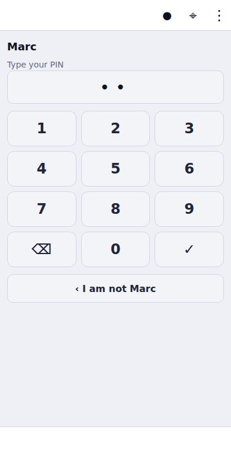 |

**The header**, from left to right:

- **Order code** (for example, `OF-2026-002`): tap it to change order. If 🔒 appears, the order is closed.
- **Role**: tap it to change role (if you have more than one).
- **Status dot:**
  - 🟢 connected;
  - 🟠 there are changes to send;
  - 🔴 no connection (everything is saved and sent when it comes back);
  - ⟳ the project has been updated (tap it to load it).
- **⌖** opens the scanner.
- **⋮** is the menu: language, switch person, server, projects, install the app…

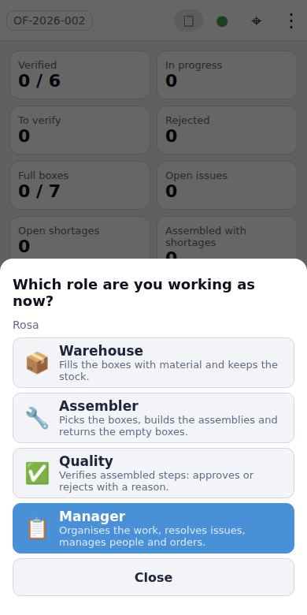

At the bottom are **your role's tabs**. The number in brackets shows how many things are pending (shortages, issues, defects).

### 6.2 📋 Manager: preparing the order

**Creating a production order.** **Orders** tab:

1. The code is filled in automatically (`OF-2026-002`); you can change it.
2. Type the **serial number** (`DX1-0042`) and some **notes** (for example, *Customer: Vallès Laboratories*).
3. Press **+ Create the order and start**.

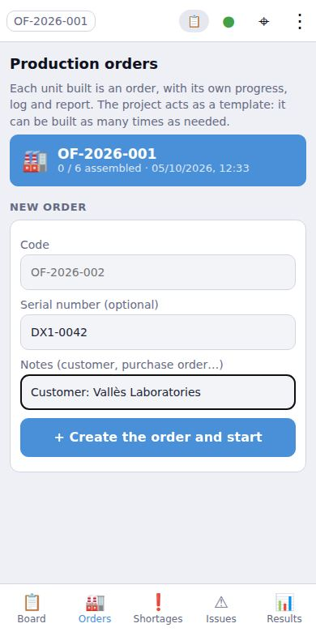

A device signing in for the first time goes to the **most recent** order; after that, each device remembers the last order it worked on. To change order, tap the code in the header.

**Assigning steps.** On the **Board**, for each step, choose the person under *Assigned to*. The assembler will see it marked with 👤 and the *Continue* button will offer them their own steps first.

### 6.3 📦 Warehouse: filling the boxes

**Fill tab.** Shows the order's boxes by step, with their status: *Empty*, *Filling*, *Full*, *With shortages*, *In use* or *Returned*.

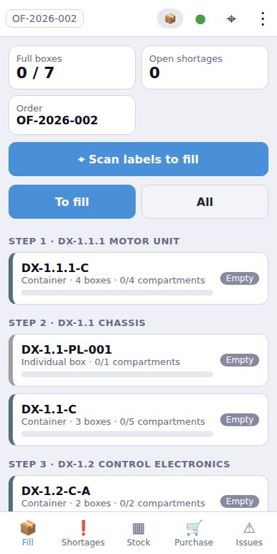

1. Tap a box (or scan its label with **⌖**).
2. For each compartment, **put the material in** and tap it, or scan the compartment's label. It turns green and the material leaves the stock.
3. **Fill everything** ticks all the compartments at once (except shortages).
4. Tapping a compartment that is already full **empties** it (the material goes back to stock).

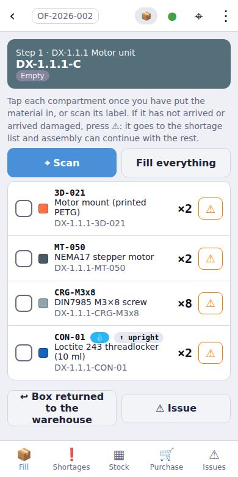

**When there is a problem with a material: ⚠ button**

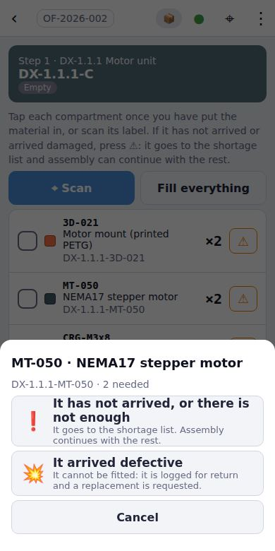

- **❗ It has not arrived, or there is not enough:** the app asks **how many you could put in** (0 if none arrived) and an optional **note** (supplier, expected date…). The rest becomes a **shortage**.
- **💥 It arrived defective:** the defective part form opens (see [section 6.6](#66-defective-or-broken-parts)).

**When the missing material arrives:** scan the compartment's label (or tap it and confirm it *has arrived*). The compartment is topped up, the shortage closes by itself and the assembler will see it.

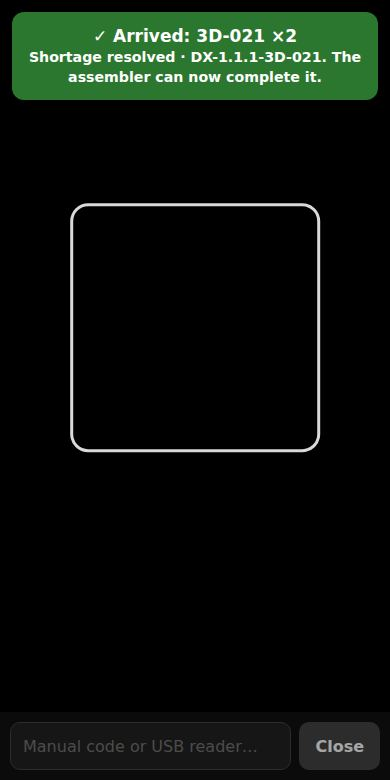

**Shortages tab.** Everything that is missing, grouped by material: how many, for which step and box, since when, supplier and note. **Copy**, **Share** and **⬇ CSV** buttons to send it to purchasing. It also gives access to the **defective parts** and returns.

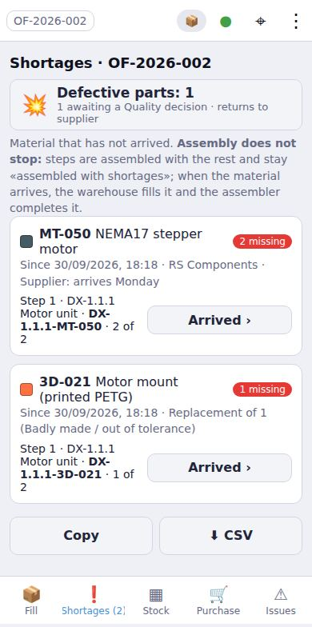

**Stock tab.** *Needed* is what still has to go into the boxes; *In stock* is the stock. The **−** and **+** buttons add or subtract one unit, and typing a number records a **count**.

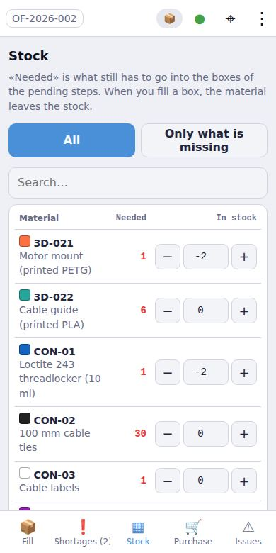

**Purchase tab.** What has to be bought to finish the order, grouped by supplier. Shortages are marked as **❗ urgent**.

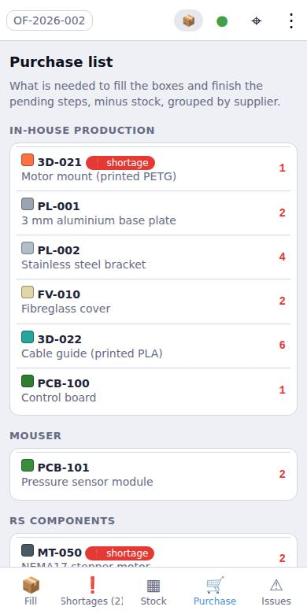

**Returning the boxes.** When a box comes back empty and clean to the warehouse, open it and press **↩ Box returned to the warehouse**. The assembler can do this too.

### 6.4 🔧 Assembler: assembling

**Steps tab.** The steps in assembly order, with their status. A step stays locked until its sub-assemblies are assembled (even with shortages). **Continue** takes you to the next one for you.

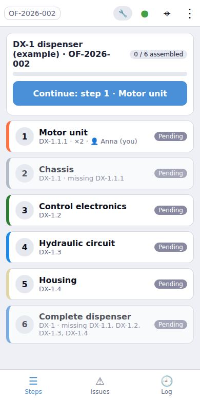

**Inside a step**, from top to bottom:

1. **Warnings:** rejected by Quality (with the reason), parts that have not arrived, boxes the warehouse has not filled yet…
2. **1 · Preparation: pick the boxes.** Tap each compartment as you pick it, or press **⌖ Scan labels**. If you scan a label from another step, the app warns you with a sound and tells you which step it belongs to. Compartments for parts that have not arrived are shown in orange and do not need picking.
3. **2 · Assembly:** **▶ Start the step** (the time starts counting), tools, reference image, **instructions** with a checkbox to tick them one by one, and **tightening torques**.
4. **Photos**, **⚠ Issue** and **💥 Broken or defective part**.
5. **3 · Finish:** where the assembled unit is stored (storage box) and **✓ Mark the step as assembled**.
6. After assembling it: **↩ Return the empty boxes to the warehouse**.

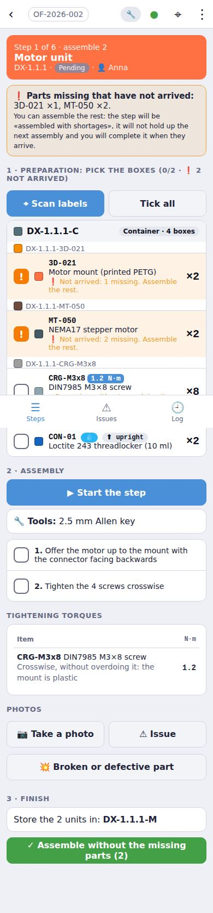

**Assembling with shortages.** If a part is missing, the button reads **✓ Assemble without the missing parts**. The step becomes **"Assembled with shortages"** and **does not hold up the next assembly**: the rest of the machine can go ahead. When the material arrives, the step says *"Already arrived…"* and the **✓ Complete** button becomes active.

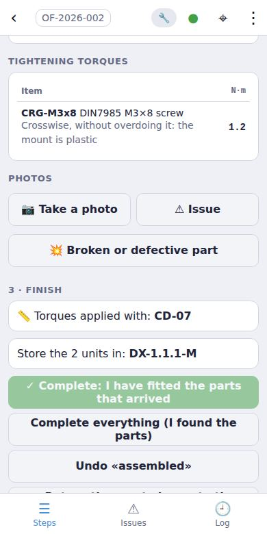

**Complete everything (I found the parts)** is for when the missing parts turned up another way. The app asks for confirmation.

**Undo "assembled"** takes the step back to its previous state (for example, if you picked the wrong step). It cannot be done once Quality has verified it.

### 6.5 ✅ Quality: verifying

**Verify tab.** Steps are shown in four groups:

- **to verify**;
- **assembled with shortages** (cannot be approved yet);
- **rejected**;
- **verified**.

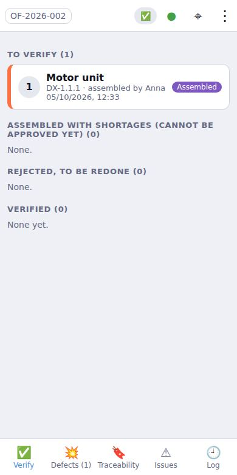

1. Tap a step. You will see who assembled it, when and how long it took, and any previous rejections.
2. Go through the **checklist**, item by item:
   - each instruction;
   - each tightening torque;
   - that all the parts are there;
   - that there is no damage or debris.
3. Take **photos** if needed.
4. Press **✓ Approve**, which becomes active when everything is ticked. Or type the **reason** and press **✗ Reject and send it back to the assembler**.

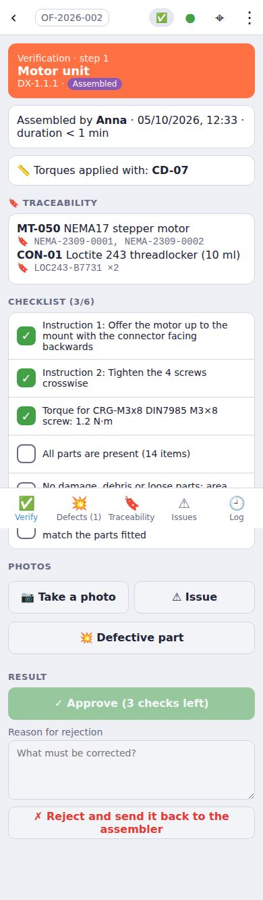

- If you assembled the step yourself, the app will not let you verify it (four eyes).
- If the step has pending parts (shortages), it **cannot be approved** until the assembler completes it.
- The boxes you have ticked are kept if you leave and come back.

### 6.6 Defective or broken parts

A part can arrive damaged (spotted by the **Warehouse**, with the compartment's ⚠ button) or break or get damaged during assembly (the **Assembler** or **Quality**, with **💥 Broken or defective part**).

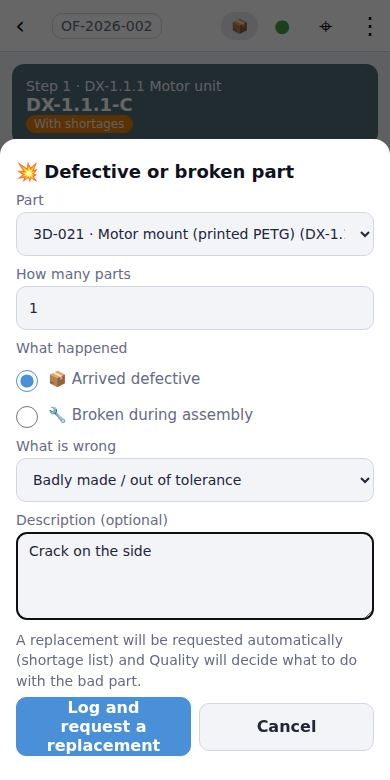

1. Choose the **part** (if the step has several) and **how many**.
2. Choose **what happened**:
   - **📦 Arrived defective**: the supplier is responsible;
   - **🔧 Broken during assembly**: it happened in the workshop.
3. Choose **what is wrong**:
   - broken;
   - badly made or out of tolerance;
   - damaged in transit;
   - wrong part;
   - scratched or dented;
   - other.
4. Add a **description** (for example, *"Crack on the side"*).
5. Press **Log and request a replacement**.

What happens next:

- The bad part **leaves the box** and does not go back to stock.
- **A replacement is requested**: it becomes a shortage, shows up as urgent on the purchase list and the workshop **does not stop**.
- If the step was already assembled (or verified), it **becomes pending** on this part again and will have to be verified again.
- When the replacement arrives, it is handled like any shortage: the Warehouse scans it, the Assembler presses *Complete* and Quality verifies it.

**Quality decides what to do with the bad part.** **💥 Defects** tab:

| Decision | When |
|---|---|
| ↩ Return to supplier | It arrived defective. In the note, the return number (for example, `RMA-2026-017`). |
| 🗑 Scrap | It cannot be fixed. |
| 🛠 Repair / recover | It can be fixed. |
| ✓ Accept as is | It can be used anyway. If you put it back in the box, the Warehouse must press *Arrived* to close the replacement. |

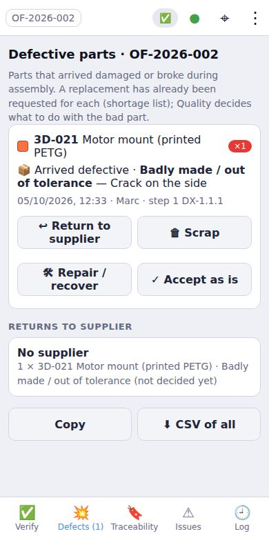

Below is the **list of returns by supplier**, with **Copy**, **Share** and **⬇ CSV** buttons to send it.

### 6.7 Issues

Anyone can open an issue from the **Issues** tab, or with the **⚠ Issue** button on a step or a box:

1. Choose the **step** (or *General*).
2. Describe **what is happening**, for example *"The chassis drawing does not show the plate orientation"*.
3. Choose the **severity**: low, medium or high (stops assembly).
4. Press **Save**.

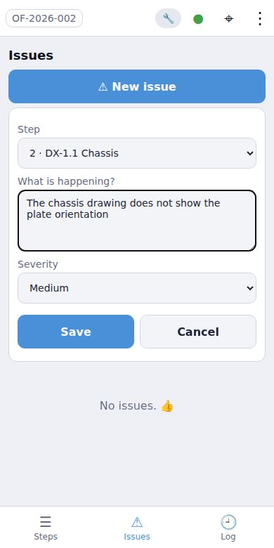

Quality and the Manager mark it as **resolved**, with an explanation.

### 6.8 📋 Manager: follow-up, results and closing

**Board.** The order's status at a glance:

- verified, in progress, to verify, rejected;
- full boxes, issues, shortages, assembled with shortages, defective parts and defects to decide;
- each step, with who assembled it, how long it took, who verified it and who it is assigned to.

Buttons: **👥 People**, **📊 Results**, **💥 Defects** and **🔒 Close the order**.

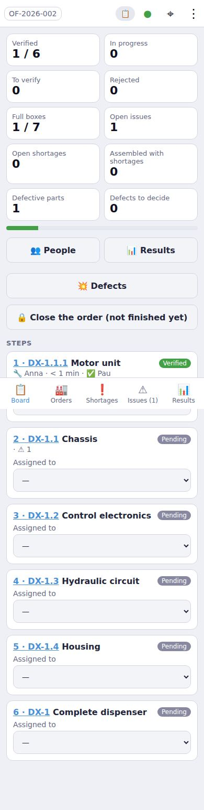

**Results.** The order's indicators:

- status;
- verified;
- **right first time** (steps approved without any rejection);
- rejections;
- assembly time;
- issues;
- what each person has done.

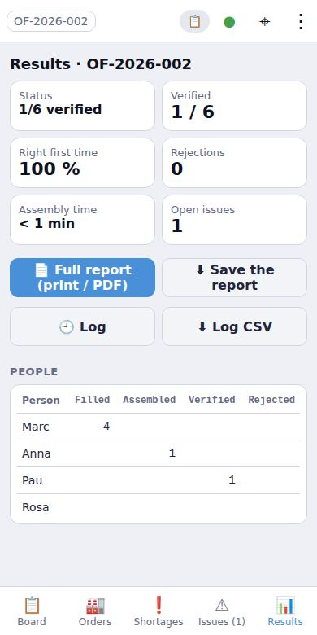

**📄 Full report** opens the order report, ready to print or save as PDF (in the print dialog, choose *Save as PDF*). It is shown in the language of whoever opens it and contains:

- the header with the order, the serial number and the project version;
- the indicators;
- the steps, with who did them and how long they took;
- the rejections and the issues;
- the **defective parts** with the decision taken;
- the **shortages** with when they arrived;
- the material moved;
- the people;
- the full **traceability log**;
- space to sign.

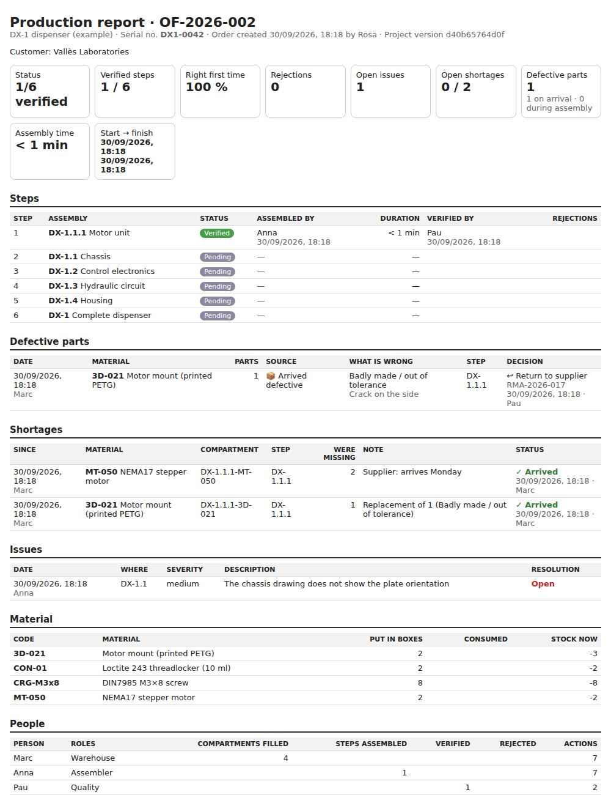

**Closing the order.** On the Board, **🔒 Close the order**. If there are steps still to verify, shortages or defects to decide, the app warns you first. A closed order is **read-only**. If needed, it can be **🔓 Reopened**.

**Building another unit.** Create a **new order** (section 6.2). The project is the same; progress starts from zero.

### 6.9 Working offline

If a device loses Wi-Fi, the header dot turns 🔴 and the app **keeps working**:

- Everything you do is saved on the device, with your name, and is sent automatically when the connection comes back.
- Photos are kept on the device (with an orange dotted border) and uploaded automatically.
- If two people worked at the same time, they do not overwrite each other: each action is applied only once and stock adds up.
- If on reconnecting the server rejects an action (for example, because the order has been closed), the app shows the reason.

### 6.10 Without a server (a single device)

- Open `muntatge.html` and tap **Example project**, or open the configurator's `.fordre.json` file (menu ⋮ › *Open project file*).
- The first time, the app asks for **your name** (shown in the log) and the **role**. You can change role at any time by tapping it in the header.
- Everything is saved on that device. From the ⋮ menu you can **export the progress** (JSON) to keep it or move it to another device.

---

## 7. Practical cases

### 7.1 Material is missing when filling the boxes

> Marc is filling the Motor unit container. The NEMA17 motors have not arrived.

1. **Marc (Warehouse):** in box `DX-1.1.1-C`, on compartment `MT-050`, press **⚠** › **It has not arrived** › *How many could you put in?* `0` › note `Supplier: arrives Monday`. Fill the rest with **Fill everything**.
2. **Marc:** in **Shortages**, press **Share** and send the list to purchasing.
3. **Anna (Assembler):** in the *Motor unit* step she sees *"Parts missing that have not arrived: MT-050 ×2"*. She assembles the rest and presses **✓ Assemble without the missing parts**. The step becomes *Assembled with shortages* and the *Chassis* can now be started.
4. **On Monday, Marc:** scans the label of compartment `MT-050`. The app says *"Arrived · Shortage resolved"*.
5. **Anna:** in the *Motor unit* step, presses **✓ Complete**.
6. **Pau (Quality):** verifies and approves the step.

### 7.2 A defective part arrives

> One of the printed `3D-021` mounts arrives cracked.

1. **Marc:** compartment `3D-021` › **⚠** › **It arrived defective** › 1 part › *Arrived defective* › *Badly made / out of tolerance* › description *"Crack on the side"* › **Log and request a replacement**.
2. The replacement is requested and the step can be assembled with the rest.
3. **Pau:** in **Defects**, presses **↩ Return to supplier** with the return number in the note.
4. When the replacement arrives, it is completed as in case 7.1.

### 7.3 A part breaks during assembly

> While tightening, Anna strips the thread of 2 M3×8 screws.

1. **Anna:** in the step › **💥 Broken or defective part** › choose `CRG-M3x8` › 2 › *Broken during assembly* › *Broken* › *"Thread stripped while tightening"* › **Log and request a replacement**.
2. If the step was already assembled, it becomes pending on the 2 screws again.
3. **Pau:** decides **🗑 Scrap**.
4. **Marc:** puts 2 new screws in the box (scanning the label).
5. **Anna:** **✓ Complete**. **Pau:** verifies.

### 7.4 Quality rejects a step

1. **Pau:** in the verification, types the reason (*"Left motor washer missing"*) and presses **✗ Reject**.
2. **Anna:** the step appears in red with the reason. She corrects it and presses **✓ Mark the step as assembled** again.
3. **Pau:** verifies it again. In the report, this step will not count as *right first time*.

### 7.5 The bill of materials has changed and there are orders in progress

1. **Rosa:** imports the new list into the configurator. She checks the changes and which boxes must be reprinted.
2. She prints the new boxes and **publishes** the project again.
3. The phones show ⟳: tap it to load the new project.
4. The report of orders created earlier will warn that *the project was modified after the order was created*. It is good practice to finish the orders in progress before changing the project, or to open new ones.

### 7.6 Several people with the same tablet

Menu ⋮ › **👤 Switch person**. If there are unsent changes, the app warns you. Each person's changes are sent under their name even if someone else has signed in since.

### 7.7 Someone leaves or a phone is lost

**Rosa:** Board › People › the person › **Deactivate**. Their sessions are closed on every device.

### 7.8 A team that works in several languages

> Marc prefers to work in Spanish, Anna in Catalan and an external maintenance technician in English.

1. Each of them chooses their language on their device (menu ⋮ › **Language**), or is given a shortcut with `&lang=es`, `&lang=ca` or `&lang=en`.
2. They all work on the same order. The **log**, the statuses and the warnings appear to each person in their language.
3. The order report is shown in the language of whoever opens it. Handwritten notes and reasons are shown as they were written.

---

## 8. Troubleshooting

| What happens | Why | What to do |
|---|---|---|
| The phone does not open the server app. | It is not on the same Wi-Fi, or the address is wrong. | Connect it to the workshop Wi-Fi and open the address shown by the server (or scan the QR). |
| A browser security warning appears. | The workshop certificate is not installed. | Install it (section 2.7) or accept the warning (*Advanced › Proceed*). |
| Everything was fine and suddenly the security warning appears on every phone. | The server changed IP and created a new certificate. | Install the new certificate on every device and give the server a fixed IP (section 2.4, step 5). |
| The scanner says *"The camera cannot be opened"*. | Camera permission is missing, or it is not a secure connection. | Give the browser camera permission. Open the app over `https`, not `http` or by double-click. |
| The scanner does not read the QR. | Low light, too close or a small label. | Move back a little, add light, or type the code in the bar at the bottom. |
| *"Label from another project or an earlier version"*. | The label is from an earlier version of the project. | Reprint the labels from the configurator. |
| *"Incorrect name or PIN"*. | Wrong PIN. | Try again. After 5 errors you must wait a minute. The Manager can change the PIN. |
| *"Your role does not allow this action"*. | The person does not have the required role. | The Manager adds the role (People). |
| *"You cannot verify a step you assembled yourself"*. | Four-eyes rule. | Have another Quality person verify it. |
| *"Parts are missing: it cannot be approved"*. | The step is assembled with shortages. | The assembler must complete it when the parts arrive. |
| The header dot stays 🟠 or 🔴 for a long time. | The server is not responding or the device has no Wi-Fi. | Check the Wi-Fi and the server (`sudo systemctl status fordre`). No changes are lost. |
| *"This project is not on the server"*. | A project that has not been published was opened. | The Manager must publish it (🏭 Workshop › Publish). |
| The server does not start: *"No es pot obrir el port 8443"* (cannot open port 8443). | Another program is using the port. | Stop the other program or change the port (`--port 9443`). |
| The configurator shows a box with a *"sticks out"* warning. | The part is taller than the compartment. | Check the material's dimensions, raise the *Maximum depth* or use a lid (the lid gets a taller frame). |
| The trays are too large for the printer. | The bed size is wrong. | ⚙ Settings › 3D printer › Bed X / Bed Y. |
| Press-fit lids are too tight or too loose. | The clearance is not calibrated. | Print the calibration piece (section 3.2). |
| The app appears in a language that is not yours. | The browser's language was used. | Menu ⋮ › **Language** (in the configurator, the **CA / ES / EN** selector). The device will remember it. |

---

## 9. Appendices

### 9.1 Statuses

**Step statuses**

| Status | Means |
|---|---|
| Pending | It cannot be started yet or has not been started. |
| Ready | The sub-assemblies are assembled and the boxes are full. |
| In progress | Assembly has started. |
| Assembled with shortages | Assembled, but parts are missing that have not arrived or have broken. It does not hold up the next step. |
| Assembled | Complete and awaiting verification. |
| Rejected | Quality rejected it, and it goes back to the assembler. |
| Verified | Quality approved it. |

**Box statuses**

| Status | Means |
|---|---|
| Empty | Nothing has been put in. |
| Filling | Part of the material has been put in. |
| With shortages | Material that has not arrived is missing. |
| Full | All the compartments are full. |
| In use | The assembler has picked all the compartments. |
| Returned | It came back empty to the warehouse. |

### 9.2 Permissions for each action

| Action | 📦 Warehouse | 🔧 Assembler | ✅ Quality | 📋 Manager |
|---|:-:|:-:|:-:|:-:|
| Fill and empty boxes, stock | ✓ | | | ✓ |
| Mark a shortage | ✓ | | | ✓ |
| Log a defective or broken part | ✓ | ✓ | ✓ | ✓ |
| Pick boxes, start, assemble, complete | | ✓ | | ✓ |
| Return boxes | ✓ | ✓ | | ✓ |
| Verify (approve or reject) | | | ✓ | ✓ |
| Decide what to do with a defective part | | | ✓ | ✓ |
| Resolve issues | | | ✓ | ✓ |
| Open issues, take photos | ✓ | ✓ | ✓ | ✓ |
| Assign steps, open and close orders, people, publish | | | | ✓ |

### 9.3 Useful addresses (with the server at `192.168.1.50`)

| What | Address |
|---|---|
| Help page and certificate | `http://192.168.1.50:8080` |
| Workshop app | `https://192.168.1.50:8443/muntatge.html` |
| Workshop app, by role | `https://192.168.1.50:8443/muntatge.html?rol=magatzem` (or `muntador`, `qualitat`, `responsable`) |
| Configurator | `https://192.168.1.50:8443/index.html` |
| Configurator with an example list | `https://192.168.1.50:8443/index.html?llista=exemples/plantilla_fordre.csv` |
| Any of the above in English | Add `?lang=en` (or `&lang=en` if there is already a `?`) |

### 9.4 Configurator keyboard shortcuts

| Key | Action |
|---|---|
| `F` | Focus on the selection in the 3D view. |
| `Home` | Show all. |
| `Delete` | Delete the selection. |
| `Esc` | Close the open dialog. |

In the workshop app, a **USB or Bluetooth barcode reader** works without any setup: scan and the code is processed automatically.

### 9.5 Files and licence

- Project: `.fordre.json`. Lists: `.csv`, `.xlsx`. Boxes: `.stl`, `.3mf`. RFID labels: `.csv`.
- File and folder names: FOrdre's internal names (`muntatge.html`, `servidor/`, `dades/`, `exemples/`…) are in Catalan and do not change with the language.
- Source code and demo: https://github.com/Bioquad/FOrdre
- Licence: **CERN Open Hardware Licence v2 – Strongly Reciprocal** (`LICENSE` file). The third-party libraries (Three.js, qrcode-generator, SheetJS, jsQR) carry their own licences in `vendor/llicencies/`.
