# Manual de FOrdre

**Versión 1.7** · Instalación, configuración y uso, paso a paso

*También en: [Català](MANUAL.md) · [English](MANUAL.en.md)*

FOrdre prepara, a partir de la lista de materiales de una máquina, las **cajas y bandejas a medida** para imprimir en 3D (una para cada paso de montaje, con un cajetín para cada pieza y sus etiquetas) y después **guía el taller**: quién llena las cajas, quién monta, quién verifica y quién lo gestiona, hasta tener la máquina acabada y un informe de todo lo que se ha hecho.

Este manual sigue un ejemplo real de principio a fin: la **Dosificadora DX-1**, que viene incluida con FOrdre, y un taller con cuatro personas: **Rosa** (Responsable), **Marc** (Almacén), **Anna** (Montadora) y **Pau** (Calidad).

> Las capturas de este manual muestran FOrdre en castellano. Para cambiar el idioma, vea el [punto 3.7](#37-idioma).

---

## Índice

1. [Qué es FOrdre](#1-qué-es-fordre)
2. [Instalación](#2-instalación)
3. [Configuración](#3-configuración)
4. [Preparar la lista de materiales](#4-preparar-la-lista-de-materiales)
5. [El configurador paso a paso](#5-el-configurador-paso-a-paso)
6. [La app del taller paso a paso](#6-la-app-del-taller-paso-a-paso)
7. [Casos prácticos](#7-casos-prácticos)
8. [Resolución de problemas](#8-resolución-de-problemas)
9. [Anexos](#9-anexos)

---

## 1. Qué es FOrdre

### 1.1 Las tres herramientas

| Herramienta | Dónde se usa | Para qué sirve |
|---|---|---|
| **Configurador** (`index.html`) | Ordenador | Importar la lista de materiales, ver las cajas en 3D y descargar los STL para imprimir, las etiquetas y la hoja de ruta. |
| **App del taller** (`muntatge.html`) | Móvil o tableta | Cada persona entra con su rol: llenar cajas, montar, verificar, gestionar órdenes y ver resultados. |
| **Servidor del taller** (`servidor/`) | Raspberry Pi o PC | Lo comparte todo en tiempo real entre los aparatos, guarda las personas y las órdenes, y comprueba las reglas. |

Las tres herramientas funcionan **sin internet**. El servidor es opcional: sin servidor, cada aparato trabaja solo.

### 1.2 El camino completo

1. **Definir.** El Responsable importa la lista de materiales en el configurador y ajusta las cajas.
2. **Imprimir.** Descarga los STL y las etiquetas, imprime las cajas y las etiqueta.
3. **Publicar.** Publica el proyecto en el servidor del taller y abre una **orden de fabricación** para cada unidad que hay que fabricar.
4. **Llenar.** El Almacén pone el material en las cajas escaneando las etiquetas. Lo que no ha llegado va a la **lista de faltantes**, y lo que llega mal se registra como **defectuoso**.
5. **Montar.** El Montador coge las cajas y sigue los pasos. Si falta alguna pieza, monta el resto y lo completa cuando llega.
6. **Comprobar.** Calidad verifica cada paso con una lista de comprobación y lo aprueba, o lo rechaza con el motivo.
7. **Resultados.** El Responsable cierra la orden y saca el **informe**: quién ha hecho cada cosa, cuánto ha tardado, qué ha faltado y qué se ha roto.
8. **Repetir.** Para fabricar otra unidad, se abre una orden nueva con el mismo proyecto.

### 1.3 Palabras que usaremos

| Palabra | Qué quiere decir |
|---|---|
| **Proyecto** | Una máquina: su árbol de montaje, los materiales y la configuración de las cajas. Se guarda en un archivo `.fordre.json`. |
| **Conjunto** | Una parte de la máquina que se monta en un paso (por ejemplo, *Grupo motor*). Puede tener subconjuntos: es el **árbol de montaje**. |
| **Material** | Cada pieza diferente: una placa, un tornillo, un motor, un tubo de cola… |
| **Cajetín** | El hueco a medida donde va un material. Nunca hay dos materiales en el mismo cajetín. |
| **Bandeja / caja / contenedor** | Donde van los cajetines. Una *bandeja* tiene muchos cajetines; una *caja* es para un solo material; un *contenedor* lleva cajas dentro. |
| **Kit** | Todas las cajas de un paso de montaje. |
| **Caja de guarda** | La caja donde se guarda un subconjunto una vez montado, para llevarlo al paso siguiente. |
| **Orden de fabricación** | Una unidad concreta que se fabrica (por ejemplo, `OF-2026-002`, número de serie `DX1-0042`). Tiene su progreso, registro e informe. |
| **Faltante** | Material que no ha llegado (o no hay suficiente). |
| **Pieza defectuosa** | Pieza que ha llegado mal o que se ha roto al montar. |

---

## 2. Instalación

### 2.1 Qué necesitas

| Para… | Necesitas |
|---|---|
| El configurador | Un ordenador con Chrome, Edge o Firefox (Windows, macOS o Linux). |
| La app del taller | Móviles o tabletas Android o iPhone/iPad con el navegador. Una cámara para escanear (opcional: también sirve un lector de códigos USB o Bluetooth). |
| El servidor del taller (opcional) | Una Raspberry Pi 3, 4 o 5 (o cualquier ordenador) con **Node.js 18 o superior**, conectada a la red del taller. |
| Imprimir las cajas | Una impresora 3D y su programa de laminado (PrusaSlicer, Cura, Bambu Studio, OrcaSlicer…). |
| Imprimir las etiquetas | Una impresora de etiquetas (Brother, Dymo…), una impresora térmica de rollo u hojas A4 adhesivas. |

Hay tres maneras de usar FOrdre. Elige la que te convenga:

| Manera | Cuándo conviene |
|---|---|
| **A. Demo en línea** | Para probarlo ahora mismo, sin instalar nada. |
| **B. Carpetas del ZIP, con doble clic** | Para una sola persona o para preparar cajas, sin taller compartido. |
| **C. Servidor del taller** | Cuando varias personas trabajan a la vez con móviles y tabletas. Es la manera completa. |

### 2.2 Opción A: probarlo sin instalar nada

1. Abre **https://Bioquad.github.io/FOrdre/?lang=es** con el navegador del ordenador.
2. Para verlo funcionar con una lista de ejemplo, abre directamente:
   - **https://Bioquad.github.io/FOrdre/?lang=es&llista=exemples/plantilla_fordre.csv** (lista de piezas)
   - **https://Bioquad.github.io/FOrdre/?lang=es&llista=exemples/bom_cad_solidworks.csv** (BOM de CAD)
3. La app del taller para el móvil está en **https://Bioquad.github.io/FOrdre/muntatge.html?lang=es**.

> La demo guarda los datos solo en el navegador que usas. Para trabajar de verdad con un equipo, usa el servidor del taller (opción C).

### 2.3 Opción B: las carpetas del ZIP, con doble clic

El archivo `FOrdre-eines-x.y.z.zip` lleva una carpeta para cada herramienta:

```
FOrdre/
├── LLEGEIX-ME.txt
├── 1-configurador/    index.html       → el configurador
├── 2-taller/          muntatge.html    → la app del taller
│                      rol-magatzem.html, rol-muntador.html,
│                      rol-qualitat.html, rol-responsable.html
├── 3-servidor/        la solución entera, con el servidor
└── 4-documentacio/    este manual, el README y las capturas
```

1. Descomprime el ZIP donde quieras (por ejemplo, en `Documentos\FOrdre`).
2. **Configurador:** haz doble clic en `1-configurador/index.html`.
3. **App del taller en este ordenador:** haz doble clic en `2-taller/muntatge.html`, o directamente en `rol-magatzem.html` (Almacén) o en el rol que quieras.

Limitaciones cuando se abre con doble clic:

- Los botones de **lista de ejemplo** no funcionan porque el navegador no deja leer archivos así. Elige la lista con el botón de archivo; las de ejemplo están en `1-configurador/exemples/`.
- El **escáner con la cámara** puede no funcionar, porque algunos navegadores solo dejan usar la cámara en conexiones seguras (https). Puedes escribir el código a mano o usar un lector USB.
- El botón **📱 Montaje** del configurador no encuentra la app del taller. Pasa el proyecto con un archivo `.fordre.json` (vea el [punto 5.10](#510-pasar-el-proyecto-al-taller)).

### 2.4 Opción C: servidor del taller en una Raspberry Pi

Es la manera recomendada: la Raspberry Pi queda encendida en el taller y todos los aparatos se conectan a ella por la Wi-Fi.

**Paso 1. Preparar la tarjeta SD**

1. En el ordenador, instala **Raspberry Pi Imager** (https://www.raspberrypi.com/software/).
2. Elige el modelo de Raspberry Pi, el sistema **Raspberry Pi OS Lite (64-bit)** y la tarjeta SD.
3. En **Editar la configuración**:
   - Nombre del equipo: `fordre` (después se podrá acceder como `fordre.local`).
   - Usuario y contraseña: por ejemplo, `taller` y una contraseña segura.
   - Wi-Fi: el nombre y la contraseña de la red del taller (o conéctala por cable).
   - Servicios: activa **SSH**.
4. Graba la tarjeta, ponla en la Raspberry Pi y enciéndela. Espera un par de minutos.

**Paso 2. Conectarse**

Desde un ordenador de la misma red, abre un terminal (en Windows, *PowerShell*):

```bash
ssh taller@fordre.local
```

Si no la encuentra por el nombre, busca su dirección IP en el router (por ejemplo, `192.168.1.50`) y haz `ssh taller@192.168.1.50`.

**Paso 3. Instalar FOrdre**

```bash
sudo apt update && sudo apt install -y git
git clone https://github.com/Bioquad/FOrdre.git
cd FOrdre
sudo bash servidor/configura-raspberry.sh
```

El script:

1. instala Node.js si no está;
2. crea el servicio `fordre`, que arranca solo cada vez que se enciende la Raspberry Pi;
3. muestra las direcciones al final.

Si no tienes el repositorio, también puedes copiar la carpeta `3-servidor` del ZIP a la Raspberry Pi (con una memoria USB o con `scp`) y ejecutar el mismo `sudo bash servidor/configura-raspberry.sh`.

**Paso 4. Comprobar que funciona**

```bash
sudo systemctl status fordre      # debe decir «active (running)»
journalctl -u fordre -f           # muestra el registro y el QR (Ctrl+C para salir)
```

En el registro verás algo así (los mensajes de la consola del servidor están en catalán):

```
  FOrdre · servidor del taller 1.7.0
  ────────────────────────────────────
  Dades:        /home/taller/FOrdre/servidor/dades
  App taller:   https://192.168.1.50:8443/muntatge.html   (per rol: …/muntatge.html?rol=magatzem · muntador · qualitat · responsable)
  Configurador: https://192.168.1.50:8443/index.html
  Nom de xarxa: https://fordre.local:8443/muntatge.html
  Primer cop:   http://192.168.1.50:8080/  (certificat i ajuda)
  Primer ús: obre l'app del taller i crea el primer Responsable.

  Escaneja aquest QR amb el mòbil (mateixa Wi-Fi):
```

**Paso 5. Darle una IP fija (muy recomendable)**

El servidor hace un certificado de seguridad para su dirección. Si la Raspberry Pi cambia de IP, el certificado se rehace y habrá que volver a instalarlo en cada móvil. Para evitarlo:

- en el router, en la sección **DHCP** o **Reserva de direcciones**, reserva siempre la misma IP para la Raspberry Pi; o bien
- usa siempre el nombre `https://fordre.local:8443`.

**Comandos útiles**

| Qué quieres hacer | Comando |
|---|---|
| Ver el registro y el QR | `journalctl -u fordre -f` |
| Detener el servidor | `sudo systemctl stop fordre` |
| Volver a arrancarlo | `sudo systemctl restart fordre` |
| Actualizar FOrdre | `cd ~/FOrdre && git pull && sudo systemctl restart fordre` |
| Cambiar los puertos | `FORDRE_PORT=9443 FORDRE_PORT_HTTP=9080 sudo -E bash servidor/configura-raspberry.sh` |
| Poner una clave de red | `FORDRE_CLAU=4821 sudo -E bash servidor/configura-raspberry.sh` |

### 2.5 Servidor en un PC con Windows

1. Instala **Node.js** versión LTS desde https://nodejs.org (deja todas las opciones por defecto).
2. Descomprime el ZIP y entra en `FOrdre\3-servidor\servidor`.
3. Haz doble clic en **`inicia-windows.bat`**. Se abre una ventana con las direcciones y el QR.
4. Si Windows pregunta por el cortafuegos, marca **Redes privadas** y pulsa **Permitir acceso**.
5. Para detenerlo, cierra la ventana.

Para que arranque solo al encender el ordenador: pulsa `Win + R`, escribe `shell:startup` y pon allí un acceso directo a `inicia-windows.bat`.

> Configura el ordenador para que **no entre en reposo**: si se duerme, los móviles pierden la conexión (siguen trabajando y lo enviarán al volver, pero no se verá en tiempo real).

### 2.6 Servidor en Linux o macOS

```bash
cd FOrdre/3-servidor        # o la carpeta del repositorio
bash servidor/inicia.sh      # Ctrl+C para detenerlo
```

En Linux con systemd (Debian, Ubuntu…) también puedes usar `sudo bash servidor/configura-raspberry.sh` para que quede como servicio.

### 2.7 Preparar cada móvil o tableta (la primera vez)

El escáner de la cámara solo funciona en conexiones seguras (https). El servidor usa un certificado propio, y cada aparato lo tiene que aceptar una vez.

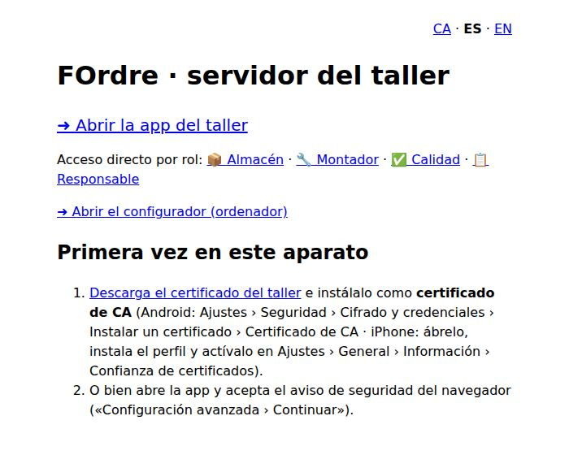

1. Conecta el aparato a la **misma Wi-Fi** que el servidor.
2. Escanea el QR que muestra el servidor, o abre `http://<dirección-del-servidor>:8080` (por ejemplo, `http://192.168.1.50:8080`). Se abre la página de ayuda, en el idioma del navegador (arriba se puede elegir **CA · ES · EN**).
3. **Recomendado:** pulsa *Descarga el certificado del taller* e instálalo:
   - **Android:** Ajustes › Seguridad › Cifrado y credenciales › Instalar un certificado › **Certificado de CA** › elige el archivo `fordre-taller.crt`.
   - **iPhone / iPad:** abre el archivo › Ajustes › *Perfil descargado* › Instalar. Después, Ajustes › General › Información › **Confianza de certificados** › activa *FOrdre taller*.
   - **Windows:** doble clic en el archivo › Instalar certificado › Equipo local › *Colocar todos los certificados en el siguiente almacén* › **Entidades de certificación raíz de confianza**.
4. **O bien**, sin instalarlo: abre la app y acepta el aviso del navegador (*Configuración avanzada › Continuar*). Funciona, pero el aviso volverá a salir de vez en cuando.
5. Abre la app del taller e **instálala** como una app:
   - Android (Chrome): menú ⋮ › *Instalar aplicación* (o *Añadir a pantalla de inicio*).
   - iPhone (Safari): botón *Compartir* › *Añadir a la pantalla de inicio*.
6. Si el aparato siempre se usa para el mismo trabajo, usa el **acceso directo del rol** (vea el [punto 3.6](#36-accesos-directos-por-rol)).

### 2.8 Opciones del servidor

```
node servidor/fordre-servidor.js [--port 8443] [--port-http 8080] [--dades carpeta] [--clau PIN] [--nou-certificat]
```

| Opción | Variable de entorno | Por defecto | Qué hace |
|---|---|---|---|
| `--port` | `FORDRE_PORT` | `8443` | Puerto seguro (https) de las apps. |
| `--port-http` | `FORDRE_PORT_HTTP` | `8080` | Puerto de la página de ayuda y del certificado. |
| `--dades` | `FORDRE_DADES` | `servidor/dades` | Carpeta donde se guarda todo. |
| `--clau` | `FORDRE_CLAU` | (ninguna) | Clave de red: una barrera adicional antes del PIN de cada persona. Hay que escribirla en el menú ⋮ de la app. |
| `--nou-certificat` | — | — | Fuerza a hacer un certificado nuevo. |

Ejemplo: un servidor con una clave de red y los datos en un disco USB:

```bash
node servidor/fordre-servidor.js --clau 4821 --dades /media/usb/fordre-dades
```

### 2.9 Copias de seguridad y actualizaciones

Todo lo que hace el taller se guarda en `servidor/dades/`:

```
dades/
├── projectes/     un archivo por proyecto publicado
├── ordres/        las órdenes de cada proyecto
├── progres/       el progreso de cada orden (con una copia .bak del estado anterior)
├── fotos/         las fotos, por proyecto y orden
├── persones.json  personas, roles y resumen de los PIN (nunca el PIN en claro)
└── certificat/    el certificado https del servidor
```

**Hacer una copia de seguridad** (en la Raspberry Pi, con una memoria USB montada en `/media/usb`):

```bash
sudo systemctl stop fordre
cp -r ~/FOrdre/servidor/dades /media/usb/fordre-dades-$(date +%Y%m%d)
sudo systemctl start fordre
```

En Windows, cierra la ventana del servidor y copia la carpeta `servidor\dades` donde quieras.

**Restaurarla:** detén el servidor, sustituye la carpeta `dades` por la copia y vuelve a arrancarlo.

**Actualizar FOrdre:** `git pull` y reiniciar el servidor (vea el [punto 2.4](#24-opción-c-servidor-del-taller-en-una-raspberry-pi)). Los datos no se tocan.

---

## 3. Configuración

### 3.1 El configurador: ⚙ Configuración

Pulsa **⚙ Configuración** en la barra de arriba del configurador. Los cambios se aplican al instante y se ven en la vista 3D. El botón **Valores por defecto** lo devuelve todo como al principio.

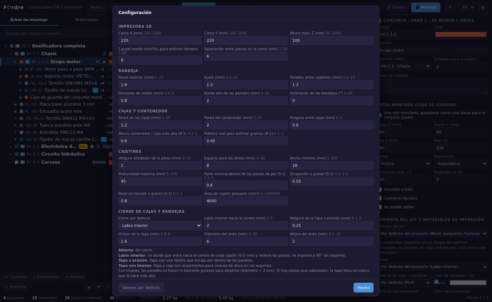

**Impresora 3D**

| Campo | Por defecto | Límites | Cuándo cambiarlo |
|---|---|---|---|
| Cama X / Cama Y (mm) | 220 × 220 | 150–2000 | Pon el tamaño útil de la cama de tu impresora. Las bandejas nunca lo superarán. |
| Altura máx. Z (mm) | 100 | 50–2000 | Altura máxima que quieres imprimir. |
| Caudal medio (mm³/s) | 8 | 1–60 | Para estimar las horas de impresión de cada tanda. |
| Separación entre piezas en la cama (mm) | 6 | 1–50 | Distancia entre piezas en las tandas de impresión. |

**Bandeja**

| Campo | Por defecto | Límites | Notas |
|---|---|---|---|
| Pared exterior (mm) | 1,6 | 1–10 | Más grosor, más resistencia y más filamento. |
| Suelo (mm) | 1,2 | 0,6–10 | |
| Paredes entre cajetines (mm) | 1,2 | 0,6–10 | |
| Divisores de celdas (mm) | 0,8 | 0,4–5 | Separan las unidades en disposición *individual*. |
| Borde alto de las paredes (mm) | 2 | 0–20 | Evita que las piezas rueden al mover la bandeja. |
| Inclinación de las bandejas (°) | 0 | 0–45 | Bandejas inclinadas sobre una cuña. Se limita sola si hay piezas que no se pueden tumbar. |

**Cajas y contenedor**

| Campo | Por defecto | Límites |
|---|---|---|
| Pared de las cajas (mm) | 1,2 | 1–10 |
| Pared del contenedor (mm) | 2 | 1–10 |
| Holgura entre cajas (mm) | 0,6 | 0–5 |
| Altura del contenedor respecto a la caja más alta (0–1) | 0,6 | 0,2–1 |
| Plástico real para estimar gramos (0–1) | 0,45 | 0,1–1 |

**Cajetines**

| Campo | Por defecto | Límites | Notas |
|---|---|---|---|
| Holgura alrededor de la pieza (mm) | 1 | 0–10 | Juego para que la pieza entre y salga bien. |
| Espacio para los dedos (mm) | 8 | 0–40 | Espacio para coger las piezas. |
| Ancho mínimo (mm) | 18 | 5–200 | Tiene que caber un dedo. |
| Profundidad máxima (mm) | 45 | 5–500 | |
| Parte mínima dentro de las piezas de pie (0–1) | 0,6 | 0,1–1 | Piezas que van de pie (líquidos): qué parte queda dentro. |
| Ocupación a granel (0–1) | 0,55 | 0,2–0,9 | Cuánto ocupa el material amontonado. |
| Nivel de llenado a granel (0–1) | 0,8 | 0,3–1 | Hasta dónde se llena (no hasta arriba del todo). |
| Área de cajetín pequeño (mm²) | 4000 | — | Por debajo, el cajetín es *pequeño* (importante para el formato mixto). |

**Cierre de cajas y bandejas**

| Campo | Por defecto | Notas |
|---|---|---|
| Cierre por defecto | Labio interior | *Abierta*, *Labio interior*, *Tapa a presión* o *Tapa con imanes* (vea el [punto 3.3](#33-formatos-de-kit-y-cierres)). |
| Labio interior hacia el centro (mm) | 2 | 0–5. Se imprime a 45°, sin soportes. |
| Holgura de la tapa a presión (mm) | 0,25 | Se calibra con la pieza de calibración. |
| Grosor de la tapa (mm) | 1,6 | |
| Diámetro y altura del imán (mm) | 6 × 2 | Los imanes de disco que tengas. |
| Tapa también en cada caja interior | Sí | Con contenedor. |
| Contenedores apilables | Sí | Todos con la misma planta y un pie que encaja en el de abajo. |
| Asas en los lados cortos | Sí | |
| QR grabado en las tapas | Sí | Se lee mejor si lo repasas con un rotulador. |

**Identificación y ergonomía**

- Código grabado en relieve en la cara frontal.
- Rebaje para la etiqueta adhesiva.
- Código del material grabado en el fondo de cada cajetín.
- Fondo redondeado en los cajetines a granel (la tornillería sale deslizando el dedo).

**Formato de los kits y materiales de impresión**

| Campo | Por defecto |
|---|---|
| Formato por defecto | Mixto (pequeños fusionados) |
| Material de cajas y bandejas | PLA |
| Material para piezas ESD | PETG-ESD (antiestático) |
| Material del contenedor | PETG |
| Color de las cajas individuales | El del material (también: el del conjunto, por tipo, o un color fijo) |
| Color fijo / bandejas, color del contenedor | Gris claro / gris azulado |

Materiales de impresión disponibles: PLA, PETG, ABS, ASA, PC, PA (nailon), PP, TPU (flexible), PETG-ESD (antiestático) y PLA con fibra de carbono. Las cajas de piezas sensibles a ESD se hacen aparte con el material antiestático.

**Ejemplo.** Una impresora con una cama de 250 × 210 mm, cajas de PETG, tapas con imanes de 8 × 3 mm y etiquetas de cinta de 12 mm: Cama X `250`, Cama Y `210`, Material de cajas `PETG`, Cierre `Tapa con imanes`, Diámetro del imán `8`, Altura del imán `3`, Etiquetas `Cinta 12 mm`.

### 3.2 Calibrar las holguras

Cada impresora imprime un poco diferente. La pieza de calibración ajusta las tapas y los encajes a la tuya.

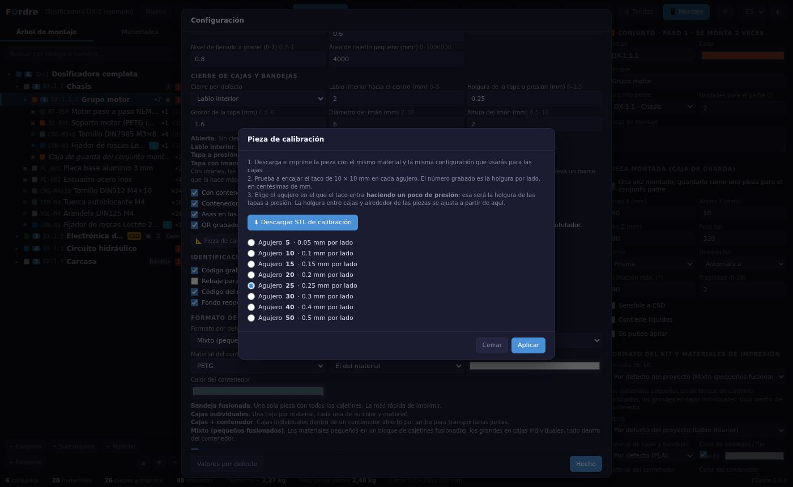

1. ⚙ Configuración › **📐 Pieza de calibración…** › **Descargar STL de calibración**.
2. Imprímela con el material de las cajas.
3. Prueba el taco en cada agujero. Elige el agujero en el que el taco **entra ajustado, sin forzar y sin bailar**.
4. Marca ese agujero en el diálogo y pulsa **Aplicar**. FOrdre ajusta la holgura de las tapas, de las cajas y de los cajetines.

### 3.3 Formatos de kit y cierres

**Formatos del kit** (para todo el proyecto o para cada conjunto):

| Formato | Cómo es | Cuándo elegirlo |
|---|---|---|
| **Bandeja fusionada** | Una sola pieza con todos los cajetines. | La más rápida de imprimir. Kits pequeños. |
| **Cajas individuales** | Una caja por material, cada una de su color y material. | Cuando los materiales se reponen por separado. |
| **Cajas + contenedor** | Las cajas individuales dentro de un contenedor abierto por arriba, con muescas para cogerlas. | Para llevar todo el kit a la vez. |
| **Mixto** (recomendado) | Los materiales pequeños en un bloque de cajetines fusionados, los grandes en cajas individuales, todo dentro del contenedor. | El mejor equilibrio. |

**Cierres:**

| Cierre | Cómo es | Cuándo elegirlo |
|---|---|---|
| **Abierta** | Sin cierre. | Bandejas que no se mueven. |
| **Labio interior** (0–5 mm) | Un borde que entra hacia el centro de cada cajetín y retiene las piezas. | Por defecto: no hace falta imprimir tapa. |
| **Tapa a presión** | Tapa con una faldilla que encaja por dentro. | Para transportar. Calibra la holgura (punto 3.2). |
| **Tapa con imanes** | Imanes de disco en las esquinas de la caja y de la tapa. | Se abre y se cierra muy deprisa. Las paredes se hacen más gruesas para alojarlos. |

### 3.4 Etiquetas

El formato se elige en **⚙ Configuración › Etiquetas** (o en la ficha de cualquier material, en el apartado *Etiqueta*) y se aplica a todo el proyecto. Con *A medida…* se escriben el ancho y el alto.

| Formato | Tamaño | Impresora |
|---|---|---|
| Cinta 9 / 12 / 18 / 24 mm | Largo automático | Brother P-touch, Dymo, cintas laminadas |
| Rollo térmico | 62 × 29, 50 × 25 o 40 × 20 mm | Impresoras térmicas de etiquetas |
| Hoja A4 | 70 × 37 (3 × 8), 48,5 × 25,4 (4 × 11), 38 × 21,2 (5 × 13), 25,4 × 10 (7 × 27) | Impresora normal con hojas adhesivas |
| A medida | La que quieras | — |

Cada etiqueta lleva el **código**, el **nombre**, la **cantidad**, el **paso**, el **conjunto**, los colores, un **QR** y un **código de barras** (Code 128). La etiqueta se adapta al ancho del cajetín: si es muy estrecho, se quita el QR. Los textos de la etiqueta salen en el idioma del configurador. Al imprimir, elige **escala 100 %** (sin «ajustar a la página»).

### 3.5 El taller: personas y roles

**Primer uso.** La primera vez que se abre la app con el servidor, pide crear el **Responsable**:

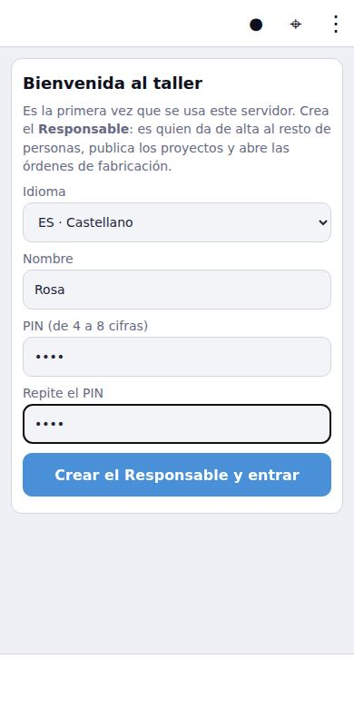

1. Elige el **idioma**, escribe el nombre (por ejemplo, *Rosa*) y un PIN de 4 a 8 cifras (por ejemplo, `1111`, que después cambiarás por uno seguro).
2. Pulsa **Crear el Responsable y entrar**.

Si el servidor todavía no tiene ningún proyecto, la app lo dice. El Responsable lo publica desde el configurador (punto 5.10), o puede tocar **Proyecto de ejemplo** para probarlo: si entra como Responsable, el ejemplo se publica solo en el servidor.

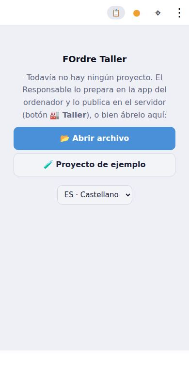

**Dar de alta al resto de personas.** Como Responsable: **📋 Panel › 👥 Personas**.

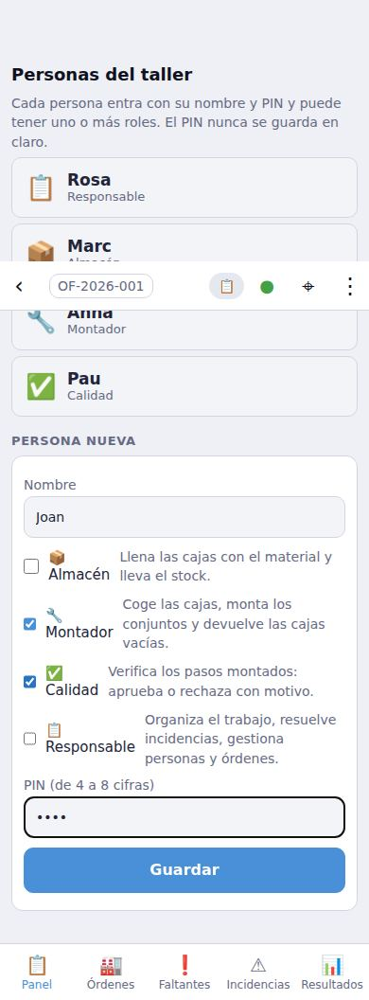

1. Escribe el **nombre**.
2. Marca sus **roles** (puede tener más de uno).
3. Escribe su **PIN** y pulsa **Guardar**.

En el ejemplo:

| Persona | Roles | PIN de ejemplo |
|---|---|---|
| Rosa | Responsable | 1111 |
| Marc | Almacén | 2222 |
| Anna | Montador | 3333 |
| Pau | Calidad | 4444 |
| Joan | Montador y Calidad | 5555 |

**Qué puede hacer cada rol:**

| Rol | Puede hacer |
|---|---|
| 📦 Almacén | Llenar y vaciar cajas, marcar faltantes y piezas defectuosas, stock, devolver cajas. |
| 🔧 Montador | Coger cajas, empezar y marcar pasos como montados (también con faltantes), completarlos, registrar piezas rotas, devolver cajas. |
| ✅ Calidad | Verificar (aprobar o rechazar), decidir qué se hace con las piezas defectuosas, registrarlas, resolver incidencias. |
| 📋 Responsable | Todo lo anterior, y además publicar proyectos, abrir y cerrar órdenes, asignar pasos y gestionar personas. |

Todo el mundo puede abrir incidencias, hacer fotos y consultar el registro y los resultados.

**Regla de los cuatro ojos.** Quien ha montado un paso **no lo puede verificar**. Joan, que tiene los dos roles, puede verificar lo que monta Anna, pero no lo que monta él mismo. El Responsable no tiene esta limitación.

**Cambiar un PIN o los roles:** Personas › toca la persona › cambia lo que haga falta › **Guardar**. Si dejas el PIN vacío, no se cambia.

**Dar de baja a alguien:** Personas › toca la persona › **Dar de baja**. Ya no podrá entrar y se cierran sus sesiones. El registro de lo que hizo se conserva. El taller no deja dar de baja al último Responsable.

### 3.6 Accesos directos por rol

Si un aparato siempre se usa para el mismo trabajo (la tableta del almacén, la de la línea de montaje…), hazle un acceso directo a su rol:

| Rol | Dirección |
|---|---|
| 📦 Almacén | `https://<servidor>:8443/muntatge.html?rol=magatzem` |
| 🔧 Montador | `https://<servidor>:8443/muntatge.html?rol=muntador` |
| ✅ Calidad | `https://<servidor>:8443/muntatge.html?rol=qualitat` |
| 📋 Responsable | `https://<servidor>:8443/muntatge.html?rol=responsable` |

Los nombres de los roles en la dirección (`magatzem`, `muntador`, `qualitat`, `responsable`) son fijos, sea cual sea el idioma. Para que además salga en castellano, añade `&lang=es`, por ejemplo `…/muntatge.html?rol=magatzem&lang=es`.

Abre la dirección y guárdala en la pantalla de inicio. La página de ayuda del servidor (`http://<servidor>:8080`) tiene los cuatro enlaces. Con la app instalada, si mantienes pulsado el icono, también salen los accesos de los roles. Si la persona que entra no tiene ese rol, la app la avisa y usa el suyo.

En la carpeta `2-taller` del ZIP están los mismos accesos en archivos: `rol-magatzem.html`, `rol-muntador.html`, `rol-qualitat.html` y `rol-responsable.html`.

### 3.7 Idioma

FOrdre se puede usar en **catalán**, **castellano** e **inglés**. Dónde se elige:

| Herramienta | Dónde |
|---|---|
| Configurador | Selector **CA / ES / EN** en la barra de arriba, al lado de ◐. |
| App del taller | Menú ⋮ › **Idioma**, o debajo de la lista de personas de la pantalla de entrada. |
| Página de ayuda del servidor | Sale en el idioma del navegador. Arriba están los enlaces **CA · ES · EN**. |

- Cada aparato **recuerda** su idioma. La primera vez se usa el del navegador (si no es ninguno de los tres, el inglés).
- También se puede poner en la dirección con `?lang=ca`, `?lang=es` o `?lang=en`. Por ejemplo, la tableta del almacén en castellano: `https://<servidor>:8443/muntatge.html?rol=magatzem&lang=es`.
- **Qué se traduce:** todos los textos de las apps, las etiquetas, la hoja de ruta, el informe, las cabeceras de la plantilla CSV y los mensajes del servidor.
- **El registro** se lee en el idioma de cada uno: si Marc trabaja en castellano y Rosa en catalán, Rosa ve en catalán lo que ha hecho Marc.
- **Lo que escribe la gente** (notas, motivos, descripciones) y los datos del proyecto (nombres de conjuntos y materiales) se muestran tal como se han escrito.
- El importador reconoce las columnas en cualquiera de los tres idiomas, así que una plantilla descargada en inglés se puede volver a importar desde un configurador en castellano.

---

## 4. Preparar la lista de materiales

FOrdre lee dos tipos de lista, en **Excel** (`.xlsx`, `.xls`, `.ods`) o **CSV** (`.csv`, separado por `;`, `,` o tabulador). Las columnas se reconocen en catalán, castellano e inglés, y antes de importar se pueden corregir.

### 4.1 Formato FOrdre (una fila por material)

Descarga la plantilla con el botón **Plantilla CSV** del configurador: las cabeceras salen en el idioma del configurador. Cada fila es un material dentro de un conjunto. Una fila **con conjunto pero sin código de material** define el conjunto mismo.

| Columna | Obligatoria | Qué va | Ejemplo |
|---|---|---|---|
| `conjunto` | Sí | Código del conjunto donde se monta el material. | `XAS` |
| `nombre conjunto` | — | Nombre del conjunto. | `Chasis` |
| `padre` | — | Código del conjunto donde se monta este conjunto (vacío si es la máquina). | `MAQ` |
| `codigo` | Sí* | Código del material. *Vacío en una fila de conjunto. | `PL-001` |
| `nombre` | — | Nombre del material. | `Placa base aluminio` |
| `cantidad` | Sí | Cuántas lleva cada unidad del conjunto. En una fila de conjunto: cuántas unidades necesita el padre. | `2` |
| `x`, `y`, `z` | Recomendado | Medidas de la pieza, en mm (largo, ancho, alto). | `180`, `120`, `3` |
| `peso` | — | Peso de una unidad, en g. | `175` |
| `tipo` | — | `pieza`, `tornillo` (tornillería y material pequeño) o `consumible`. | `pieza` |
| `forma` | — | `box` (prisma) o `cylinder` (cilindro). | `box` |
| `esd` | — | Sensible a la electricidad estática: `1`/`0` (también `sí`/`no`). | `0` |
| `liquido` | — | Contiene líquidos: `1`/`0`. Irá de pie. | `1` |
| `angulo max` | — | Inclinación máxima en grados (90 = se puede tumbar del todo). | `30` |
| `apilable` | — | Se puede apilar: `1`/`0`. | `1` |
| `max apilado` | — | Cuántas unidades se pueden apilar. | `5` |
| `fragilidad` | — | Fragilidad de 0 a 10. | `7` |
| `disposicion` | — | `auto`, `individual`, `apilado`, `capa` o `granel`. | `granel` |
| `color` | — | Color del material o del conjunto, en `#RRGGBB`. | `#9AA5B1` |
| `origen` | — | `propio` (diseño propio) o `comprado`. | `comprado` |
| `proveedor` | — | Proveedor o referencia. Agrupa la lista de compra y las devoluciones. | `Würth` |
| `notas` | — | Notas libres. | |
| `par de apriete` | — | Par de apriete en N·m. Sale en el paso de montaje. | `2.5` |
| `nota montaje` | — | Nota de montaje de este elemento. | `En cruz` |
| `instrucciones` | — | (Fila de conjunto) pasos de montaje, separados por `\|`. | `Presentar las placas \| Montar las escuadras \| Apretar en cruz` |
| `herramientas` | — | (Fila de conjunto) herramientas necesarias. | `Llave Allen 3 mm, llave dinamométrica` |
| `cierre` | — | (Fila de conjunto) `ninguno`, `labio`, `presion` o `imanes`. | `imanes` |
| `formato kit` | — | (Fila de conjunto) `fusionado`, `individual`, `contenedor` o `mixto`. | `contenedor` |
| `material caja` | — | Material de impresión de la caja de este material. | `PETG` |
| `color caja` | — | Color de la caja de este material. | `#FDD835` |

Los valores también se entienden en catalán e inglés (por ejemplo, `peca`/`part`, `cargol`/`screw`, `llavi`/`lip`).

**Ejemplo completo** (es la plantilla, leída como tabla):

| conjunto | nombre conjunto | padre | codigo | nombre | cantidad | x | y | z | tipo | disposicion | par de apriete | instrucciones |
|---|---|---|---|---|---|---|---|---|---|---|---|---|
| MAQ | Máquina completa | | | | 1 | | | | | | | Montaje final \| Prueba de funcionamiento |
| XAS | Chasis | MAQ | PL-001 | Placa base aluminio | 2 | 180 | 120 | 3 | pieza | auto | | |
| XAS | Chasis | MAQ | CRG-M4x10 | Tornillo DIN912 M4x10 | 24 | 10 | 7 | 7 | tornillo | granel | 2.5 | |
| XAS | Chasis | MAQ | CON-01 | Fijador de roscas 243 | 1 | 25 | 25 | 75 | consumible | individual | | |
| MOT | Grupo motor | XAS | | | 2 | 60 | 50 | 80 | | | | Encarar el motor \| Apretar los 4 tornillos |
| MOT | Grupo motor | XAS | MT-050 | Motor NEMA17 | 1 | 42 | 42 | 48 | pieza | auto | | |
| ELE | Electrónica | MAQ | PCB-100 | Placa de control | 1 | 100 | 70 | 18 | pieza | individual | | |

Se lee así: la máquina (`MAQ`) tiene un chasis (`XAS`) y una electrónica (`ELE`). El chasis lleva 2 placas, 24 tornillos y un fijador de roscas, y también **2 grupos motor** (`MOT`), que se montan antes y se guardan en una caja de guarda de 60 × 50 × 80 mm.

### 4.2 BOM indentada de un programa de CAD

Exporta la **lista de materiales con niveles** (indentada) de tu programa: FreeCAD, Fusion 360, SolidWorks, Inventor, Onshape… Tiene que tener:

- una columna de **nivel** (`1`, `2`, `3`, o bien `1`, `1.1`, `1.1.2`, o el nombre sangrado);
- una columna de **código** (*Part Number*);
- una columna de **cantidad**.

Si lleva medidas (*Length*, *Width*, *Height*) y peso (*Mass*), mejor. Ejemplo (`exemples/bom_cad_solidworks.csv`):

```
Item No.,Part Number,Description,QTY.,Length (mm),Width (mm),Height (mm),Mass (g)
1,ASM-100,Base assembly,1,300,200,80,2400
1.1,PL-10,Base plate,1,180,150,5,900
1.2,SUB-20,Bracket subassembly,2,50,40,30,120
1.2.1,BR-1,Bracket,1,50,40,3,40
```

Las filas que tienen hijos se convierten en **conjuntos**. Si llevan medidas, son la **pieza montada**, y tendrán caja de guarda.

Consejos para exportar:

- **SolidWorks:** en la tabla de materiales, elige *Sangrada* y guárdala como Excel o CSV.
- **Fusion 360:** exporta la *Bill of Materials* con la estructura.
- **Inventor:** *Lista de materiales* › vista *Estructurada* › *Exportar*.
- **FreeCAD:** con el banco de trabajo *Assembly*, exporta la lista de piezas a una hoja de cálculo y guárdala como CSV.

### 4.3 Subconjuntos que se guardan montados (grupos de grupos)

Cuando un subconjunto se monta antes y hay que llevarlo al conjunto padre, dale las **medidas de la pieza acabada** (en la fila del conjunto, o en la ficha *Pieza montada*). FOrdre:

1. le hace una **caja de guarda** donde se guarda una vez montado;
2. en el paso del padre, esa caja aparece como una caja más para coger;
3. si el padre necesita varias unidades (por ejemplo, 2 grupos motor), los materiales del subconjunto **se multiplican**.

### 4.4 Errores típicos y cómo evitarlos

| Problema | Solución |
|---|---|
| Un material sale con medidas 0 y un cajetín pequeño. | Rellena `x`, `y` y `z`. Sin medidas, FOrdre no sabe cuánto espacio necesita. |
| Los tornillos ocupan demasiado. | Pon `disposicion` = `granel` y `tipo` = `tornillo`. |
| Una botella sale tumbada. | Pon `liquido` = `1` y `angulo max` bajo: irá de pie. |
| La BOM no hace conjuntos. | Revisa que la columna de nivel esté bien asignada en el diálogo de importación. |
| Las unidades salen muy grandes o muy pequeñas. | Elige las **Unidades de medida** (mm, cm, m o pulgadas) y de **peso** (g, kg o lb) en el diálogo. |
| Instrucciones en una sola línea. | Separa los pasos con `\|`. |

---

## 5. El configurador paso a paso

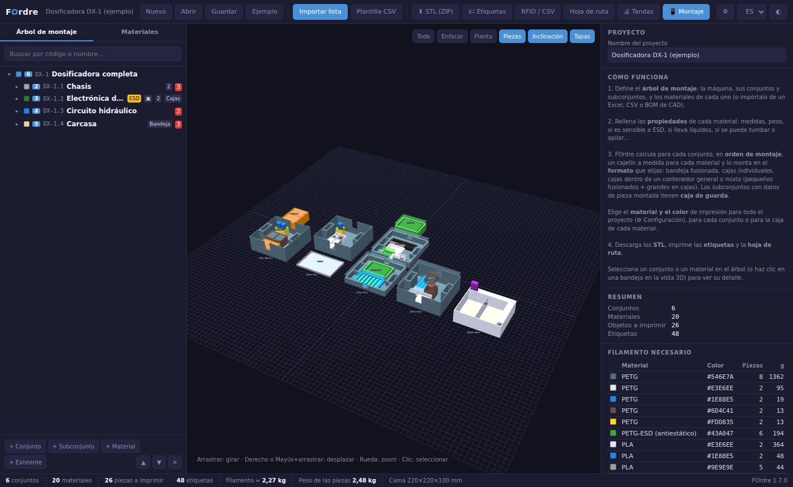

La pantalla tiene tres partes:

- **A la izquierda**, el **árbol de montaje** (pestaña *Árbol de montaje*) y la lista de **materiales** (pestaña *Materiales*).
- **En el centro**, la **vista 3D** de todas las cajas, ordenadas por paso.
- **A la derecha**, la **ficha** de lo que tienes seleccionado. Sin selección, salen el proyecto, el resumen y el filamento necesario.

En la barra de arriba están: **Nuevo**, **Abrir**, **Guardar**, **Ejemplo**, **Importar lista**, **Plantilla CSV**, **⬇ STL (ZIP)**, **🏷 Etiquetas**, **RFID / CSV**, **Hoja de ruta**, **🖨 Tandas**, **📱 Montaje**, **🏭 Taller** (solo con el servidor), **⚙ Configuración** (en pantallas justas, solo el icono ⚙), el selector de idioma **CA / ES / EN** y **◐** (tema claro u oscuro).

### 5.1 Importar la lista

1. Pulsa **Importar lista**.
2. Elige el archivo, o pruébalo con **📄 Lista de piezas (CSV)** o **📐 BOM de CAD**.
3. Revisa el **Formato de la lista** (*FOrdre / Excel* o *BOM de CAD indentada*), las **Unidades de medida** y las de **peso**.
4. Revisa la **Correspondencia de columnas**: cada campo de FOrdre con la columna de tu archivo. Si alguna no se ha reconocido, elígela tú.
5. Abajo verás **cuántos conjuntos y materiales** se leerán, los avisos y los **cambios respecto al proyecto actual**.
6. Elige **Añadir / actualizar** (mantiene lo que ya hay y actualiza lo que coincide) o **Sustituir el proyecto**.
7. Pulsa **Importar**.

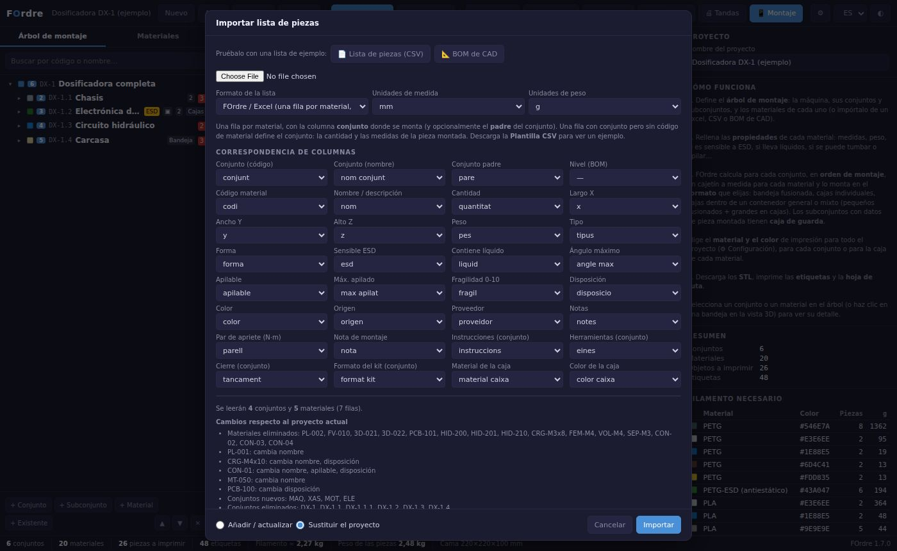

Con una BOM de CAD, el diálogo reconoce la columna de nivel:

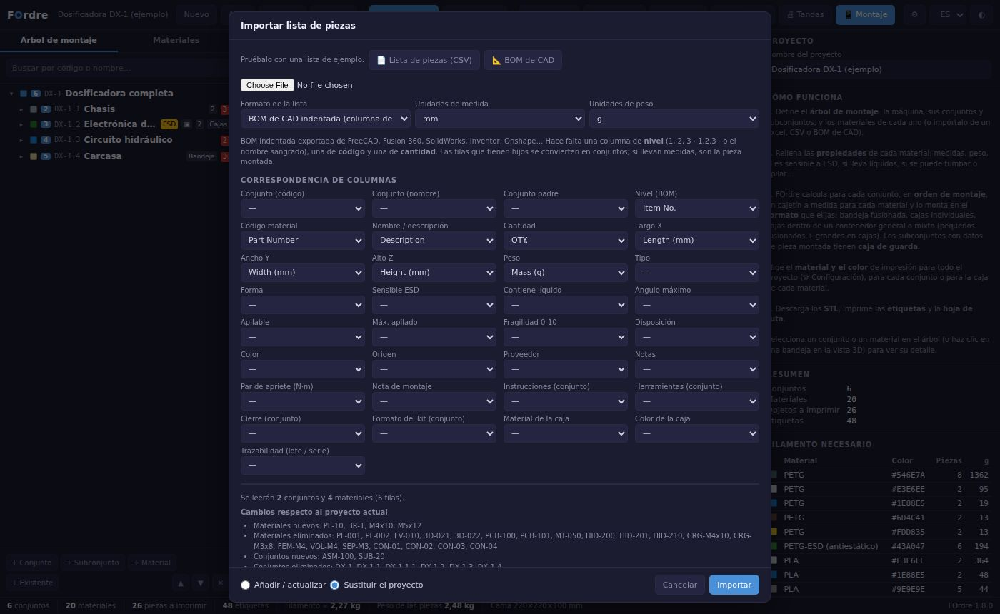

> Las listas de ejemplo que vienen con FOrdre tienen los nombres de las piezas en catalán: son datos, y se muestran tal como están escritos.

### 5.2 Ver las cajas generadas

Después de importar, FOrdre calcula las cajas y las muestra en 3D. Toca un conjunto en el árbol y se resaltan sus cajas.

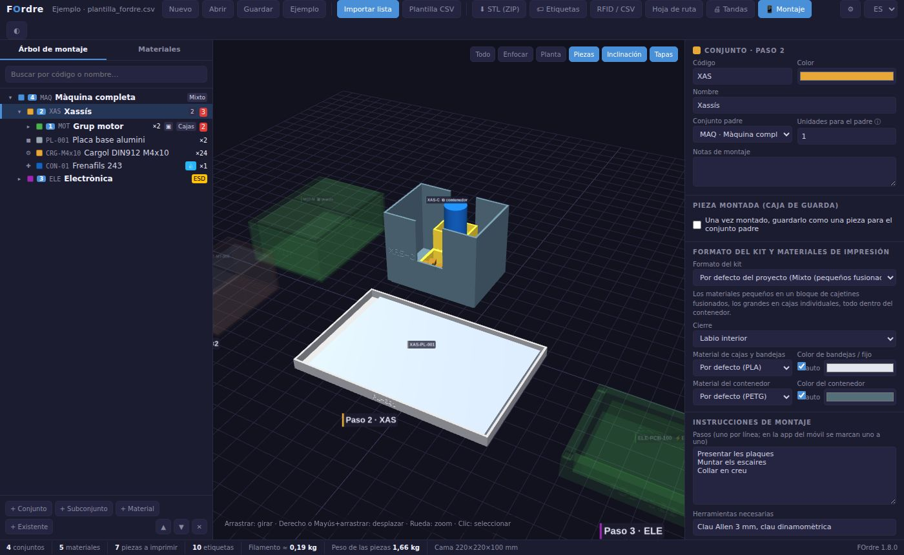

**Controles de la vista 3D:**

| Acción | Cómo |
|---|---|
| Girar | Arrastra con el botón izquierdo. |
| Desplazar | Arrastra con el botón derecho, o con Mayús + botón izquierdo. |
| Zoom | Rueda del ratón. |
| Seleccionar | Clic sobre una caja. |
| Verlo todo / enfocar la selección | Botones **Todo** y **Enfocar**, o teclas `Inicio` y `F`. |
| Vista desde arriba | Botón **Planta**. |
| Mostrar u ocultar las piezas, la inclinación o las tapas | Botones **Piezas**, **Inclinación** y **Tapas**. |

**Marcas en el árbol:** el número azul es el paso de montaje; `ESD` indica piezas sensibles a la estática; `▣` quiere decir que tiene caja de guarda; *Cajas* o *Bandeja* indican el formato; el número rojo son los avisos.

### 5.3 Ajustar un material

Toca un material en el árbol (dentro de su conjunto) o en la pestaña *Materiales*.

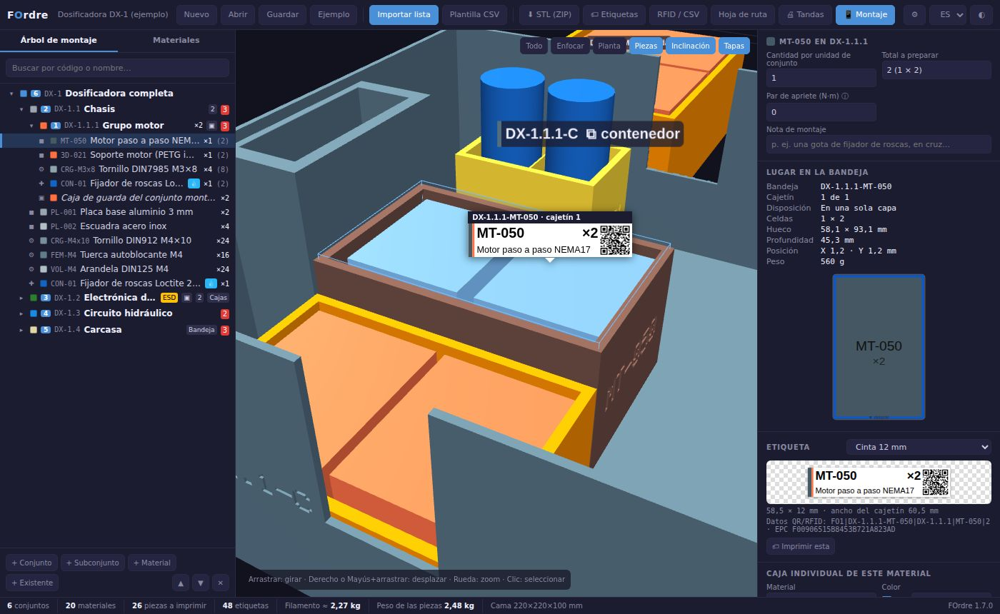

La ficha tiene estas partes:

- **Dentro de este conjunto:** *Cantidad por unidad de conjunto* (y el *Total a preparar*), *Par de apriete (N·m)* y *Nota de montaje*.
- **Lugar en la bandeja:** en qué caja va, disposición, celdas, tamaño del hueco y profundidad.
- **Etiqueta:** el formato (para todo el proyecto), una vista previa, los datos del QR/RFID e **Imprimir esta**.
- **Caja individual de este material:** material y color de su caja (en formatos con cajas).
- **Forma real de la pieza (nido a medida):** carga el **STL** de la pieza y el fondo de la celda tendrá su forma. Es ideal para placas con componentes y piezas curvadas o frágiles.
- **Material:** código, nombre, tipo, forma, medidas (X, Y, Z en mm), peso (g/unidad), color, disposición, inclinación máxima, fragilidad, máximo de unidades apiladas, origen, proveedor y las casillas *Sensible a la electricidad estática (ESD)*, *Contiene líquidos / fluidos* y *Se puede apilar*.

**Ejemplo:** el motor NEMA17 (`MT-050`) va en una sola capa, con 2 celdas (una para cada grupo motor), dentro del contenedor `DX-1.1.1-C`.

### 5.4 Ajustar un conjunto

Toca un conjunto en el árbol.

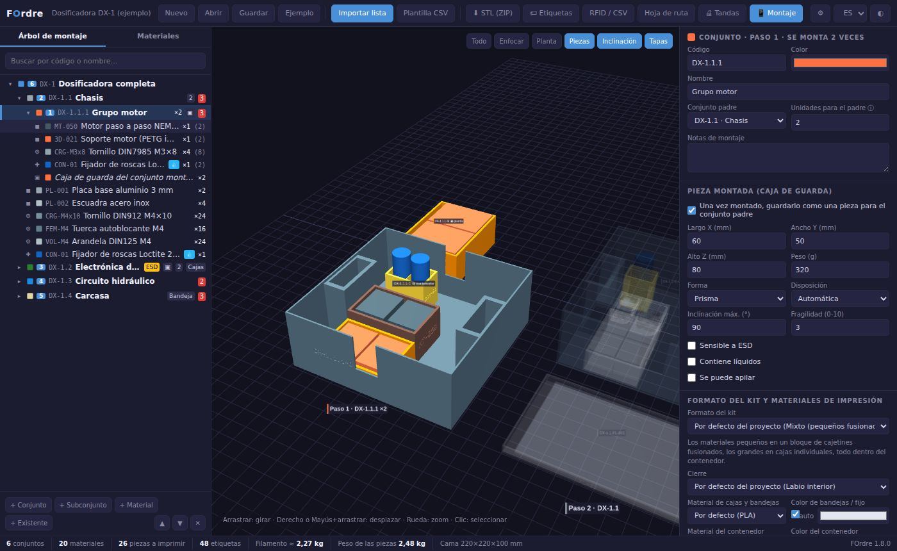

- **Código, color, nombre, conjunto padre** y **unidades para el padre** (por ejemplo, el chasis lleva 2 grupos motor).
- **Pieza montada (caja de guarda):** marca *Una vez montado, guardarlo como una pieza para el conjunto padre* y pon sus medidas.
- **Formato del kit y materiales de impresión:** formato, cierre, material y color de las cajas y del contenedor. *Por defecto del proyecto* usa lo que hay en ⚙ Configuración.
- **Instrucciones de montaje:**
  - *Pasos*, uno por línea: en la app del móvil se marcan uno a uno.
  - *Herramientas necesarias*.
  - *Imagen de referencia* (el resultado esperado).
- **Bandejas, cajas y contenedores:** cada objeto a imprimir, con el tamaño, los gramos de filamento, los botones para descargar su **STL** e imprimir sus **etiquetas**. También salen los avisos, por ejemplo *«sobresale 5 mm del cajetín»*.

Con los botones **+ Conjunto**, **+ Subconjunto**, **+ Material**, **+ Existente** (un material que ya está), **▲ ▼** (mover) y **✕** (eliminar) se puede editar el árbol a mano.

### 5.5 Lista de todos los materiales

La pestaña **Materiales** muestra todos los materiales de la máquina con el total de cada uno. Desde aquí se pueden editar y exportar en CSV.

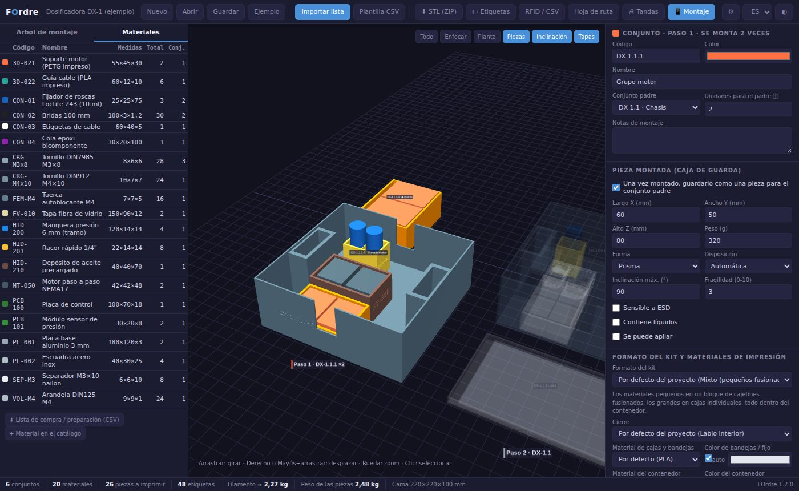

### 5.6 Descargar e imprimir

**Las cajas (STL y 3MF)**

- **⬇ STL (ZIP):** todas las bandejas, cajas, contenedores, tapas y cuñas, en un ZIP. Lleva un `LEEME.txt` con el filamento necesario. El nombre de cada archivo lleva el paso, el objeto, el material y el color, por ejemplo `01_DX-1.1.1-C_PETG_546E7A.stl`.
- **🖨 Tandas:** agrupa todas las piezas por **material y color** y las coloca en la cama, con los gramos y las horas estimadas. Cada tanda se descarga en **3MF** con las piezas posicionadas, lista para abrir en el programa de laminado.

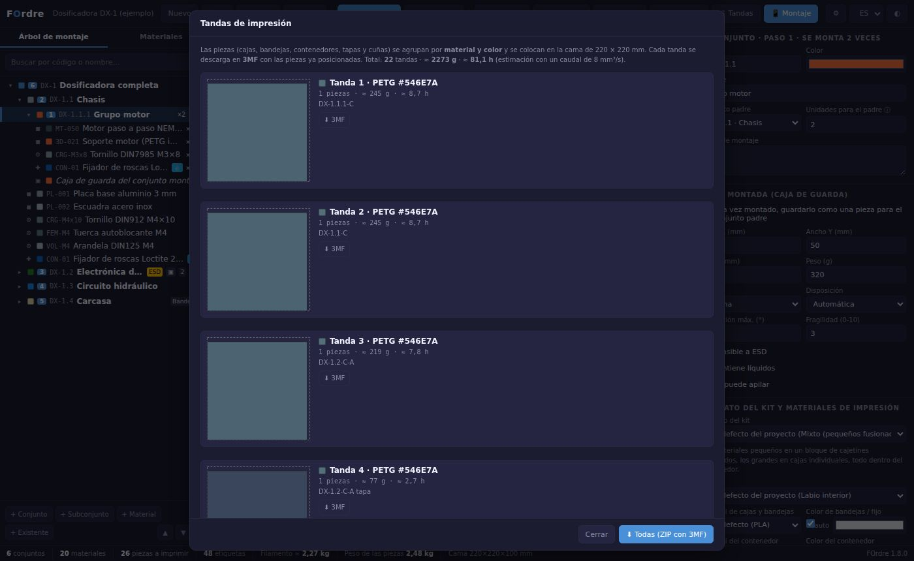

Consejos de impresión:

- Imprime las cajas **sin soportes**: los labios y las asas están pensados para imprimirse a 45°.
- Relleno del 10–15 % y 2–3 perímetros son suficientes.
- Las cajas ESD, con filamento antiestático.
- Con tapas a presión, imprime primero la pieza de calibración (punto 3.2).

**Las etiquetas**

- **🏷 Etiquetas** abre todas las etiquetas del proyecto, listas para imprimir. Desde la ficha de un conjunto o de un material se pueden imprimir solo las suyas.

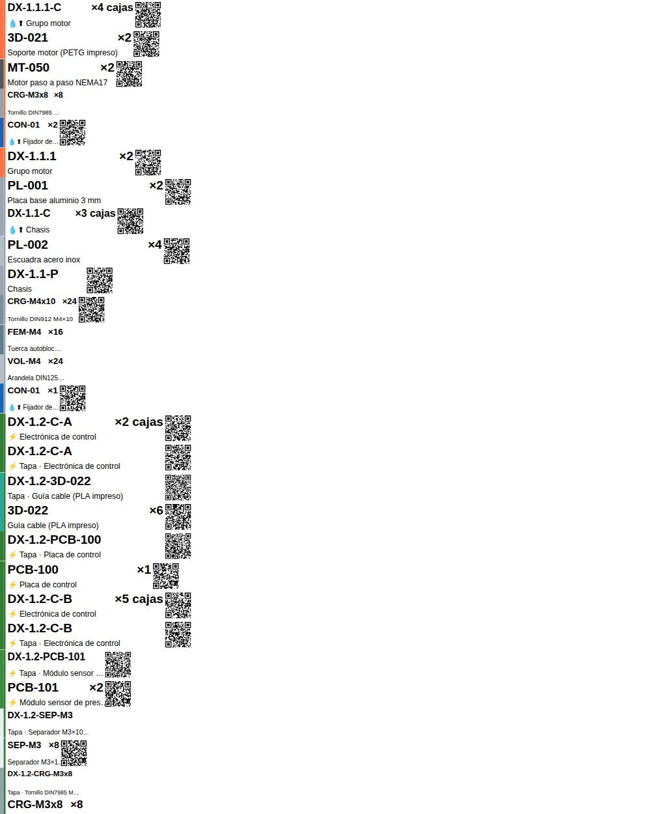

- **RFID / CSV:** un CSV con los datos de cada etiqueta y un EPC de 96 bits, para grabadoras RFID. Con Chrome para Android, las etiquetas NFC se pueden escribir directamente.

**La hoja de ruta**

- **Hoja de ruta:** documento imprimible con los pasos, los subconjuntos que hay que tener montados, el mapa de cada bandeja y la lista de comprobación.

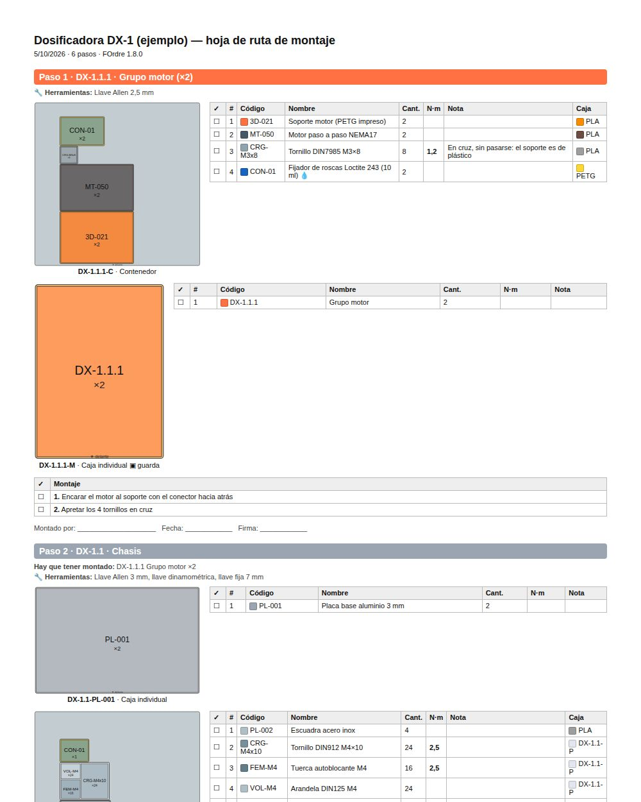

### 5.7 Montar las cajas

1. Imprime todas las tandas.
2. Pega en cada caja (y en cada tapa) su etiqueta. El código grabado en relieve te indica dónde va cada una.
3. Con tapa de imanes: pega los imanes con una gota de cianoacrilato, **vigilando la polaridad** (pruébala antes con la tapa).
4. Coloca las cajas dentro del contenedor siguiendo el mapa de la hoja de ruta.

### 5.8 Cuando cambia la lista de materiales (revisiones)

Vuelve a importar la lista (modo *Añadir / actualizar*). Antes de importar, FOrdre muestra **qué ha cambiado** (materiales nuevos o eliminados, medidas, cantidades) y **qué cajas hay que volver a imprimir**. Cada revisión queda en la ficha del proyecto, en *Revisiones de la lista de materiales*.

### 5.9 Guardar y abrir

- **Guardar** descarga el proyecto en un archivo `.fordre.json`. Guárdalo con la documentación de la máquina.
- **Abrir** carga un `.fordre.json`.
- El navegador guarda una copia automática, pero **no te fíes solo de esta copia**: guarda el archivo.

### 5.10 Pasar el proyecto al taller

**Con el servidor del taller (recomendado)**

1. Abre el configurador desde el servidor: `https://<servidor>:8443/index.html`.
2. Pulsa **🏭 Taller** y entra como Responsable (nombre y PIN).
3. Pulsa **⬆ Publicar este proyecto**.
4. Crea una **orden** (con el número de serie, si lo tiene) con **+ Nueva orden**.
5. Desde el mismo diálogo verás el estado de cada paso en directo y podrás abrir el **📄 Informe de la orden**.

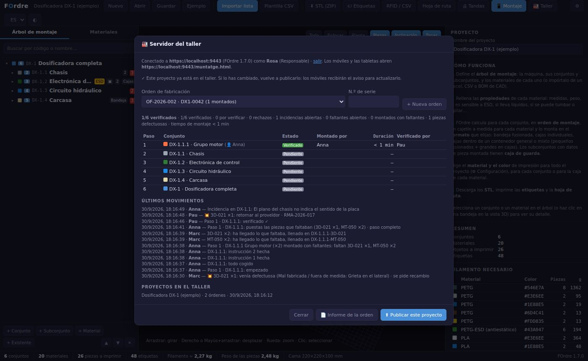

Si modificas el proyecto, vuelve a publicarlo: los móviles recibirán el aviso para actualizarlo (el punto de estado se convierte en ⟳).

**Sin servidor**

Pulsa **📱 Montaje**. Puedes pasar el proyecto de estas maneras:

- con un **QR** que se escanea con el móvil;
- con un **enlace** para enviar;
- con un **archivo** `.fordre.json` (en la app: menú ⋮ › *Abrir archivo de proyecto*).

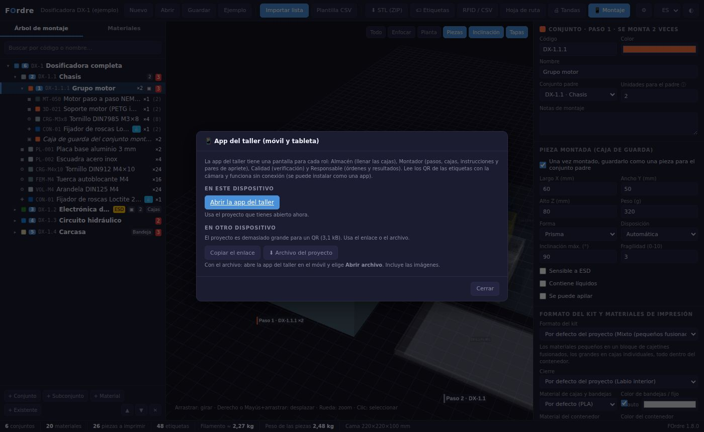

---

## 6. La app del taller paso a paso

### 6.1 Entrar y elegir el rol

1. Abre la app (`https://<servidor>:8443/muntatge.html`, o el acceso directo de tu rol).
2. Toca tu nombre. Debajo de la lista puedes cambiar el **idioma**.
3. Escribe el PIN con el teclado y pulsa **✓**.

| Elige el nombre | Escribe el PIN |
|---|---|
| 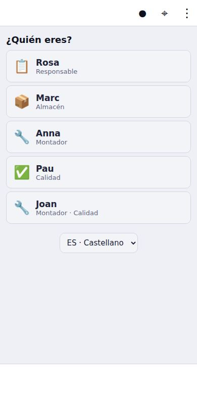 | 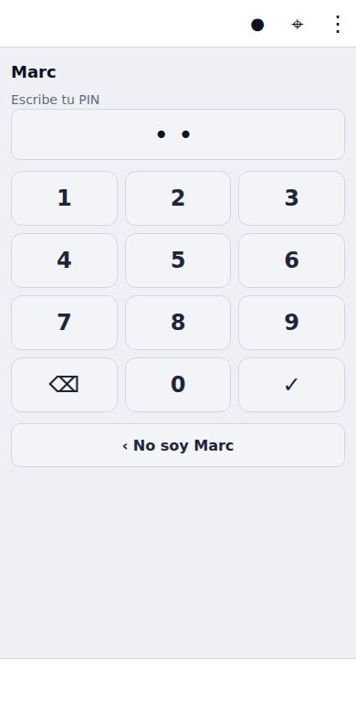 |

**La cabecera**, de izquierda a derecha:

- **Código de la orden** (por ejemplo, `OF-2026-002`): tócalo para cambiar de orden. Si sale 🔒, la orden está cerrada.
- **Rol**: tócalo para cambiar de rol (si tienes más de uno).
- **Punto de estado:**
  - 🟢 conectado;
  - 🟠 hay cambios por enviar;
  - 🔴 sin conexión (se guarda todo y se envía al volver);
  - ⟳ el proyecto se ha actualizado (tócalo para cargarlo).
- **⌖** abre el escáner.
- **⋮** es el menú: idioma, cambiar de persona, servidor, proyectos, instalar la app…

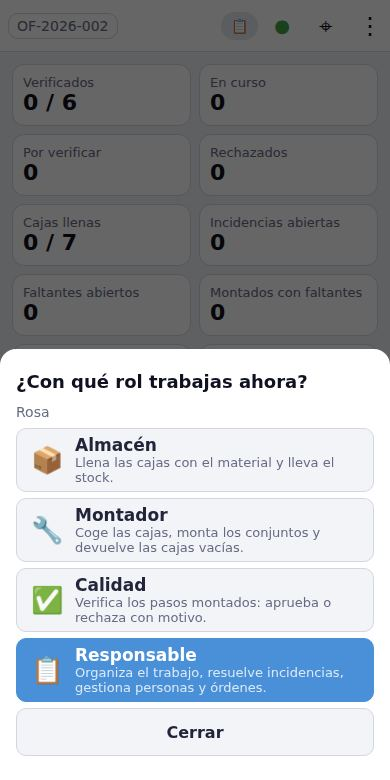

En la parte de abajo están las **pestañas de tu rol**. El número entre paréntesis indica cuántas cosas hay pendientes (faltantes, incidencias, defectos).

### 6.2 📋 Responsable: preparar la orden

**Crear una orden de fabricación.** Pestaña **Órdenes**:

1. El código se pone solo (`OF-2026-002`); lo puedes cambiar.
2. Escribe el **número de serie** (`DX1-0042`) y unas **notas** (por ejemplo, *Cliente: Laboratorios Vallès*).
3. Pulsa **+ Crear la orden y empezar**.

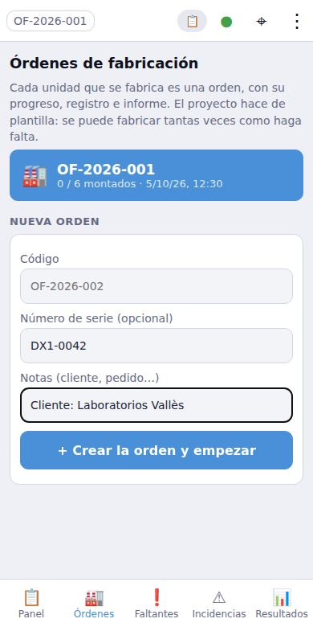

Un aparato que entra por primera vez se pone en la orden **más reciente**; después, cada aparato recuerda la última orden en la que ha trabajado. Para cambiar de orden, toca el código en la cabecera.

**Asignar pasos.** En el **Panel**, en cada paso, elige la persona en *Asignado a*. El montador lo verá marcado con 👤 y el botón *Continuar* le propondrá primero los suyos.

### 6.3 📦 Almacén: llenar las cajas

**Pestaña Llenar.** Muestra las cajas de la orden por paso, con su estado: *Vacía*, *Llenándose*, *Llena*, *Con faltantes*, *En uso* o *Devuelta*.

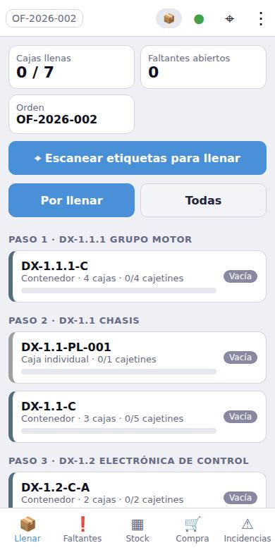

1. Toca una caja (o escanea su etiqueta con **⌖**).
2. Para cada cajetín, **pon el material** y tócalo, o escanea la etiqueta del cajetín. Queda marcado en verde y el material sale del stock.
3. **Llenarlo todo** marca todos los cajetines de una vez (salvo los faltantes).
4. Tocar un cajetín ya lleno lo **vacía** (el material vuelve al stock).

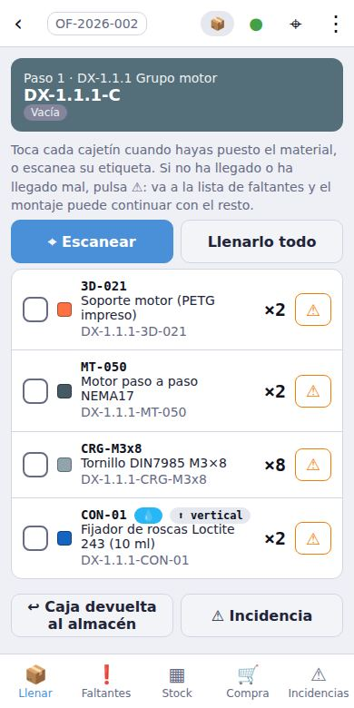

**Cuando hay un problema con un material: botón ⚠**

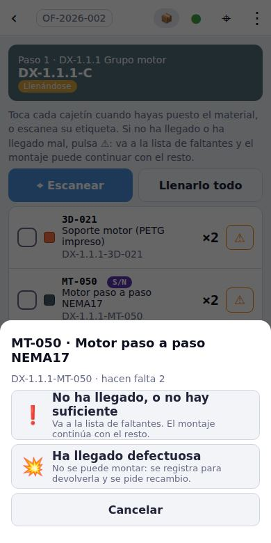

- **❗ No ha llegado, o no hay suficiente:** la app pregunta **cuántos has podido poner** (0 si no ha llegado ninguno) y una **nota** opcional (proveedor, fecha prevista…). El resto queda como **faltante**.
- **💥 Ha llegado defectuosa:** se abre el formulario de pieza defectuosa (vea el [punto 6.6](#66-piezas-defectuosas-o-rotas)).

**Cuando llega el material que faltaba:** escanea la etiqueta del cajetín (o tócalo y confirma que *ha llegado*). El cajetín se completa, el faltante se cierra solo y el montador lo verá.

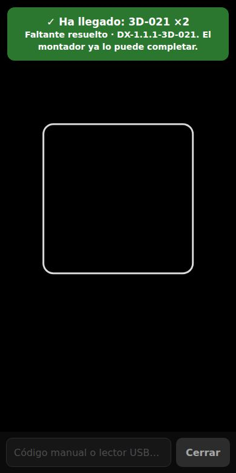

**Pestaña Faltantes.** Todo lo que falta, agrupado por material: cuántos, para qué paso y caja, desde cuándo, proveedor y nota. Botones **Copiar**, **Compartir** y **⬇ CSV** para enviarlo a compras. También está el acceso a las **piezas defectuosas** y a las devoluciones.

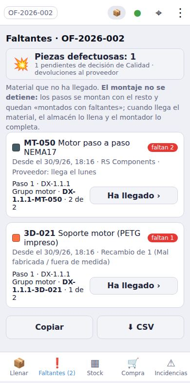

**Pestaña Stock.** *Hace falta* es lo que todavía falta poner en las cajas; *Tengo* es el stock. Los botones **−** y **+** suman o restan una unidad, y escribir un número hace un **recuento**.

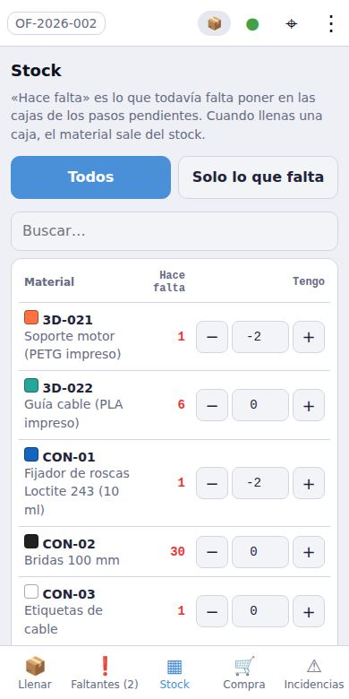

**Pestaña Compra.** Lo que hay que comprar para acabar la orden, agrupado por proveedor. Los faltantes salen marcados como **❗ urgentes**.

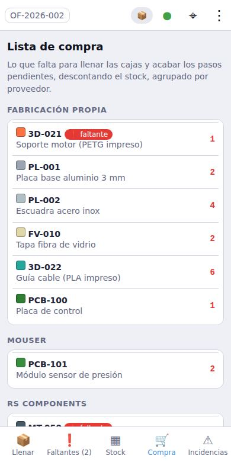

**Devolver las cajas.** Cuando una caja vuelve vacía y limpia al almacén, ábrela y pulsa **↩ Caja devuelta al almacén**. También lo puede hacer el montador.

### 6.4 🔧 Montador: montar

**Pestaña Pasos.** Los pasos en orden de montaje, con su estado. Un paso queda bloqueado hasta que sus subconjuntos están montados (aunque sea con faltantes). **Continuar** lleva al siguiente que te toca.

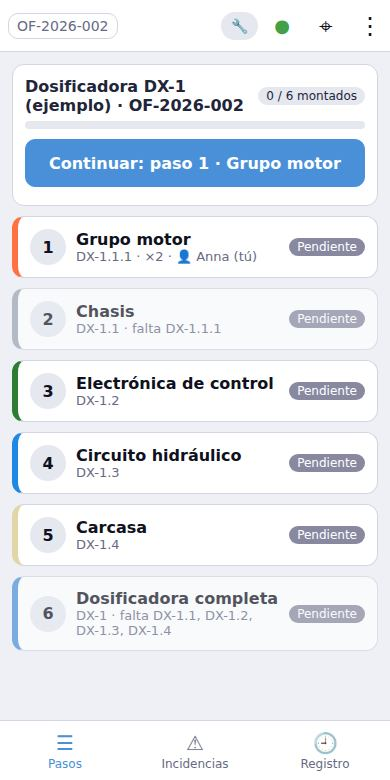

**Dentro de un paso**, de arriba abajo:

1. **Avisos:** rechazado por Calidad (con el motivo), piezas que no han llegado, cajas que el almacén todavía no ha llenado…
2. **1 · Preparación: coge las cajas.** Toca cada cajetín cuando lo cojas, o pulsa **⌖ Escanear etiquetas**. Si escaneas una etiqueta de otro paso, la app avisa con un sonido y te dice de qué paso es. Los cajetines de piezas que no han llegado salen en naranja y no hace falta cogerlos.
3. **2 · Montaje:** **▶ Empezar el paso** (cuenta el tiempo), herramientas, imagen de referencia, **instrucciones** con casilla para marcarlas una a una, y **pares de apriete**.
4. **Fotos**, **⚠ Incidencia** y **💥 Pieza rota o defectuosa**.
5. **3 · Final:** dónde se guarda el conjunto montado (caja de guarda) y **✓ Marcar el paso como montado**.
6. Después de montarlo: **↩ Devolver las cajas vacías al almacén**.

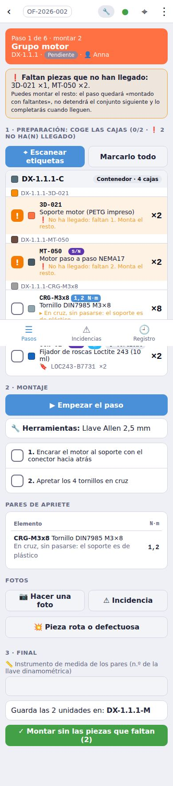

**Montar con faltantes.** Si falta alguna pieza, el botón dice **✓ Montar sin las piezas que faltan**. El paso queda **«Montado con faltantes»** y **no bloquea el conjunto siguiente**: se puede continuar con el resto de la máquina. Cuando llega el material, el paso dice *«Ya han llegado…»* y el botón **✓ Completar** queda activo.

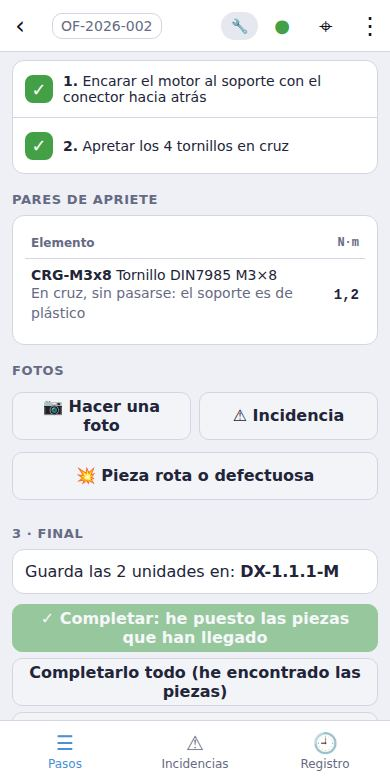

**Completarlo todo (he encontrado las piezas)** sirve cuando las piezas que faltaban se han encontrado por otro camino. La app pide confirmación.

**Deshacer «montado»** devuelve el paso al estado anterior (por ejemplo, si te has equivocado de paso). No se puede hacer si Calidad ya lo ha verificado.

### 6.5 ✅ Calidad: verificar

**Pestaña Verificar.** Los pasos se muestran en cuatro grupos:

- **por verificar**;
- **montados con faltantes** (todavía no se pueden aprobar);
- **rechazados**;
- **verificados**.

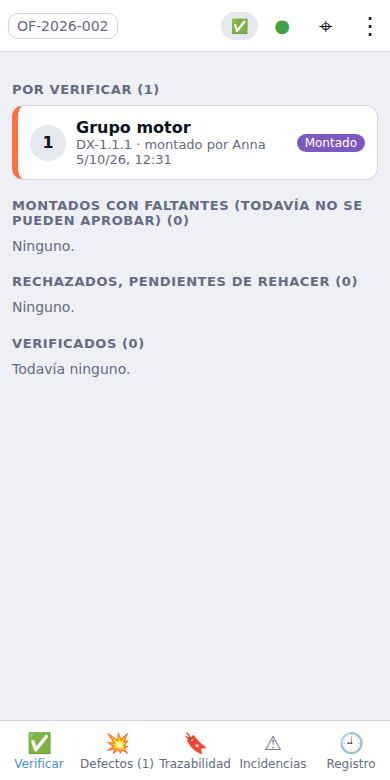

1. Toca un paso. Verás quién lo ha montado, cuándo y cuánto ha tardado, y los rechazos anteriores.
2. Revisa la **lista de comprobación**, elemento por elemento:
   - cada instrucción;
   - cada par de apriete;
   - que estén todas las piezas;
   - que no haya daños ni restos.
3. Haz **fotos** si hace falta.
4. Pulsa **✓ Aprobar**, que se activa cuando todo está marcado. O bien escribe el **motivo** y pulsa **✗ Rechazar y devolverlo al montador**.

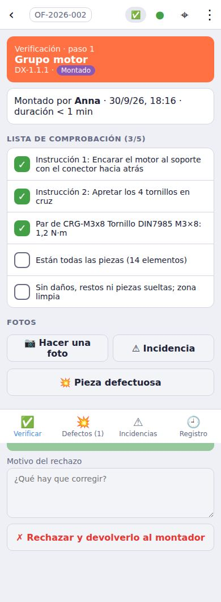

- Si has montado tú el paso, la app no te deja verificarlo (cuatro ojos).
- Si el paso tiene piezas pendientes (faltantes), **no se puede aprobar** hasta que el montador lo complete.
- Las casillas que has marcado se conservan si sales y vuelves.

### 6.6 Piezas defectuosas o rotas

Una pieza puede llegar mal (la detecta el **Almacén**, con el botón ⚠ del cajetín) o romperse o estropearse al montar (el **Montador** o **Calidad**, con **💥 Pieza rota o defectuosa**).

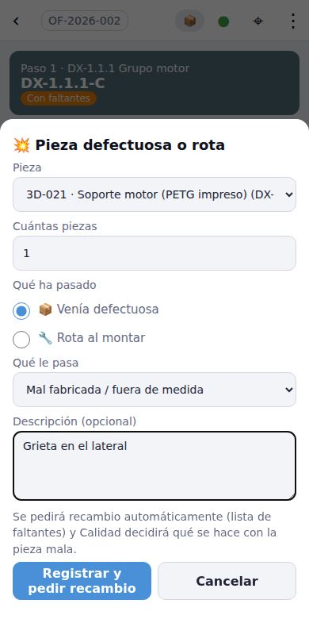

1. Elige la **pieza** (si el paso tiene varias) y **cuántas** son.
2. Elige **qué ha pasado**:
   - **📦 Venía defectuosa**: es responsabilidad del proveedor;
   - **🔧 Rota al montar**: ha pasado en el taller.
3. Elige **qué le pasa**:
   - rota;
   - mal fabricada o fuera de medida;
   - dañada en el transporte;
   - pieza equivocada;
   - rayada o con golpes;
   - otros.
4. Añade una **descripción** (por ejemplo, *«Grieta en el lateral»*).
5. Pulsa **Registrar y pedir recambio**.

Qué pasa a continuación:

- La pieza mala **sale de la caja** y no vuelve al stock.
- **Se pide recambio**: queda como faltante, sale urgente en la compra y el taller **no se detiene**.
- Si el paso ya estaba montado (o verificado), **vuelve a quedar pendiente** de esta pieza y habrá que volver a verificarlo.
- Cuando llega el recambio, se hace como con cualquier faltante: el Almacén lo escanea, el Montador pulsa *Completar* y Calidad lo verifica.

**Calidad decide qué se hace con la pieza mala.** Pestaña **💥 Defectos**:

| Decisión | Cuándo |
|---|---|
| ↩ Devolver al proveedor | Venía defectuosa. En la nota, el número de devolución (por ejemplo, `RMA-2026-017`). |
| 🗑 Chatarra | No tiene arreglo. |
| 🛠 Reparar / recuperar | Se puede arreglar. |
| ✓ Aceptar tal como está | Se puede usar igualmente. Si la vuelves a poner en la caja, el Almacén tiene que pulsar *Ha llegado* para cerrar el recambio. |

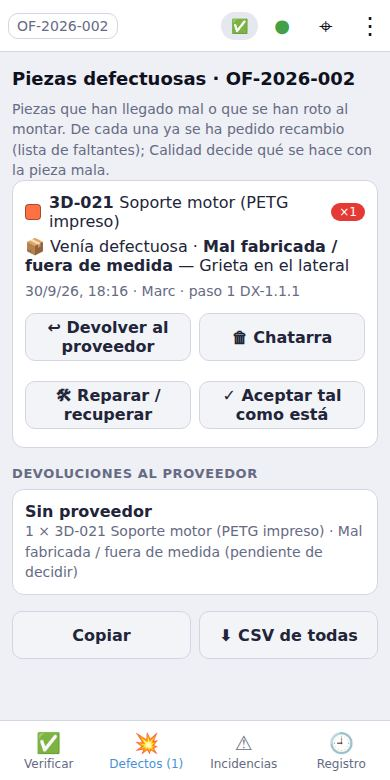

Debajo está la **lista de devoluciones por proveedor**, con los botones **Copiar**, **Compartir** y **⬇ CSV** para enviarla.

### 6.7 Incidencias

Cualquier persona puede abrir una incidencia desde la pestaña **Incidencias**, o con el botón **⚠ Incidencia** de un paso o de una caja:

1. Elige el **paso** (o *General*).
2. Describe **qué pasa**, por ejemplo *«El plano del chasis no indica el sentido de la placa»*.
3. Elige la **gravedad**: baja, media o alta (detiene el montaje).
4. Pulsa **Guardar**.

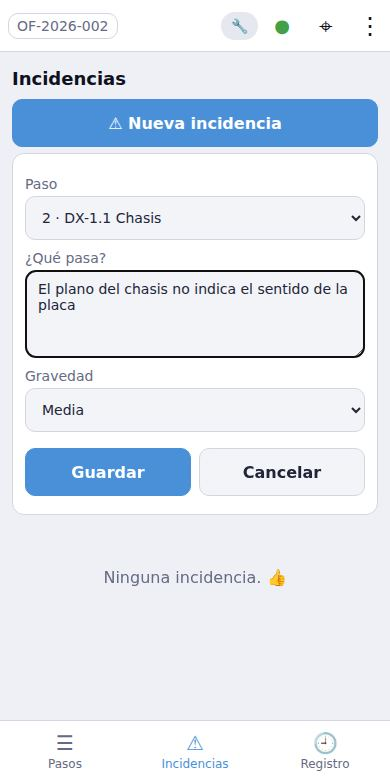

Calidad y el Responsable la marcan como **resuelta**, con una explicación.

### 6.8 📋 Responsable: seguimiento, resultados y cierre

**Panel.** El estado de la orden de un vistazo:

- verificados, en curso, por verificar, rechazados;
- cajas llenas, incidencias, faltantes, montados con faltantes, piezas defectuosas y defectos por decidir;
- cada paso, con quién lo ha montado, cuánto ha tardado, quién lo ha verificado y a quién está asignado.

Botones: **👥 Personas**, **📊 Resultados**, **💥 Defectos** y **🔒 Cerrar la orden**.

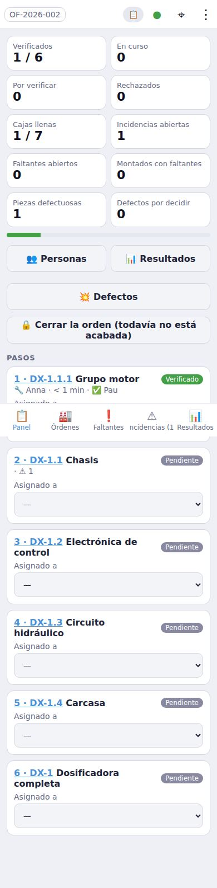

**Resultados.** Los indicadores de la orden:

- estado;
- verificados;
- **bien a la primera** (pasos aprobados sin ningún rechazo);
- rechazos;
- tiempo de montaje;
- incidencias;
- lo que ha hecho cada persona.

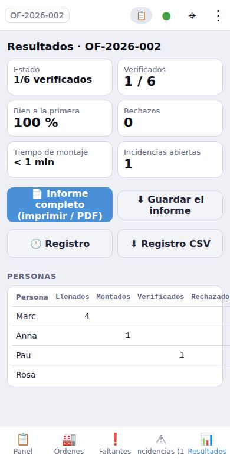

**📄 Informe completo** abre el informe de la orden, listo para imprimir o guardar en PDF (en el diálogo de imprimir, elige *Guardar como PDF*). Sale en el idioma de quien lo abre y lleva:

- la cabecera con la orden, el número de serie y la versión del proyecto;
- los indicadores;
- los pasos, con quién los ha hecho y cuánto han tardado;
- los rechazos y las incidencias;
- las **piezas defectuosas** con la decisión tomada;
- los **faltantes** con cuándo llegaron;
- el material movido;
- las personas;
- el **registro de trazabilidad** completo;
- el espacio para firmar.

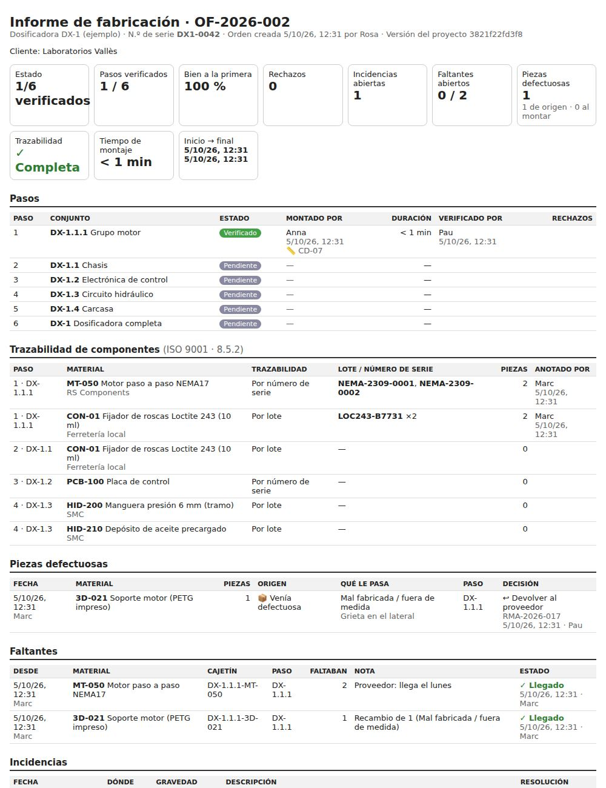

**Cerrar la orden.** En el Panel, **🔒 Cerrar la orden**. Si quedan pasos por verificar, faltantes o defectos por decidir, la app lo avisa antes. Una orden cerrada **solo se puede consultar**. Si hace falta, se puede **🔓 Reabrir**.

**Fabricar otra unidad.** Crea una **orden nueva** (punto 6.2). El proyecto es el mismo; el progreso empieza de cero.

### 6.9 Trabajar sin conexión

Si un aparato pierde la Wi-Fi, el punto de la cabecera se pone 🔴 y la app **sigue funcionando**:

- Todo lo que haces se guarda en el aparato, con tu nombre, y se envía solo cuando vuelve la conexión.
- Las fotos se guardan en el aparato (con un borde de puntos naranja) y se suben solas.
- Si dos personas han trabajado a la vez, no se pisan: cada acción se aplica una sola vez y el stock se suma.
- Si al volver el servidor rechaza alguna acción (por ejemplo, porque la orden se ha cerrado), la app avisa con el motivo.

### 6.10 Sin servidor (un aparato solo)

- Abre `muntatge.html` y toca **Proyecto de ejemplo**, o abre el archivo `.fordre.json` del configurador (menú ⋮ › *Abrir archivo de proyecto*).
- La primera vez, la app pregunta **tu nombre** (sale en el registro) y el **rol**. Se puede cambiar de rol en cualquier momento tocándolo en la cabecera.
- Todo se guarda en ese aparato. Desde el menú ⋮ se puede **exportar el progreso** (JSON) para guardarlo o pasarlo a otro aparato.

---

## 7. Casos prácticos

### 7.1 Falta material al llenar las cajas

> Marc llena el contenedor del Grupo motor. Los motores NEMA17 no han llegado.

1. **Marc (Almacén):** en la caja `DX-1.1.1-C`, en el cajetín `MT-050`, pulsa **⚠** › **No ha llegado** › *¿Cuántos has podido poner?* `0` › nota `Proveedor: llega el lunes`. Llena el resto con **Llenarlo todo**.
2. **Marc:** en **Faltantes**, pulsa **Compartir** y envía la lista a compras.
3. **Anna (Montadora):** en el paso *Grupo motor* ve *«Faltan piezas que no han llegado: MT-050 ×2»*. Monta el resto y pulsa **✓ Montar sin las piezas que faltan**. El paso queda *Montado con faltantes* y el *Chasis* ya se puede empezar.
4. **El lunes, Marc:** escanea la etiqueta del cajetín `MT-050`. La app dice *«Ha llegado · Faltante resuelto»*.
5. **Anna:** en el paso *Grupo motor*, pulsa **✓ Completar**.
6. **Pau (Calidad):** verifica y aprueba el paso.

### 7.2 Llega una pieza defectuosa

> Uno de los soportes impresos `3D-021` llega agrietado.

1. **Marc:** cajetín `3D-021` › **⚠** › **Ha llegado defectuosa** › 1 pieza › *Venía defectuosa* › *Mal fabricada / fuera de medida* › descripción *«Grieta en el lateral»* › **Registrar y pedir recambio**.
2. Se pide el recambio y el paso se puede montar con el resto.
3. **Pau:** en **Defectos**, pulsa **↩ Devolver al proveedor** con la nota del número de devolución.
4. Cuando llega el recambio, se completa como en el caso 7.1.

### 7.3 Se rompe una pieza al montar

> Al apretar, a Anna se le pasa la rosca de 2 tornillos M3×8.

1. **Anna:** en el paso › **💥 Pieza rota o defectuosa** › elige `CRG-M3x8` › 2 › *Rota al montar* › *Rota* › *«Rosca pasada al apretar»* › **Registrar y pedir recambio**.
2. Si el paso ya estaba montado, vuelve a quedar pendiente de los 2 tornillos.
3. **Pau:** decide **🗑 Chatarra**.
4. **Marc:** pone 2 tornillos nuevos en la caja (escaneando la etiqueta).
5. **Anna:** **✓ Completar**. **Pau:** verifica.

### 7.4 Calidad rechaza un paso

1. **Pau:** en la verificación, escribe el motivo (*«Falta la arandela del motor izquierdo»*) y pulsa **✗ Rechazar**.
2. **Anna:** el paso sale en rojo con el motivo. Lo corrige y vuelve a pulsar **✓ Marcar el paso como montado**.
3. **Pau:** lo vuelve a verificar. En el informe, este paso no contará como *bien a la primera*.

### 7.5 Ha cambiado la lista de materiales y hay órdenes en marcha

1. **Rosa:** importa la lista nueva en el configurador. Revisa los cambios y qué cajas hay que volver a imprimir.
2. Imprime las cajas nuevas y vuelve a **publicar** el proyecto.
3. Los móviles muestran ⟳: hay que tocarlo para cargar el proyecto nuevo.
4. El informe de las órdenes creadas antes avisará de que *el proyecto se ha modificado después de crear la orden*. Es una buena práctica acabar las órdenes en marcha antes de cambiar el proyecto, o abrir otras nuevas.

### 7.6 Varias personas con la misma tableta

Menú ⋮ › **👤 Cambiar de persona**. Si hay cambios sin enviar, la app lo avisa. Los cambios de cada persona se envían con su nombre aunque ya haya entrado otra.

### 7.7 Alguien se va o se pierde un móvil

**Rosa:** Panel › Personas › la persona › **Dar de baja**. Sus sesiones se cierran en todos los aparatos.

### 7.8 Un equipo que trabaja en varios idiomas

> Marc prefiere trabajar en castellano, Anna en catalán y un técnico de mantenimiento externo, en inglés.

1. Cada uno elige su idioma en su aparato (menú ⋮ › **Idioma**), o se le prepara un acceso directo con `&lang=es`, `&lang=ca` o `&lang=en`.
2. Todos trabajan sobre la misma orden. El **registro**, los estados y los avisos salen a cada uno en su idioma.
3. El informe de la orden sale en el idioma de quien lo abre. Las notas y los motivos escritos a mano se muestran tal como se escribieron.

---

## 8. Resolución de problemas

| Qué pasa | Por qué | Qué hacer |
|---|---|---|
| El móvil no abre la app del servidor. | No está en la misma Wi-Fi, o la dirección no es correcta. | Conéctalo a la Wi-Fi del taller y abre la dirección que muestra el servidor (o escanea el QR). |
| Sale un aviso de seguridad del navegador. | El certificado del taller no está instalado. | Instálalo (punto 2.7) o acepta el aviso (*Configuración avanzada › Continuar*). |
| Todo iba bien y de repente sale el aviso de seguridad en todos los móviles. | El servidor ha cambiado de IP y ha hecho un certificado nuevo. | Instala el certificado nuevo en cada aparato y da una IP fija al servidor (punto 2.4, paso 5). |
| El escáner dice *«No se puede abrir la cámara»*. | Falta el permiso de cámara, o no es una conexión segura. | Da permiso de cámara al navegador. Abre la app por `https`, no por `http` ni con doble clic. |
| El escáner no lee el QR. | Poca luz, demasiado cerca o etiqueta pequeña. | Aléjate un poco, da más luz, o escribe el código a mano en la barra de abajo. |
| *«Etiqueta de otro proyecto o de una versión anterior»*. | La etiqueta es de una versión anterior del proyecto. | Vuelve a imprimir las etiquetas desde el configurador. |
| *«Nombre o PIN incorrectos»*. | PIN equivocado. | Vuelve a intentarlo. Después de 5 errores hay que esperar un minuto. El Responsable puede cambiar el PIN. |
| *«Tu rol no permite esta acción»*. | La persona no tiene el rol necesario. | El Responsable le añade el rol (Personas). |
| *«No puedes verificar un paso que has montado tú»*. | Regla de los cuatro ojos. | Que lo verifique otra persona de Calidad. |
| *«Faltan piezas: no se puede aprobar»*. | El paso está montado con faltantes. | El montador lo tiene que completar cuando lleguen las piezas. |
| El punto de la cabecera está 🟠 o 🔴 mucho rato. | El servidor no responde o el aparato no tiene Wi-Fi. | Comprueba la Wi-Fi y el servidor (`sudo systemctl status fordre`). Los cambios no se pierden. |
| *«Este proyecto no está en el servidor»*. | Se ha abierto un proyecto que no se ha publicado. | El Responsable lo tiene que publicar (🏭 Taller › Publicar). |
| El servidor no arranca: *«No es pot obrir el port 8443»*. | Hay otro programa en el puerto. | Detén el otro programa o cambia el puerto (`--port 9443`). |
| El configurador muestra una caja con un aviso *«sobresale»*. | La pieza es más alta que el cajetín. | Revisa las medidas del material, sube la *Profundidad máxima* o usa tapa (la tapa lleva un marco más alto). |
| Las bandejas son demasiado grandes para la impresora. | El tamaño de la cama no es el correcto. | ⚙ Configuración › Impresora 3D › Cama X / Cama Y. |
| Las tapas a presión van demasiado justas o demasiado flojas. | La holgura no está calibrada. | Imprime la pieza de calibración (punto 3.2). |
| La app sale en un idioma que no es el tuyo. | Se ha tomado el idioma del navegador. | Menú ⋮ › **Idioma** (en el configurador, el selector **CA / ES / EN**). El aparato lo recordará. |

---

## 9. Anexos

### 9.1 Estados

**Estados de un paso**

| Estado | Quiere decir |
|---|---|
| Pendiente | Todavía no se puede empezar o no se ha empezado. |
| Preparado | Los subconjuntos están montados y las cajas llenas. |
| En curso | Se ha empezado a montar. |
| Montado con faltantes | Montado, pero faltan piezas que no han llegado o se han roto. No bloquea el paso siguiente. |
| Montado | Completo y pendiente de verificar. |
| Rechazado | Calidad lo ha rechazado, y vuelve al montador. |
| Verificado | Calidad lo ha aprobado. |

**Estados de una caja**

| Estado | Quiere decir |
|---|---|
| Vacía | No se ha puesto nada. |
| Llenándose | Se ha puesto una parte del material. |
| Con faltantes | Falta material que no ha llegado. |
| Llena | Todos los cajetines están llenos. |
| En uso | El montador ha cogido todos los cajetines. |
| Devuelta | Ha vuelto vacía al almacén. |

### 9.2 Permisos de cada acción

| Acción | 📦 Almacén | 🔧 Montador | ✅ Calidad | 📋 Responsable |
|---|:-:|:-:|:-:|:-:|
| Llenar y vaciar cajas, stock | ✓ | | | ✓ |
| Marcar un faltante | ✓ | | | ✓ |
| Registrar una pieza defectuosa o rota | ✓ | ✓ | ✓ | ✓ |
| Coger cajas, empezar, montar, completar | | ✓ | | ✓ |
| Devolver cajas | ✓ | ✓ | | ✓ |
| Verificar (aprobar o rechazar) | | | ✓ | ✓ |
| Decidir qué se hace con una pieza defectuosa | | | ✓ | ✓ |
| Resolver incidencias | | | ✓ | ✓ |
| Abrir incidencias, hacer fotos | ✓ | ✓ | ✓ | ✓ |
| Asignar pasos, abrir y cerrar órdenes, personas, publicar | | | | ✓ |

### 9.3 Direcciones útiles (con el servidor en `192.168.1.50`)

| Qué | Dirección |
|---|---|
| Página de ayuda y certificado | `http://192.168.1.50:8080` |
| App del taller | `https://192.168.1.50:8443/muntatge.html` |
| App del taller, por rol | `https://192.168.1.50:8443/muntatge.html?rol=magatzem` (o `muntador`, `qualitat`, `responsable`) |
| Configurador | `https://192.168.1.50:8443/index.html` |
| Configurador con una lista de ejemplo | `https://192.168.1.50:8443/index.html?llista=exemples/plantilla_fordre.csv` |
| Cualquiera de las anteriores en castellano | Añade `?lang=es` (o `&lang=es` si ya hay un `?`) |

### 9.4 Atajos de teclado del configurador

| Tecla | Acción |
|---|---|
| `F` | Enfocar la selección en la vista 3D. |
| `Inicio` | Verlo todo. |
| `Supr` | Eliminar la selección. |
| `Esc` | Cerrar el diálogo abierto. |

En la app del taller, un **lector de códigos USB o Bluetooth** funciona sin configurar nada: escanea y el código se procesa solo.

### 9.5 Archivos y licencia

- Proyecto: `.fordre.json`. Listas: `.csv`, `.xlsx`. Cajas: `.stl`, `.3mf`. Etiquetas RFID: `.csv`.
- Nombres de archivos y carpetas: los nombres internos de FOrdre (`muntatge.html`, `servidor/`, `dades/`, `exemples/`…) están en catalán y no cambian con el idioma.
- Código fuente y demo: https://github.com/Bioquad/FOrdre
- Licencia: **CERN Open Hardware Licence v2 – Strongly Reciprocal** (archivo `LICENSE`). Las librerías de terceros (Three.js, qrcode-generator, SheetJS, jsQR) llevan su propia licencia en `vendor/llicencies/`.
