# Manual de FOrdre

**Versió 1.6** · Instal·lació, configuració i ús, pas a pas

FOrdre prepara, a partir de la llista de materials d'una màquina, les **caixes i safates a mida** per imprimir en 3D (una per a cada pas de muntatge, amb un caixetí per a cada peça i les seves etiquetes) i després **guia el taller**: qui omple les caixes, qui munta, qui verifica i qui ho gestiona, fins a tenir la màquina acabada i un informe de tot el que s'ha fet.

Aquest manual segueix un exemple real de principi a fi: la **Dosificadora DX-1**, que ve inclosa amb FOrdre, i un taller amb quatre persones: la **Rosa** (Responsable), en **Marc** (Magatzem), l'**Anna** (Muntadora) i en **Pau** (Qualitat).

---

## Índex

1. [Què és FOrdre](#1-què-és-fordre)
2. [Instal·lació](#2-installació)
3. [Configuració](#3-configuració)
4. [Preparar la llista de materials](#4-preparar-la-llista-de-materials)
5. [El configurador pas a pas](#5-el-configurador-pas-a-pas)
6. [L'app del taller pas a pas](#6-lapp-del-taller-pas-a-pas)
7. [Casos pràctics](#7-casos-pràctics)
8. [Resolució de problemes](#8-resolució-de-problemes)
9. [Annexos](#9-annexos)

---

## 1. Què és FOrdre

### 1.1 Les tres eines

| Eina | On es fa servir | Per a què serveix |
|---|---|---|
| **Configurador** (`index.html`) | Ordinador | Importar la llista de materials, veure les caixes en 3D, i descarregar els STL per imprimir, les etiquetes i el full de ruta. |
| **App del taller** (`muntatge.html`) | Mòbil o tauleta | Cada persona hi entra amb el seu rol: omplir caixes, muntar, verificar, gestionar ordres i veure resultats. |
| **Servidor del taller** (`servidor/`) | Raspberry Pi o PC | Comparteix-ho tot en temps real entre els aparells, guarda les persones i les ordres, i comprova les regles. |

Les tres eines funcionen **sense internet**. El servidor és opcional: sense servidor, cada aparell treballa sol.

### 1.2 El camí complet

1. **Definir.** El Responsable importa la llista de materials al configurador i ajusta les caixes.
2. **Imprimir.** Descarrega els STL i les etiquetes, imprimeix les caixes i les etiqueta.
3. **Publicar.** Publica el projecte al servidor del taller i obre una **ordre de fabricació** per a cada unitat que s'ha de fabricar.
4. **Omplir.** El Magatzem posa el material a les caixes escanejant les etiquetes. El que no ha arribat va a la **llista de mancants**, i el que arriba malament es registra com a **defectuós**.
5. **Muntar.** El Muntador agafa les caixes i segueix els passos. Si falta alguna peça, munta la resta i ho completa quan arriba.
6. **Comprovar.** Qualitat verifica cada pas amb una llista de comprovació i l'aprova, o el rebutja amb el motiu.
7. **Resultats.** El Responsable tanca l'ordre i en treu l'**informe**: qui ha fet cada cosa, quant ha trigat, què ha faltat i què s'ha trencat.
8. **Repetir.** Per fabricar una altra unitat, s'obre una ordre nova amb el mateix projecte.

### 1.3 Paraules que farem servir

| Paraula | Què vol dir |
|---|---|
| **Projecte** | Una màquina: el seu arbre de muntatge, els materials i la configuració de les caixes. Es desa en un fitxer `.fordre.json`. |
| **Conjunt** | Una part de la màquina que es munta en un pas (per exemple, *Grup motor*). Pot tenir subconjunts: és l'**arbre de muntatge**. |
| **Material** | Cada peça diferent: una placa, un cargol, un motor, un tub de cola… |
| **Caixetí** | El forat a mida on va un material. Mai no hi ha dos materials al mateix caixetí. |
| **Safata / caixa / contenidor** | On van els caixetins. Una *safata* té molts caixetins; una *caixa* és per a un sol material; un *contenidor* porta caixes a dins. |
| **Kit** | Totes les caixes d'un pas de muntatge. |
| **Caixa de guarda** | La caixa on es desa un subconjunt un cop muntat, per portar-lo al pas següent. |
| **Ordre de fabricació** | Una unitat concreta que es fabrica (per exemple, `OF-2026-002`, número de sèrie `DX1-0042`). Té el seu progrés, registre i informe. |
| **Mancant** | Material que no ha arribat (o no n'hi ha prou). |
| **Peça defectuosa** | Peça que ha arribat malament o que s'ha trencat en muntar. |

---

## 2. Instal·lació

### 2.1 Què necessites

| Per a… | Necessites |
|---|---|
| El configurador | Un ordinador amb Chrome, Edge o Firefox (Windows, macOS o Linux). |
| L'app del taller | Mòbils o tauletes Android o iPhone/iPad amb el navegador. Una càmera per escanejar (opcional: també serveix un lector de codis USB o Bluetooth). |
| El servidor del taller (opcional) | Una Raspberry Pi 3, 4 o 5 (o qualsevol ordinador) amb **Node.js 18 o superior**, connectada a la xarxa del taller. |
| Imprimir les caixes | Una impressora 3D i el seu programa de laminat (PrusaSlicer, Cura, Bambu Studio, OrcaSlicer…). |
| Imprimir les etiquetes | Una impressora d'etiquetes (Brother, Dymo…), una impressora tèrmica de rotlle o fulls A4 adhesius. |

Hi ha tres maneres de fer servir FOrdre. Tria la que et convingui:

| Manera | Quan convé |
|---|---|
| **A. Demo en línia** | Per provar-ho ara mateix, sense instal·lar res. |
| **B. Carpetes del ZIP, amb doble clic** | Per a una sola persona o per preparar caixes, sense taller compartit. |
| **C. Servidor del taller** | Quan diverses persones treballen alhora amb mòbils i tauletes. És la manera completa. |

### 2.2 Opció A: provar-ho sense instal·lar res

1. Obre **https://Bioquad.github.io/FOrdre/** amb el navegador de l'ordinador.
2. Per veure-ho funcionar amb una llista d'exemple, obre directament:
   - **https://Bioquad.github.io/FOrdre/?llista=exemples/plantilla_fordre.csv** (llista de peces)
   - **https://Bioquad.github.io/FOrdre/?llista=exemples/bom_cad_solidworks.csv** (BOM de CAD)
3. L'app del taller per al mòbil és a **https://Bioquad.github.io/FOrdre/muntatge.html**.

> La demo desa les dades només al navegador que fas servir. Per treballar de debò amb un equip, fes servir el servidor del taller (opció C).

### 2.3 Opció B: les carpetes del ZIP, amb doble clic

El fitxer `FOrdre-eines-x.y.z.zip` porta una carpeta per a cada eina:

```
FOrdre/
├── LLEGEIX-ME.txt
├── 1-configurador/    index.html       → el configurador
├── 2-taller/          muntatge.html    → l'app del taller
│                      rol-magatzem.html, rol-muntador.html,
│                      rol-qualitat.html, rol-responsable.html
├── 3-servidor/        la solució sencera, amb el servidor
└── 4-documentacio/    aquest manual, el README i les captures
```

1. Descomprimeix el ZIP on vulguis (per exemple, a `Documents\FOrdre`).
2. **Configurador:** fes doble clic a `1-configurador/index.html`.
3. **App del taller en aquest ordinador:** fes doble clic a `2-taller/muntatge.html`, o directament a `rol-magatzem.html` (o al rol que vulguis).

Limitacions quan s'obre amb doble clic:

- Els botons de **llista d'exemple** no funcionen perquè el navegador no deixa llegir fitxers així. Tria la llista amb el botó de fitxer; les d'exemple són a `1-configurador/exemples/`.
- L'**escàner amb la càmera** pot no funcionar, perquè alguns navegadors només deixen fer servir la càmera en connexions segures (https). Pots escriure el codi a mà o fer servir un lector USB.
- El botó **📱 Muntatge** del configurador no troba l'app del taller. Passa el projecte amb un fitxer `.fordre.json` (vegeu el [punt 5.10](#510-passar-el-projecte-al-taller)).

### 2.4 Opció C: servidor del taller en una Raspberry Pi

És la manera recomanada: la Raspberry Pi queda engegada al taller i tots els aparells s'hi connecten per la Wi-Fi.

**Pas 1. Preparar la targeta SD**

1. A l'ordinador, instal·la **Raspberry Pi Imager** (https://www.raspberrypi.com/software/).
2. Tria el model de Raspberry Pi, el sistema **Raspberry Pi OS Lite (64-bit)** i la targeta SD.
3. A **Editar la configuració**:
   - Nom de l'equip: `fordre` (després s'hi podrà accedir com a `fordre.local`).
   - Usuari i contrasenya: per exemple, `taller` i una contrasenya segura.
   - Wi-Fi: el nom i la contrasenya de la xarxa del taller (o connecta-la per cable).
   - Serveis: activa **SSH**.
4. Grava la targeta, posa-la a la Raspberry Pi i engega-la. Espera un parell de minuts.

**Pas 2. Connectar-s'hi**

Des d'un ordinador de la mateixa xarxa, obre un terminal (a Windows, *PowerShell*):

```bash
ssh taller@fordre.local
```

Si no la troba pel nom, busca'n l'adreça IP al router (per exemple, `192.168.1.50`) i fes `ssh taller@192.168.1.50`.

**Pas 3. Instal·lar FOrdre**

```bash
sudo apt update && sudo apt install -y git
git clone https://github.com/Bioquad/FOrdre.git
cd FOrdre
sudo bash servidor/configura-raspberry.sh
```

L'script:

1. instal·la Node.js si no hi és;
2. crea el servei `fordre`, que arrenca sol cada vegada que s'engega la Raspberry Pi;
3. en mostra les adreces al final.

Si no tens el repositori, també pots copiar la carpeta `3-servidor` del ZIP a la Raspberry Pi (amb una memòria USB o amb `scp`) i executar-hi el mateix `sudo bash servidor/configura-raspberry.sh`.

**Pas 4. Comprovar que funciona**

```bash
sudo systemctl status fordre      # ha de dir «active (running)»
journalctl -u fordre -f           # mostra el registre i el QR (Ctrl+C per sortir)
```

Al registre hi veuràs una cosa així:

```
  FOrdre · servidor del taller 1.6.0
  ────────────────────────────────────
  Dades:        /home/taller/FOrdre/servidor/dades
  App taller:   https://192.168.1.50:8443/muntatge.html   (per rol: …/muntatge.html?rol=magatzem · muntador · qualitat · responsable)
  Configurador: https://192.168.1.50:8443/index.html
  Nom de xarxa: https://fordre.local:8443/muntatge.html
  Primer cop:   http://192.168.1.50:8080/  (certificat i ajuda)
  Primer ús: obre l'app del taller i crea el primer Responsable.

  Escaneja aquest QR amb el mòbil (mateixa Wi-Fi):
```

**Pas 5. Donar-li una IP fixa (molt recomanable)**

El servidor fa un certificat de seguretat per a la seva adreça. Si la Raspberry Pi canvia d'IP, el certificat es refà i caldrà tornar-lo a instal·lar a cada mòbil. Per evitar-ho:

- al router, a la secció **DHCP** o **Reserva d'adreces**, reserva sempre la mateixa IP per a la Raspberry Pi; o bé
- fes servir sempre el nom `https://fordre.local:8443`.

**Ordres útils**

| Què vols fer | Ordre |
|---|---|
| Veure el registre i el QR | `journalctl -u fordre -f` |
| Aturar el servidor | `sudo systemctl stop fordre` |
| Tornar-lo a engegar | `sudo systemctl restart fordre` |
| Actualitzar FOrdre | `cd ~/FOrdre && git pull && sudo systemctl restart fordre` |
| Canviar els ports | `FORDRE_PORT=9443 FORDRE_PORT_HTTP=9080 sudo -E bash servidor/configura-raspberry.sh` |
| Posar una clau de xarxa | `FORDRE_CLAU=4821 sudo -E bash servidor/configura-raspberry.sh` |

### 2.5 Servidor en un PC amb Windows

1. Instal·la **Node.js** versió LTS des de https://nodejs.org (deixa totes les opcions per defecte).
2. Descomprimeix el ZIP i entra a `FOrdre\3-servidor\servidor`.
3. Fes doble clic a **`inicia-windows.bat`**. S'obre una finestra amb les adreces i el QR.
4. Si Windows pregunta pel tallafoc, marca **Xarxes privades** i prem **Permet l'accés**.
5. Per aturar-lo, tanca la finestra.

Perquè arrenqui sol en engegar l'ordinador: prem `Win + R`, escriu `shell:startup` i posa-hi una drecera a `inicia-windows.bat`.

> Configura l'ordinador perquè **no entri en repòs**: si s'adorm, els mòbils perden la connexió (continuen treballant i ho enviaran en tornar, però no es veurà en temps real).

### 2.6 Servidor en Linux o macOS

```bash
cd FOrdre/3-servidor        # o la carpeta del repositori
bash servidor/inicia.sh      # Ctrl+C per aturar-lo
```

A Linux amb systemd (Debian, Ubuntu…) també pots fer servir `sudo bash servidor/configura-raspberry.sh` perquè quedi com a servei.

### 2.7 Preparar cada mòbil o tauleta (el primer cop)

L'escàner de la càmera només funciona en connexions segures (https). El servidor fa servir un certificat propi, i cada aparell l'ha d'acceptar una vegada.

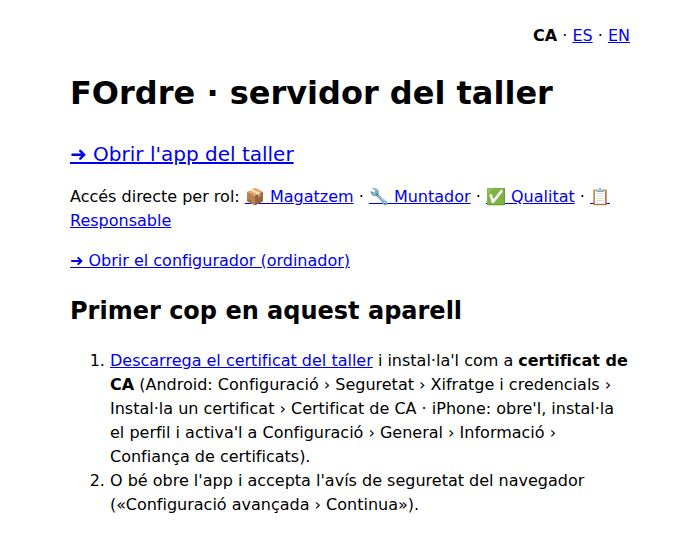

1. Connecta l'aparell a la **mateixa Wi-Fi** que el servidor.
2. Escaneja el QR que mostra el servidor, o obre `http://<adreça-del-servidor>:8080` (per exemple, `http://192.168.1.50:8080`). S'obre la pàgina d'ajuda.
3. **Recomanat:** prem *Descarrega el certificat del taller* i instal·la'l:
   - **Android:** Configuració › Seguretat › Xifratge i credencials › Instal·la un certificat › **Certificat de CA** › tria el fitxer `fordre-taller.crt`.
   - **iPhone / iPad:** obre el fitxer › Configuració › *Perfil baixat* › Instal·la. Després, Configuració › General › Informació › **Confiança de certificats** › activa *FOrdre taller*.
   - **Windows:** doble clic al fitxer › Instal·la el certificat › Màquina local › *Col·loca tots els certificats en el magatzem següent* › **Entitats de certificació arrel de confiança**.
4. **O bé**, sense instal·lar-lo: obre l'app i accepta l'avís del navegador (*Configuració avançada › Continua*). Funciona, però l'avís tornarà a sortir de tant en tant.
5. Obre l'app del taller i **instal·la-la** com una app:
   - Android (Chrome): menú ⋮ › *Instal·la l'aplicació* (o *Afegeix a la pantalla d'inici*).
   - iPhone (Safari): botó *Compartir* › *Afegeix a la pantalla d'inici*.
6. Si l'aparell sempre el fa servir la mateixa feina, fes servir l'**accés directe del rol** (vegeu el [punt 3.6](#36-accessos-directes-per-rol)).

### 2.8 Opcions del servidor

```
node servidor/fordre-servidor.js [--port 8443] [--port-http 8080] [--dades carpeta] [--clau PIN] [--nou-certificat]
```

| Opció | Variable d'entorn | Per defecte | Què fa |
|---|---|---|---|
| `--port` | `FORDRE_PORT` | `8443` | Port segur (https) de les apps. |
| `--port-http` | `FORDRE_PORT_HTTP` | `8080` | Port de la pàgina d'ajuda i del certificat. |
| `--dades` | `FORDRE_DADES` | `servidor/dades` | Carpeta on es guarda tot. |
| `--clau` | `FORDRE_CLAU` | (cap) | Clau de xarxa: una barrera addicional abans del PIN de cada persona. Cal escriure-la al menú ⋮ de l'app. |
| `--nou-certificat` | — | — | Força a fer un certificat nou. |

Exemple: un servidor amb una clau de xarxa i les dades en un disc USB:

```bash
node servidor/fordre-servidor.js --clau 4821 --dades /media/usb/fordre-dades
```

### 2.9 Còpies de seguretat i actualitzacions

Tot el que fa el taller es guarda a `servidor/dades/`:

```
dades/
├── projectes/     un fitxer per projecte publicat
├── ordres/        les ordres de cada projecte
├── progres/       el progrés de cada ordre (amb una còpia .bak de l'estat anterior)
├── fotos/         les fotos, per projecte i ordre
├── persones.json  persones, rols i resum dels PIN (mai el PIN en clar)
└── certificat/    el certificat https del servidor
```

**Fer una còpia de seguretat** (a la Raspberry Pi, amb una memòria USB muntada a `/media/usb`):

```bash
sudo systemctl stop fordre
cp -r ~/FOrdre/servidor/dades /media/usb/fordre-dades-$(date +%Y%m%d)
sudo systemctl start fordre
```

A Windows, tanca la finestra del servidor i copia la carpeta `servidor\dades` on vulguis.

**Restaurar-la:** atura el servidor, substitueix la carpeta `dades` per la còpia i torna'l a engegar.

**Actualitzar FOrdre:** `git pull` i reiniciar el servidor (vegeu el [punt 2.4](#24-opció-c-servidor-del-taller-en-una-raspberry-pi)). Les dades no es toquen.

---

## 3. Configuració

### 3.1 El configurador: ⚙ Configuració

Prem **⚙ Configuració** a la barra de dalt del configurador. Els canvis s'apliquen a l'instant i es veuen a la vista 3D. El botó **Valors per defecte** ho torna tot com al principi.

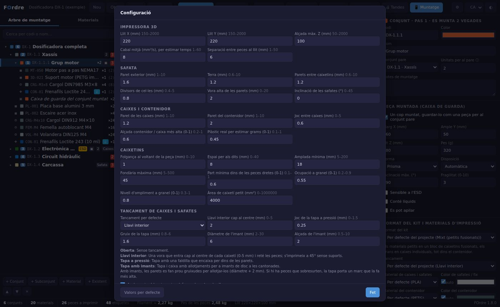

**Impressora 3D**

| Camp | Per defecte | Límits | Quan canviar-lo |
|---|---|---|---|
| Llit X / Llit Y (mm) | 220 × 220 | 150–2000 | Posa-hi la mida útil del llit de la teva impressora. Les safates no el superaran mai. |
| Alçada màx. Z (mm) | 100 | 50–2000 | Alçada màxima que vols imprimir. |
| Cabal mitjà (mm³/s) | 8 | 1–60 | Per estimar les hores d'impressió de cada tanda. |
| Separació entre peces al llit (mm) | 6 | 1–50 | Distància entre peces a les tandes d'impressió. |

**Safata**

| Camp | Per defecte | Límits | Notes |
|---|---|---|---|
| Paret exterior (mm) | 1,6 | 1–10 | Més gruix, més resistència i més filament. |
| Terra (mm) | 1,2 | 0,6–10 | |
| Parets entre caixetins (mm) | 1,2 | 0,6–10 | |
| Divisors de cel·les (mm) | 0,8 | 0,4–5 | Separen les unitats en disposició *individual*. |
| Vora alta de les parets (mm) | 2 | 0–20 | Evita que les peces rodolin en moure la safata. |
| Inclinació de les safates (°) | 0 | 0–45 | Safates inclinades sobre una falca. Es limita sola si hi ha peces que no es poden tombar. |

**Caixes i contenidor**

| Camp | Per defecte | Límits |
|---|---|---|
| Paret de les caixes (mm) | 1,2 | 1–10 |
| Paret del contenidor (mm) | 2 | 1–10 |
| Joc entre caixes (mm) | 0,6 | 0–5 |
| Alçada del contenidor respecte la caixa més alta (0–1) | 0,6 | 0,2–1 |
| Plàstic real per estimar grams (0–1) | 0,45 | 0,1–1 |

**Caixetins**

| Camp | Per defecte | Límits | Notes |
|---|---|---|---|
| Folgança al voltant de la peça (mm) | 1 | 0–10 | Joc perquè la peça entri i surti bé. |
| Espai per als dits (mm) | 8 | 0–40 | Espai per agafar les peces. |
| Amplada mínima (mm) | 18 | 5–200 | Hi ha de cabre un dit. |
| Fondària màxima (mm) | 45 | 5–500 | |
| Part mínima dins de les peces dretes (0–1) | 0,6 | 0,1–1 | Peces que van dretes (líquids): quina part queda dins. |
| Ocupació a granel (0–1) | 0,55 | 0,2–0,9 | Quant ocupa el material amuntegat. |
| Nivell d'ompliment a granel (0–1) | 0,8 | 0,3–1 | Fins on s'omple (no fins dalt de tot). |
| Àrea de caixetí petit (mm²) | 4000 | — | Per sota, el caixetí és *petit* (important per al format mixt). |

**Tancament de caixes i safates**

| Camp | Per defecte | Notes |
|---|---|---|
| Tancament per defecte | Llavi interior | *Oberta*, *Llavi interior*, *Tapa a pressió* o *Tapa amb imants* (vegeu el [punt 3.3](#33-formats-de-kit-i-tancaments)). |
| Llavi interior cap al centre (mm) | 2 | 0–5. S'imprimeix a 45°, sense suports. |
| Joc de la tapa a pressió (mm) | 0,25 | Es calibra amb la peça de calibratge. |
| Gruix de la tapa (mm) | 1,6 | |
| Diàmetre i alçada de l'imant (mm) | 6 × 2 | Els imants de disc que tinguis. |
| Tapa també a cada caixa de dins | Sí | Amb contenidor. |
| Contenidors apilables | Sí | Tots amb la mateixa planta i un peu que encaixa al de sota. |
| Nanses als costats curts | Sí | |
| QR gravat a les tapes | Sí | Es llegeix millor si el repasses amb un retolador. |

**Identificació i ergonomia**

- Codi gravat en relleu a la cara frontal.
- Rebaix per a l'etiqueta adhesiva.
- Codi del material gravat al fons de cada caixetí.
- Fons arrodonit als caixetins a granel (la cargoleria surt fent lliscar el dit).

**Format dels kits i materials d'impressió**

| Camp | Per defecte |
|---|---|
| Format per defecte | Mixt (petits fusionats) |
| Material de caixes i safates | PLA |
| Material per a peces ESD | PETG-ESD (antiestàtic) |
| Material del contenidor | PETG |
| Color de les caixes individuals | El del material (també: el del conjunt, per tipus, o un color fix) |
| Color fix / safates, color del contenidor | Gris clar / gris blavós |

Materials d'impressió disponibles: PLA, PETG, ABS, ASA, PC, PA (niló), PP, TPU (flexible), PETG-ESD (antiestàtic) i PLA amb fibra de carboni. Les caixes de peces sensibles a l'ESD es fan soles amb el material antiestàtic.

**Exemple.** Una impressora amb un llit de 250 × 210 mm, caixes de PETG, tapes amb imants de 8 × 3 mm i etiquetes de cinta de 12 mm: Llit X `250`, Llit Y `210`, Material de caixes `PETG`, Tancament `Tapa amb imants`, Diàmetre de l'imant `8`, Alçada de l'imant `3`, Etiquetes `Cinta 12 mm`.

### 3.2 Calibrar les folgances

Cada impressora imprimeix una mica diferent. La peça de calibratge ajusta les tapes i els encaixos a la teva.

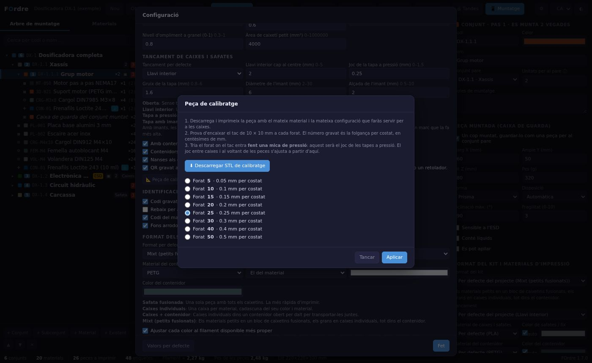

1. ⚙ Configuració › **📐 Peça de calibratge…** › **Descarrega l'STL**.
2. Imprimeix-la amb el material de les caixes.
3. Prova el tac a cada forat. Tria el forat on el tac **entra ajustat, sense forçar i sense ballar**.
4. Marca aquest forat al diàleg i prem **Aplica**. FOrdre ajusta el joc de les tapes, de les caixes i dels caixetins.

### 3.3 Formats de kit i tancaments

**Formats del kit** (per a tot el projecte o per a cada conjunt):

| Format | Com és | Quan triar-lo |
|---|---|---|
| **Safata fusionada** | Una sola peça amb tots els caixetins. | La més ràpida d'imprimir. Kits petits. |
| **Caixes individuals** | Una caixa per material, cadascuna del seu color i material. | Quan els materials es reposen per separat. |
| **Caixes + contenidor** | Les caixes individuals dins un contenidor obert per dalt, amb osques per agafar-les. | Per portar tot el kit alhora. |
| **Mixt** (recomanat) | Els materials petits en un bloc de caixetins fusionats, els grans en caixes individuals, tot dins el contenidor. | El millor equilibri. |

**Tancaments:**

| Tancament | Com és | Quan triar-lo |
|---|---|---|
| **Oberta** | Sense tancament. | Safates que no es mouen. |
| **Llavi interior** (0–5 mm) | Una vora que entra cap al centre de cada caixetí i reté les peces. | Per defecte: no cal imprimir tapa. |
| **Tapa a pressió** | Tapa amb una faldilla que encaixa per dins. | Per transportar. Calibra el joc (punt 3.2). |
| **Tapa amb imants** | Imants de disc a les cantonades de la caixa i de la tapa. | S'obre i es tanca molt de pressa. Les parets es fan més gruixudes per allotjar-los. |

### 3.4 Etiquetes

El format es tria a **⚙ Configuració › Etiquetes** (o a la fitxa de qualsevol material, a l'apartat *Etiqueta*) i s'aplica a tot el projecte. Amb *A mida…* s'hi escriuen l'amplada i l'alçada.

| Format | Mida | Impressora |
|---|---|---|
| Cinta 9 / 12 / 18 / 24 mm | Llargada automàtica | Brother P-touch, Dymo, cintes laminades |
| Rotlle tèrmic | 62 × 29, 50 × 25 o 40 × 20 mm | Impressores tèrmiques d'etiquetes |
| Full A4 | 70 × 37 (3 × 8), 48,5 × 25,4 (4 × 11), 38 × 21,2 (5 × 13), 25,4 × 10 (7 × 27) | Impressora normal amb fulls adhesius |
| A mida | La que vulguis | — |

Cada etiqueta porta el **codi**, el **nom**, la **quantitat**, el **pas**, el **conjunt**, els colors, un **QR** i un **codi de barres** (Code 128). L'etiqueta s'adapta a l'amplada del caixetí: si és molt estret, s'hi treu el QR. En imprimir, tria **escala 100 %** (sense «ajustar a la pàgina»).

### 3.5 El taller: persones i rols

**Primer ús.** La primera vegada que s'obre l'app amb el servidor, demana crear el **Responsable**:

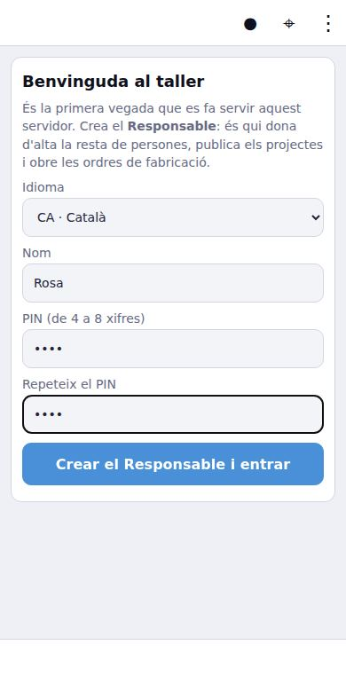

1. Escriu el nom (per exemple, *Rosa*) i un PIN de 4 a 8 xifres (per exemple, `1111`, que després canviaràs per un de segur).
2. Prem **Crear el Responsable i entrar**.

Si el servidor encara no té cap projecte, l'app ho diu. El Responsable el publica des del configurador (punt 5.10), o pot tocar **Projecte d'exemple** per provar-ho: si entra com a Responsable, l'exemple es publica sol al servidor.

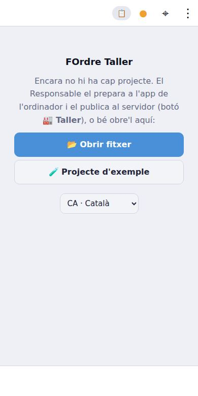

**Donar d'alta la resta de persones.** Com a Responsable: **📋 Tauler › 👥 Persones**.

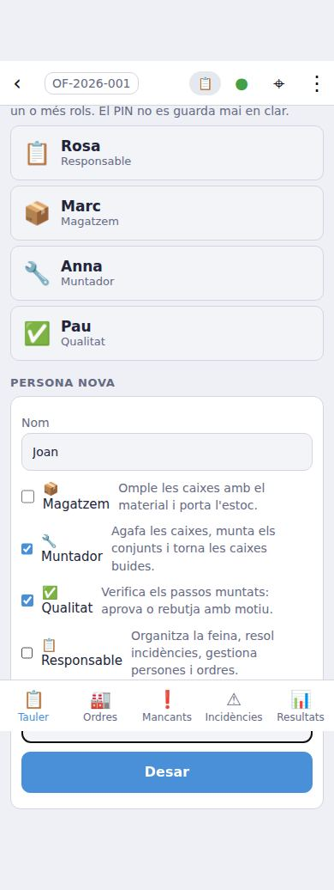

1. Escriu el **nom**.
2. Marca els seus **rols** (pot tenir-ne més d'un).
3. Escriu el seu **PIN** i prem **Desar**.

A l'exemple:

| Persona | Rols | PIN d'exemple |
|---|---|---|
| Rosa | Responsable | 1111 |
| Marc | Magatzem | 2222 |
| Anna | Muntador | 3333 |
| Pau | Qualitat | 4444 |
| Joan | Muntador i Qualitat | 5555 |

**Què pot fer cada rol:**

| Rol | Pot fer |
|---|---|
| 📦 Magatzem | Omplir i buidar caixes, marcar mancants i peces defectuoses, estoc, tornar caixes. |
| 🔧 Muntador | Agafar caixes, començar i marcar passos com a muntats (també amb mancants), completar-los, registrar peces trencades, tornar caixes. |
| ✅ Qualitat | Verificar (aprovar o rebutjar), decidir què es fa amb les peces defectuoses, registrar-ne, resoldre incidències. |
| 📋 Responsable | Tot l'anterior, i a més publicar projectes, obrir i tancar ordres, assignar passos i gestionar persones. |

Tothom pot obrir incidències, fer fotos i consultar el registre i els resultats.

**Regla dels quatre ulls.** Qui ha muntat un pas **no el pot verificar**. En Joan, que té els dos rols, pot verificar el que munta l'Anna, però no el que munta ell mateix. El Responsable no té aquesta limitació.

**Canviar un PIN o els rols:** Persones › toca la persona › canvia el que calgui › **Desar**. Si deixes el PIN buit, no es canvia.

**Donar de baixa algú:** Persones › toca la persona › **Donar de baixa**. Ja no podrà entrar i es tanquen les seves sessions. El registre del que va fer es conserva. El taller no deixa donar de baixa l'últim Responsable.

### 3.6 Accessos directes per rol

Si un aparell sempre el fa servir la mateixa feina (la tauleta del magatzem, la de la línia de muntatge…), fes-li un accés directe al seu rol:

| Rol | Adreça |
|---|---|
| 📦 Magatzem | `https://<servidor>:8443/muntatge.html?rol=magatzem` |
| 🔧 Muntador | `https://<servidor>:8443/muntatge.html?rol=muntador` |
| ✅ Qualitat | `https://<servidor>:8443/muntatge.html?rol=qualitat` |
| 📋 Responsable | `https://<servidor>:8443/muntatge.html?rol=responsable` |

Obre l'adreça i desa-la a la pantalla d'inici. La pàgina d'ajuda del servidor (`http://<servidor>:8080`) té els quatre enllaços. Amb l'app instal·lada, si mantens premuda la icona, també surten les dreceres dels rols. Si la persona que entra no té aquell rol, l'app l'avisa i fa servir el seu.

A la carpeta `2-taller` del ZIP hi ha els mateixos accessos en fitxers: `rol-magatzem.html`, `rol-muntador.html`, `rol-qualitat.html` i `rol-responsable.html`.

---

## 4. Preparar la llista de materials

FOrdre llegeix dos tipus de llista, en **Excel** (`.xlsx`, `.xls`, `.ods`) o **CSV** (`.csv`, separat per `;`, `,` o tabulador). Les columnes es reconeixen en català, castellà i anglès, i abans d'importar es poden corregir.

### 4.1 Format FOrdre (una fila per material)

Descarrega la plantilla amb el botó **Plantilla CSV** del configurador (o obre `exemples/plantilla_fordre.csv`). Cada fila és un material dins d'un conjunt. Una fila **amb conjunt però sense codi de material** defineix el conjunt mateix.

| Columna | Obligatòria | Què hi va | Exemple |
|---|---|---|---|
| `conjunt` | Sí | Codi del conjunt on es munta el material. | `XAS` |
| `nom conjunt` | — | Nom del conjunt. | `Xassís` |
| `pare` | — | Codi del conjunt on es munta aquest conjunt (buit si és la màquina). | `MAQ` |
| `codi` | Sí* | Codi del material. *Buit en una fila de conjunt. | `PL-001` |
| `nom` | — | Nom del material. | `Placa base alumini` |
| `quantitat` | Sí | Quantes en porta cada unitat del conjunt. A una fila de conjunt: quantes unitats en necessita el pare. | `2` |
| `x`, `y`, `z` | Recomanat | Mides de la peça, en mm (llarg, ample, alt). | `180`, `120`, `3` |
| `pes` | — | Pes d'una unitat, en g. | `175` |
| `tipus` | — | `peca`, `cargol` (cargoleria i petit material), `consumible` o `subconjunt`. | `peca` |
| `forma` | — | `box` (prisma) o `cylinder` (cilindre). | `box` |
| `esd` | — | Sensible a l'electricitat estàtica: `1`/`0` (també `sí`/`no`). | `0` |
| `liquid` | — | Conté líquids: `1`/`0`. Anirà dreta. | `1` |
| `angle max` | — | Inclinació màxima en graus (90 = es pot tombar del tot). | `30` |
| `apilable` | — | Es pot apilar: `1`/`0`. | `1` |
| `max apilat` | — | Quantes unitats es poden apilar. | `5` |
| `fragil` | — | Fragilitat de 0 a 10. | `7` |
| `disposicio` | — | `auto`, `individual`, `apilat`, `capa` o `granel`. | `granel` |
| `color` | — | Color del material o del conjunt, en `#RRGGBB`. | `#9AA5B1` |
| `origen` | — | `propi` (disseny propi) o `comprat`. | `comprat` |
| `proveidor` | — | Proveïdor o referència. Agrupa la llista de compra i les devolucions. | `Würth` |
| `notes` | — | Notes lliures. | |
| `parell` | — | Parell de collada en N·m. Surt al pas de muntatge. | `2.5` |
| `nota` | — | Nota de muntatge d'aquest element. | `En creu` |
| `instruccions` | — | (Fila de conjunt) passos de muntatge, separats per `\|`. | `Presentar les plaques \| Muntar els escaires \| Collar en creu` |
| `eines` | — | (Fila de conjunt) eines necessàries. | `Clau Allen 3 mm, clau dinamomètrica` |
| `tancament` | — | (Fila de conjunt) `cap`, `llavi`, `pressio` o `imants`. | `imants` |
| `format kit` | — | (Fila de conjunt) `fusionat`, `individual`, `contenidor` o `mixt`. | `contenidor` |
| `material caixa` | — | Material d'impressió de la caixa d'aquest material. | `PETG` |
| `color caixa` | — | Color de la caixa d'aquest material. | `#FDD835` |

**Exemple complet** (és la plantilla, llegida com a taula):

| conjunt | nom conjunt | pare | codi | nom | quantitat | x | y | z | tipus | disposicio | parell | instruccions |
|---|---|---|---|---|---|---|---|---|---|---|---|---|
| MAQ | Màquina completa | | | | 1 | | | | | | | Muntatge final \| Prova de funcionament |
| XAS | Xassís | MAQ | PL-001 | Placa base alumini | 2 | 180 | 120 | 3 | peca | auto | | |
| XAS | Xassís | MAQ | CRG-M4x10 | Cargol DIN912 M4x10 | 24 | 10 | 7 | 7 | cargol | granel | 2.5 | |
| XAS | Xassís | MAQ | CON-01 | Frenafils 243 | 1 | 25 | 25 | 75 | consumible | individual | | |
| MOT | Grup motor | XAS | | | 2 | 60 | 50 | 80 | | | | Encarar el motor \| Collar els 4 cargols |
| MOT | Grup motor | XAS | MT-050 | Motor NEMA17 | 1 | 42 | 42 | 48 | peca | auto | | |
| ELE | Electrònica | MAQ | PCB-100 | Placa de control | 1 | 100 | 70 | 18 | peca | individual | | |

Es llegeix així: la màquina (`MAQ`) té un xassís (`XAS`) i una electrònica (`ELE`). El xassís porta 2 plaques, 24 cargols i un frenafils, i també **2 grups motor** (`MOT`), que es munten abans i es guarden en una caixa de guarda de 60 × 50 × 80 mm.

### 4.2 BOM indentada d'un programa de CAD

Exporta la **llista de materials amb nivells** (indentada) del teu programa: FreeCAD, Fusion 360, SolidWorks, Inventor, Onshape… Cal que tingui:

- una columna de **nivell** (`1`, `2`, `3`, o bé `1`, `1.1`, `1.1.2`, o el nom sagnat);
- una columna de **codi** (*Part Number*);
- una columna de **quantitat**.

Si porta mides (*Length*, *Width*, *Height*) i pes (*Mass*), millor. Exemple (`exemples/bom_cad_solidworks.csv`):

```
Item No.,Part Number,Description,QTY.,Length (mm),Width (mm),Height (mm),Mass (g)
1,ASM-100,Base assembly,1,300,200,80,2400
1.1,PL-10,Base plate,1,180,150,5,900
1.2,SUB-20,Bracket subassembly,2,50,40,30,120
1.2.1,BR-1,Bracket,1,50,40,3,40
```

Les files que tenen fills es converteixen en **conjunts**. Si porten mides, són la **peça muntada**, i tindran caixa de guarda.

Consells per exportar:

- **SolidWorks:** a la taula de materials, tria *Indentada* i desa-la com a Excel o CSV.
- **Fusion 360:** exporta la *Bill of Materials* amb l'estructura.
- **Inventor:** *Bill of Materials* › vista *Estructurada* › *Exportar*.
- **FreeCAD:** amb el banc de treball *Assembly*, exporta la llista de peces a una fulla de càlcul i desa-la com a CSV.

### 4.3 Subconjunts que es guarden muntats (grups de grups)

Quan un subconjunt es munta abans i s'ha de portar al conjunt pare, dona-li les **mides de la peça acabada** (a la fila del conjunt, o a la fitxa *Peça muntada*). FOrdre:

1. li fa una **caixa de guarda** on es desa un cop muntat;
2. al pas del pare, aquesta caixa apareix com una caixa més per agafar;
3. si el pare en necessita diverses unitats (per exemple, 2 grups motor), els materials del subconjunt **es multipliquen**.

### 4.4 Errors típics i com evitar-los

| Problema | Solució |
|---|---|
| Un material surt amb mides 0 i un caixetí petit. | Omple `x`, `y` i `z`. Sense mides, FOrdre no sap quant espai necessita. |
| Els cargols ocupen massa. | Posa `disposicio` = `granel` i `tipus` = `cargol`. |
| Una ampolla surt estirada. | Posa `liquid` = `1` i `angle max` baix: anirà dreta. |
| La BOM no fa conjunts. | Revisa que la columna de nivell estigui ben assignada al diàleg d'importació. |
| Les unitats surten molt grans o molt petites. | Tria les **Unitats de mida** (mm, cm, m o polzades) i de **pes** (g, kg o lb) al diàleg. |
| Instruccions en una sola línia. | Separa els passos amb `\|`. |

---

## 5. El configurador pas a pas

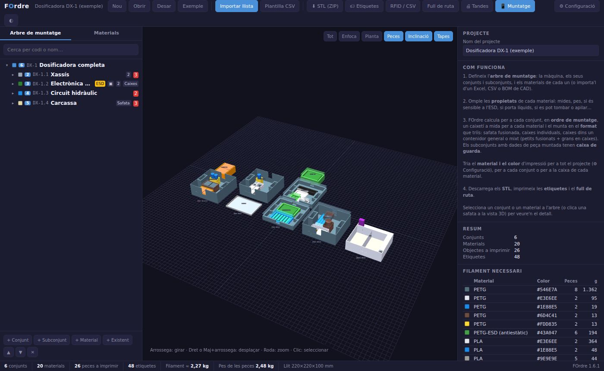

La pantalla té tres parts:

- **A l'esquerra**, l'**arbre de muntatge** (pestanya *Arbre*) i la llista de **materials** (pestanya *Materials*).
- **Al centre**, la **vista 3D** de totes les caixes, ordenades per pas.
- **A la dreta**, la **fitxa** del que tens seleccionat. Sense selecció, surten el projecte, el resum i el filament necessari.

A la barra de dalt hi ha: **Nou**, **Obrir**, **Desar**, **Exemple**, **Importar llista**, **Plantilla CSV**, **⬇ STL (ZIP)**, **🏷 Etiquetes**, **RFID / CSV**, **Full de ruta**, **🖨 Tandes**, **📱 Muntatge**, **🏭 Taller** (només amb el servidor), **⚙ Configuració** i **◐** (tema clar o fosc).

### 5.1 Importar la llista

1. Prem **Importar llista**.
2. Tria el fitxer, o prova-ho amb **📄 Llista de peces (CSV)** o **📐 BOM de CAD**.
3. Revisa el **Format de la llista** (*FOrdre / Excel* o *BOM de CAD indentada*), les **Unitats de mida** i les de **pes**.
4. Revisa la **Correspondència de columnes**: cada camp de FOrdre amb la columna del teu fitxer. Si alguna no s'ha reconegut, tria-la tu.
5. A baix veuràs **quants conjunts i materials** es llegiran, els avisos i els **canvis respecte del projecte actual**.
6. Tria **Afegir / actualitzar** (manté el que ja hi ha i actualitza el que coincideix) o **Substituir el projecte**.
7. Prem **Importar**.

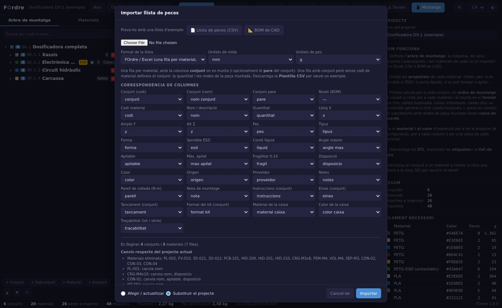

Amb una BOM de CAD, el diàleg reconeix la columna de nivell:

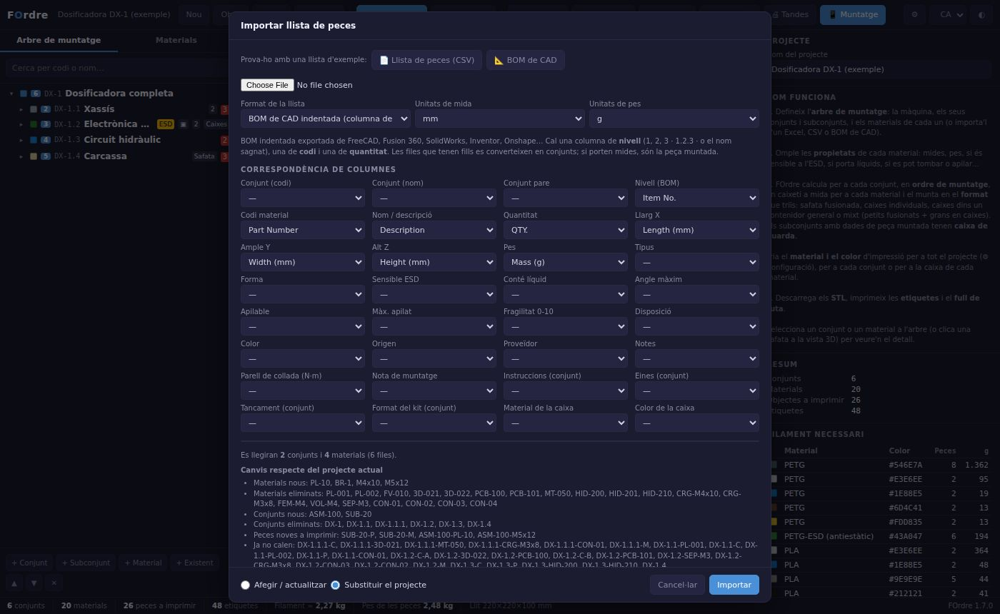

### 5.2 Veure les caixes generades

Després d'importar, FOrdre calcula les caixes i les mostra en 3D. Toca un conjunt a l'arbre i se'n ressalten les caixes.

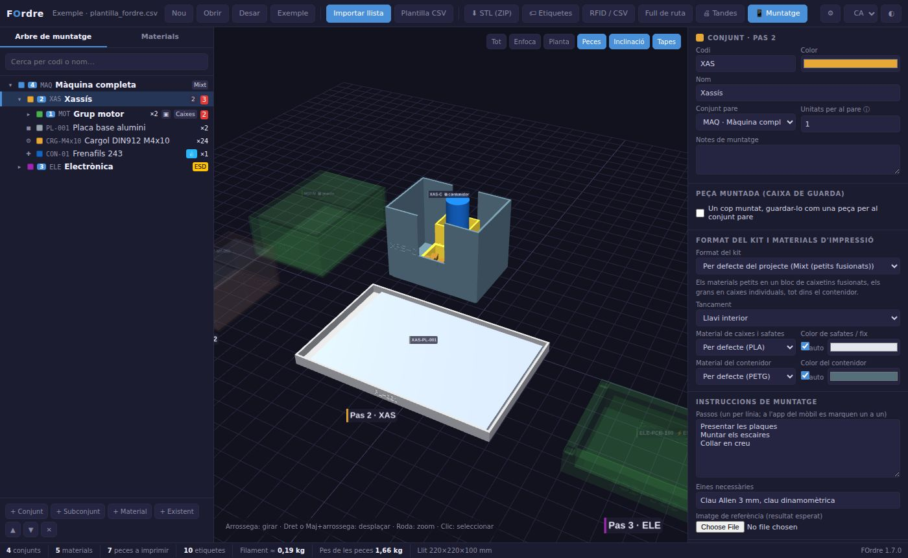

**Controls de la vista 3D:**

| Acció | Com |
|---|---|
| Girar | Arrossega amb el botó esquerre. |
| Desplaçar | Arrossega amb el botó dret, o amb Maj + botó esquerre. |
| Zoom | Roda del ratolí. |
| Seleccionar | Clic sobre una caixa. |
| Veure-ho tot / enfocar la selecció | Botons **Tot** i **Enfoca**, o tecles `Inici` i `F`. |
| Vista des de dalt | Botó **Planta**. |
| Mostrar o amagar les peces, la inclinació o les tapes | Botons **Peces**, **Inclinació** i **Tapes**. |

**Marques a l'arbre:** el número blau és el pas de muntatge; `ESD` indica peces sensibles a l'estàtica; `▣` vol dir que té caixa de guarda; *Caixes* o *Safata* indiquen el format; el número vermell són els avisos.

### 5.3 Ajustar un material

Toca un material a l'arbre (dins del seu conjunt) o a la pestanya *Materials*.

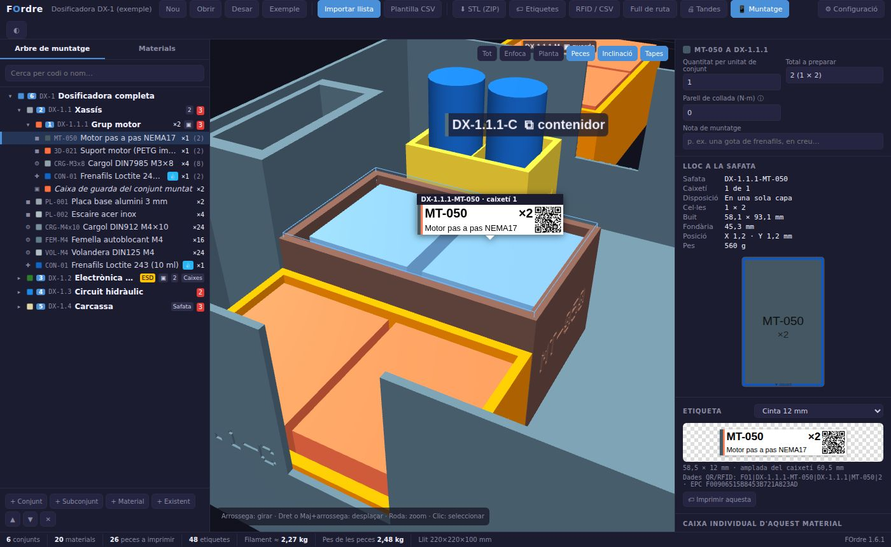

La fitxa té aquestes parts:

- **Dins d'aquest conjunt:** *Quantitat per unitat de conjunt* (i el *Total a preparar*), *Parell de collada (N·m)* i *Nota de muntatge*.
- **Lloc a la safata:** a quina caixa va, disposició, cel·les, mida del buit i fondària.
- **Etiqueta:** el format (per a tot el projecte), una vista prèvia, les dades del QR/RFID i **🏷 Imprimir aquesta**.
- **Caixa individual d'aquest material:** material i color de la seva caixa (en formats amb caixes).
- **Forma real de la peça (niu a mida):** carrega l'**STL** de la peça i el fons de la cel·la tindrà la seva forma. És ideal per a plaques amb components i peces corbades o fràgils.
- **Material:** codi, nom, tipus, forma, mides (X, Y, Z en mm), pes (g/unitat), color, disposició, inclinació màxima, fragilitat, màxim d'unitats apilades, origen, proveïdor i les caselles *Sensible a l'ESD*, *Conté líquids* i *Es pot apilar*.

**Exemple:** el motor NEMA17 (`MT-050`) va en una sola capa, amb 2 cel·les (una per a cada grup motor), dins del contenidor `DX-1.1.1-C`.

### 5.4 Ajustar un conjunt

Toca un conjunt a l'arbre.

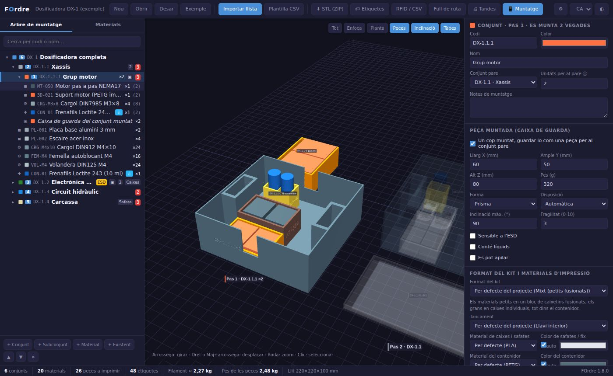

- **Codi, color, nom, conjunt pare** i **unitats per al pare** (per exemple, el xassís porta 2 grups motor).
- **Peça muntada (caixa de guarda):** marca *Un cop muntat, guardar-lo com una peça per al conjunt pare* i posa'n les mides.
- **Format del kit i materials d'impressió:** format, tancament, material i color de les caixes i del contenidor. *Per defecte del projecte* fa servir el que hi ha a ⚙ Configuració.
- **Instruccions de muntatge:**
  - *Passos*, un per línia: a l'app del mòbil es marquen un a un.
  - *Eines necessàries*.
  - *Imatge de referència* (el resultat esperat).
- **Safates, caixes i contenidors:** cada objecte a imprimir, amb la mida, els grams de filament, els botons per descarregar-ne l'**STL** i imprimir-ne les **etiquetes**. També hi surten els avisos, per exemple *«sobresurt 5 mm del caixetí»*.

Amb els botons **+ Conjunt**, **+ Subconjunt**, **+ Material**, **+ Existent** (un material que ja hi és), **▲ ▼** (moure) i **✕** (eliminar) es pot editar l'arbre a mà.

### 5.5 Llista de tots els materials

La pestanya **Materials** mostra tots els materials de la màquina amb el total de cada un. Des d'aquí es poden editar i exportar en CSV.

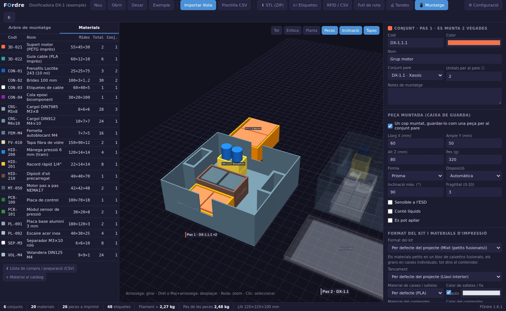

### 5.6 Descarregar i imprimir

**Les caixes (STL i 3MF)**

- **⬇ STL (ZIP):** totes les safates, caixes, contenidors, tapes i falques, en un ZIP. Porta un `LLEGEIX-ME.txt` amb el filament necessari. El nom de cada fitxer porta el pas, l'objecte, el material i el color, per exemple `01_DX-1.1.1-C_PETG_546E7A.stl`.
- **🖨 Tandes:** agrupa totes les peces per **material i color** i les col·loca al llit, amb els grams i les hores estimades. Cada tanda es descarrega en **3MF** amb les peces posicionades, llesta per obrir al programa de laminat.

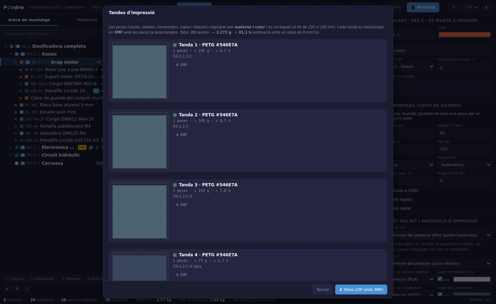

Consells d'impressió:

- Imprimeix les caixes **sense suports**: els llavis i les nanses estan pensats per imprimir-se a 45°.
- Farciment del 10–15 % i 2–3 perímetres són suficients.
- Les caixes ESD, amb filament antiestàtic.
- Amb tapes a pressió, imprimeix primer la peça de calibratge (punt 3.2).

**Les etiquetes**

- **🏷 Etiquetes** obre totes les etiquetes del projecte, llestes per imprimir. Des de la fitxa d'un conjunt o d'un material es poden imprimir només les seves.

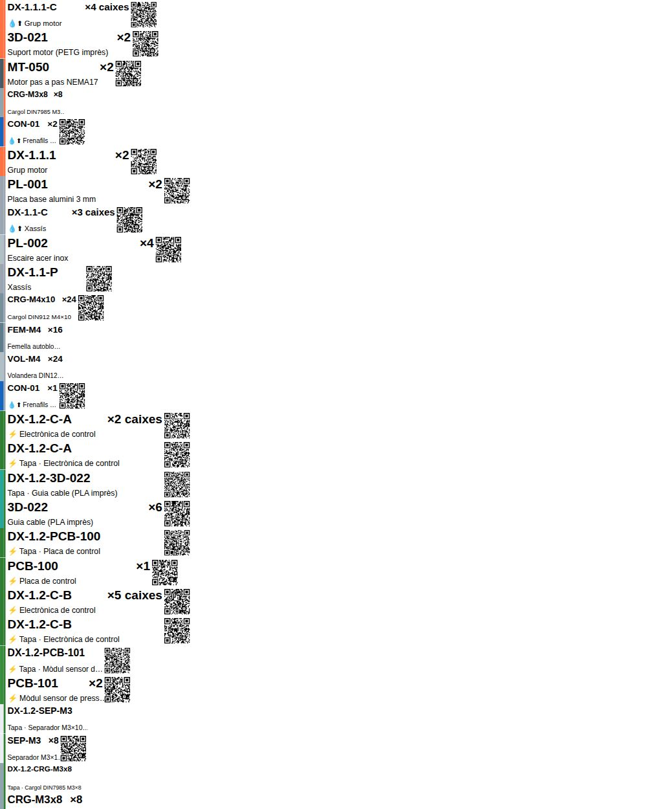

- **RFID / CSV:** un CSV amb les dades de cada etiqueta i un EPC de 96 bits, per a gravadores RFID. Amb Chrome per a Android, les etiquetes NFC es poden escriure directament.

**El full de ruta**

- **Full de ruta:** document imprimible amb els passos, els subconjunts que cal tenir muntats, el mapa de cada safata i la llista de comprovació.

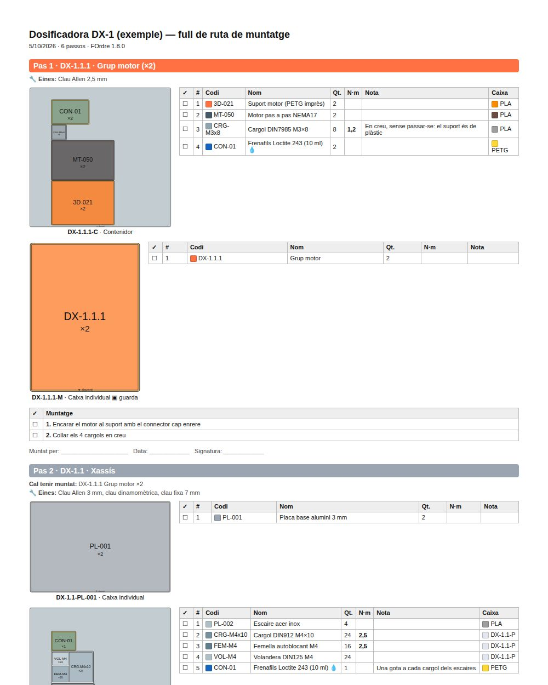

### 5.7 Muntar les caixes

1. Imprimeix totes les tandes.
2. Enganxa a cada caixa (i a cada tapa) la seva etiqueta. El codi gravat en relleu t'indica on va cadascuna.
3. Amb tapa d'imants: enganxa els imants amb una gota de cianoacrilat, **vigilant la polaritat** (prova-la abans amb la tapa).
4. Col·loca les caixes dins el contenidor seguint el mapa del full de ruta.

### 5.8 Quan canvia la llista de materials (revisions)

Torna a importar la llista (mode *Afegir / actualitzar*). Abans d'importar, FOrdre mostra **què ha canviat** (materials nous o eliminats, mides, quantitats) i **quines caixes cal tornar a imprimir**. Cada revisió queda a la fitxa del projecte, a *Revisions de la llista de materials*.

### 5.9 Desar i obrir

- **Desar** baixa el projecte en un fitxer `.fordre.json`. Guarda'l amb la documentació de la màquina.
- **Obrir** carrega un `.fordre.json`.
- El navegador en guarda una còpia automàtica, però **no et refiïs només d'aquesta còpia**: desa el fitxer.

### 5.10 Passar el projecte al taller

**Amb el servidor del taller (recomanat)**

1. Obre el configurador des del servidor: `https://<servidor>:8443/index.html`.
2. Prem **🏭 Taller** i entra com a Responsable (nom i PIN).
3. Prem **⬆ Publicar aquest projecte**.
4. Crea una **ordre** (amb el número de sèrie, si en té) amb **+ Nova ordre**.
5. Des del mateix diàleg veuràs l'estat de cada pas en directe i podràs obrir l'**📄 Informe de l'ordre**.

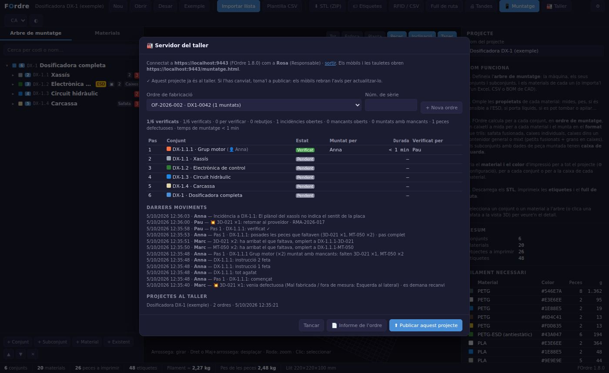

Si modifiques el projecte, torna'l a publicar: els mòbils rebran l'avís per actualitzar-lo (el punt de l'estat es converteix en ⟳).

**Sense servidor**

Prem **📱 Muntatge**. Pots passar el projecte d'aquestes maneres:

- amb un **QR** que s'escaneja amb el mòbil;
- amb un **enllaç** per enviar;
- amb un **fitxer** `.fordre.json` (a l'app: menú ⋮ › *Obrir fitxer de projecte*).

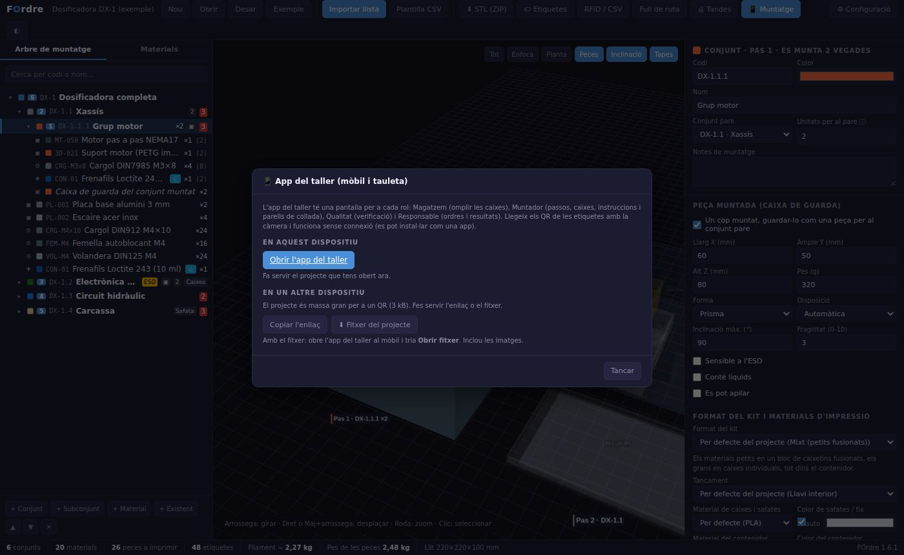

---

## 6. L'app del taller pas a pas

### 6.1 Entrar i triar el rol

1. Obre l'app (`https://<servidor>:8443/muntatge.html`, o l'accés directe del teu rol).
2. Toca el teu nom.
3. Escriu el PIN amb el teclat i prem **✓**.

| Tria el nom | Escriu el PIN |
|---|---|
| 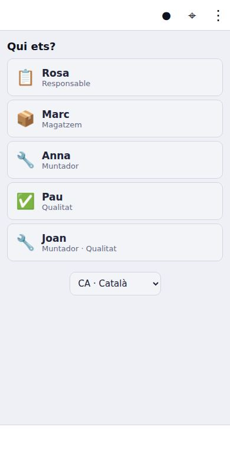 | 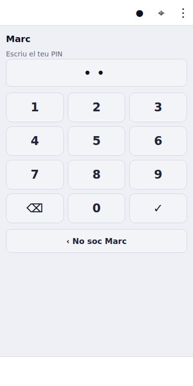 |

**La capçalera**, d'esquerra a dreta:

- **Codi de l'ordre** (per exemple, `OF-2026-002`): toca'l per canviar d'ordre. Si surt 🔒, l'ordre està tancada.
- **Rol**: toca'l per canviar de rol (si en tens més d'un).
- **Punt d'estat:**
  - 🟢 connectat;
  - 🟠 hi ha canvis per enviar;
  - 🔴 sense connexió (es guarda tot i s'envia en tornar);
  - ⟳ el projecte s'ha actualitzat (toca'l per carregar-lo).
- **⌖** obre l'escàner.
- **⋮** és el menú: canviar de persona, servidor, projectes, instal·lar l'app…

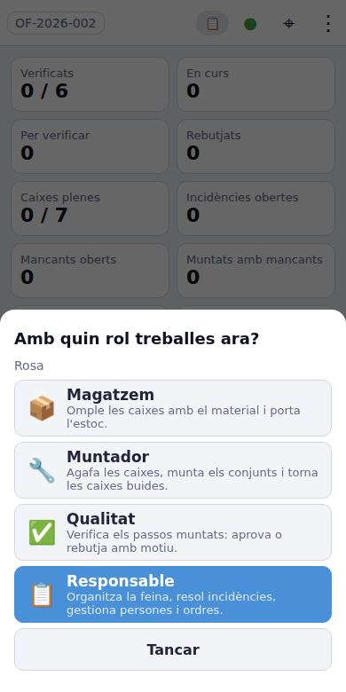

A la part de baix hi ha les **pestanyes del teu rol**. El número entre parèntesis indica quantes coses hi ha pendents (mancants, incidències, defectes).

### 6.2 📋 Responsable: preparar l'ordre

**Crear una ordre de fabricació.** Pestanya **Ordres**:

1. El codi es posa sol (`OF-2026-002`); el pots canviar.
2. Escriu el **número de sèrie** (`DX1-0042`) i unes **notes** (per exemple, *Client: Laboratoris Vallès*).
3. Prem **+ Crear l'ordre i començar-hi**.

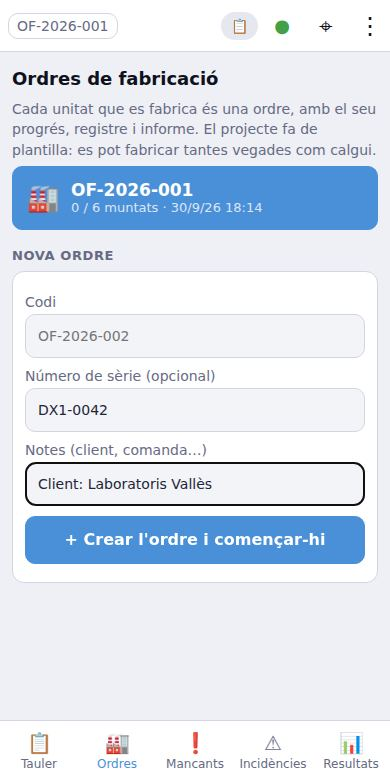

Un aparell que entra per primer cop es posa a l'ordre **més recent**; després, cada aparell recorda l'última ordre on ha treballat. Per canviar d'ordre, toca el codi a la capçalera.

**Assignar passos.** Al **Tauler**, a cada pas, tria la persona a *Assignat a*. El muntador el veurà marcat amb 👤 i el botó *Continuar* li proposarà primer els seus.

### 6.3 📦 Magatzem: omplir les caixes

**Pestanya Omplir.** Mostra les caixes de l'ordre per pas, amb el seu estat: *Buida*, *Omplint-se*, *Plena*, *Amb mancants*, *En ús* o *Retornada*.

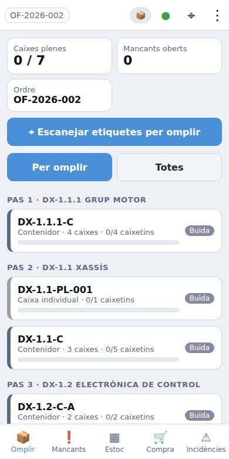

1. Toca una caixa (o escaneja la seva etiqueta amb **⌖**).
2. Per cada caixetí, **posa-hi el material** i toca'l, o escaneja l'etiqueta del caixetí. Queda marcat en verd i el material surt de l'estoc.
3. **Omplir-ho tot** marca tots els caixetins d'un cop (tret dels mancants).
4. Tocar un caixetí ja ple el **buida** (el material torna a l'estoc).

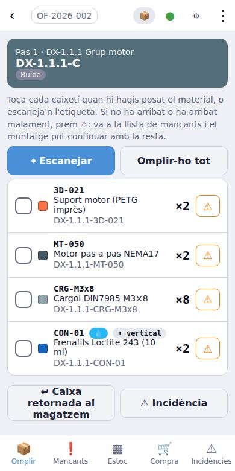

**Quan hi ha un problema amb un material: botó ⚠**

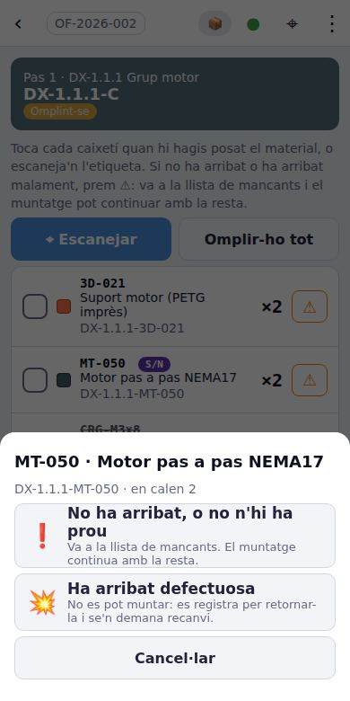

- **❗ No ha arribat, o no n'hi ha prou:** l'app pregunta **quants n'has pogut posar** (0 si no n'ha arribat cap) i una **nota** opcional (proveïdor, data prevista…). La resta queda com a **mancant**.
- **💥 Ha arribat defectuosa:** s'obre el formulari de peça defectuosa (vegeu el [punt 6.6](#66-peces-defectuoses-o-trencades)).

**Quan arriba el material que faltava:** escaneja l'etiqueta del caixetí (o toca'l i confirma *Ha arribat*). El caixetí es completa, el mancant es tanca sol i el muntador ho veurà.

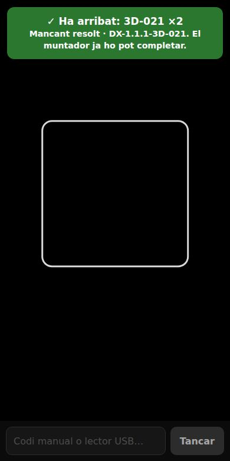

**Pestanya Mancants.** Tot el que falta, agrupat per material: quants, per a quin pas i caixa, des de quan, proveïdor i nota. Botons **Copiar**, **Compartir** i **⬇ CSV** per enviar-ho a compres. Hi ha també l'accés a les **peces defectuoses** i a les devolucions.

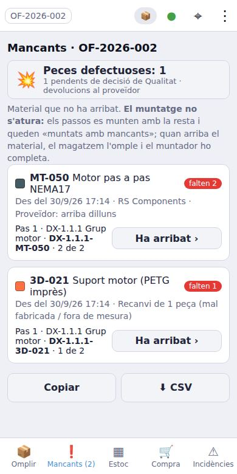

**Pestanya Estoc.** *Cal* és el que encara falta posar a les caixes; *Tinc* és l'estoc. Els botons **−** i **+** hi sumen o en resten una unitat, i escriure un número fa un **recompte**.

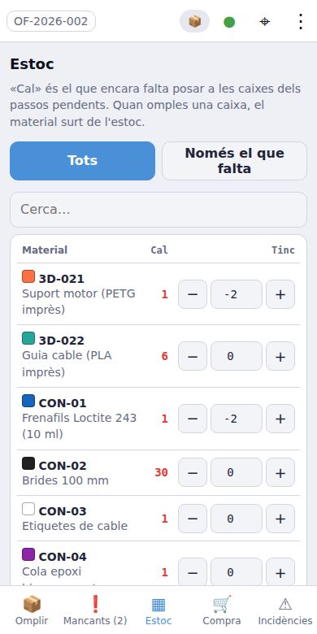

**Pestanya Compra.** El que s'ha de comprar per acabar l'ordre, agrupat per proveïdor. Els mancants surten marcats com a **❗ urgents**.

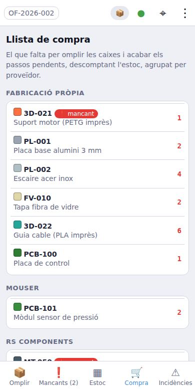

**Tornar les caixes.** Quan una caixa torna buida i neta al magatzem, obre-la i prem **↩ Caixa retornada al magatzem**. També ho pot fer el muntador.

### 6.4 🔧 Muntador: muntar

**Pestanya Passos.** Els passos en ordre de muntatge, amb el seu estat. Un pas queda bloquejat fins que els seus subconjunts estan muntats (encara que sigui amb mancants). **Continuar** porta al següent que et toca.

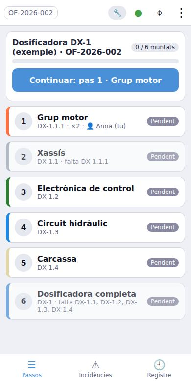

**Dins d'un pas**, de dalt a baix:

1. **Avisos:** rebutjat per Qualitat (amb el motiu), peces que no han arribat, caixes que el magatzem encara no ha omplert…
2. **1 · Preparació: agafa les caixes.** Toca cada caixetí quan l'agafis, o prem **⌖ Escanejar etiquetes**. Si escaneges una etiqueta d'un altre pas, l'app avisa amb un so i et diu de quin pas és. Els caixetins de peces que no han arribat surten en taronja i no cal agafar-los.
3. **2 · Muntatge:** **▶ Començar el pas** (compta el temps), eines, imatge de referència, **instruccions** amb casella per marcar-les una a una, i **parells de collada**.
4. **Fotos**, **⚠ Incidència** i **💥 Peça trencada o defectuosa**.
5. **3 · Final:** on es guarda el conjunt muntat (caixa de guarda) i **✓ Marcar el pas com a muntat**.
6. Després de muntar-lo: **↩ Tornar les caixes buides al magatzem**.

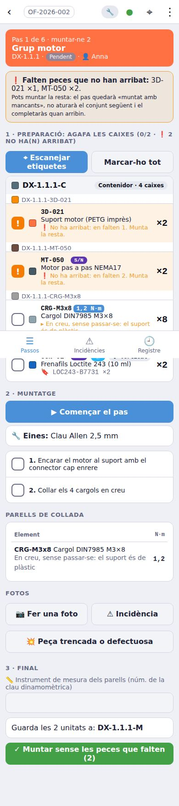

**Muntar amb mancants.** Si falta alguna peça, el botó diu **✓ Muntar sense les peces que falten**. El pas queda **«Muntat amb mancants»** i **no bloqueja el conjunt següent**: es pot continuar amb la resta de la màquina. Quan arriba el material, el pas diu *«Ja han arribat…»* i el botó **✓ Completar** queda actiu.

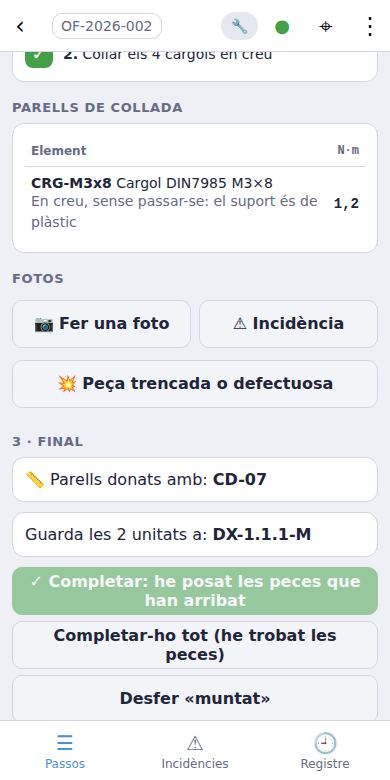

**Completar-ho tot (he trobat les peces)** serveix quan les peces que faltaven s'han trobat per un altre camí. L'app demana confirmació.

**Desfer «muntat»** torna el pas a l'estat anterior (per exemple, si t'has equivocat de pas). No es pot fer si Qualitat ja l'ha verificat.

### 6.5 ✅ Qualitat: verificar

**Pestanya Verificar.** Els passos es mostren en quatre grups:

- **per verificar**;
- **muntats amb mancants** (encara no es poden aprovar);
- **rebutjats**;
- **verificats**.

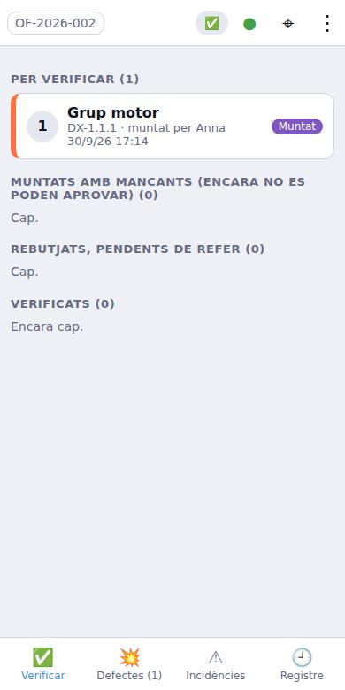

1. Toca un pas. Hi veuràs qui l'ha muntat, quan i quant ha trigat, i els rebutjos anteriors.
2. Revisa la **llista de comprovació**, element per element:
   - cada instrucció;
   - cada parell de collada;
   - que hi siguin totes les peces;
   - que no hi hagi danys ni restes.
3. Fes **fotos** si cal.
4. Prem **✓ Aprovar**, que s'activa quan tot està marcat. O bé escriu el **motiu** i prem **✗ Rebutjar i tornar-lo al muntador**.

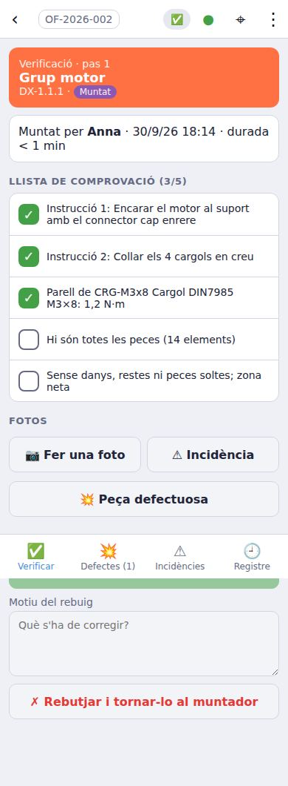

- Si has muntat tu el pas, l'app no et deixa verificar-lo (quatre ulls).
- Si el pas té peces pendents (mancants), **no es pot aprovar** fins que el muntador el completi.
- Les caselles que has marcat es conserven si surts i tornes.

### 6.6 Peces defectuoses o trencades

Una peça pot arribar malament (la detecta el **Magatzem**, amb el botó ⚠ del caixetí) o trencar-se o fer-se malbé en muntar (el **Muntador** o **Qualitat**, amb **💥 Peça trencada o defectuosa**).

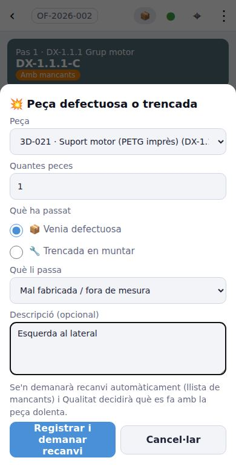

1. Tria la **peça** (si el pas en té diverses) i **quantes** són.
2. Tria **què ha passat**:
   - **📦 Venia defectuosa**: és responsabilitat del proveïdor;
   - **🔧 Trencada en muntar**: ha passat al taller.
3. Tria **què li passa**:
   - trencada;
   - mal fabricada o fora de mesura;
   - danyada en el transport;
   - peça equivocada;
   - ratllada o amb cops;
   - altres.
4. Afegeix una **descripció** (per exemple, *«Esquerda al lateral»*).
5. Prem **Registrar i demanar recanvi**.

Què passa a continuació:

- La peça dolenta **surt de la caixa** i no torna a l'estoc.
- **Se'n demana recanvi**: queda com a mancant, surt urgent a la compra i el taller **no s'atura**.
- Si el pas ja estava muntat (o verificat), **torna a quedar pendent** d'aquesta peça i s'haurà de tornar a verificar.
- Quan arriba el recanvi, es fa com amb qualsevol mancant: el Magatzem l'escaneja, el Muntador prem *Completar* i Qualitat ho verifica.

**Qualitat decideix què es fa amb la peça dolenta.** Pestanya **💥 Defectes**:

| Decisió | Quan |
|---|---|
| ↩ Retornar al proveïdor | Venia defectuosa. A la nota, el número de devolució (per exemple, `RMA-2026-017`). |
| 🗑 Ferralla | No té arreglo. |
| 🛠 Reparar / recuperar | Es pot arreglar. |
| ✓ Acceptar tal com està | Es pot fer servir igualment. Si la tornes a posar a la caixa, el Magatzem ha de prémer *Ha arribat* per tancar el recanvi. |

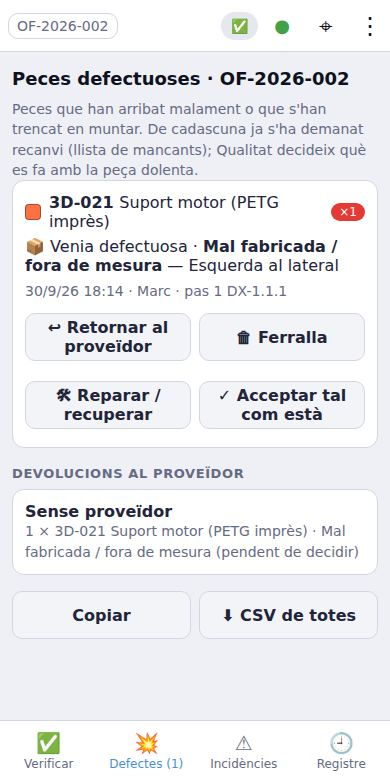

A sota hi ha la **llista de devolucions per proveïdor**, amb els botons **Copiar**, **Compartir** i **⬇ CSV** per enviar-la.

### 6.7 Incidències

Qualsevol persona pot obrir una incidència des de la pestanya **Incidències**, o amb el botó **⚠ Incidència** d'un pas o d'una caixa:

1. Tria el **pas** (o *General*).
2. Descriu **què passa**, per exemple *«El plànol del xassís no indica el sentit de la placa»*.
3. Tria la **gravetat**: baixa, mitjana o alta (atura el muntatge).
4. Prem **Desar**.

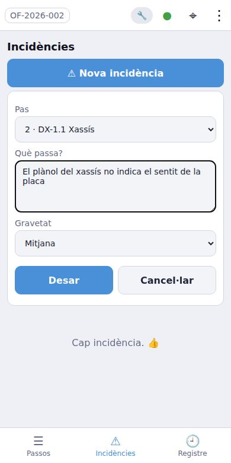

Qualitat i el Responsable la marquen com a **resolta**, amb una explicació.

### 6.8 📋 Responsable: seguiment, resultats i tancament

**Tauler.** L'estat de l'ordre d'un cop d'ull:

- verificats, en curs, per verificar, rebutjats;
- caixes plenes, incidències, mancants, muntats amb mancants, peces defectuoses i defectes per decidir;
- cada pas, amb qui l'ha muntat, quant ha trigat, qui l'ha verificat i a qui està assignat.

Botons: **👥 Persones**, **📊 Resultats**, **💥 Defectes** i **🔒 Tancar l'ordre**.

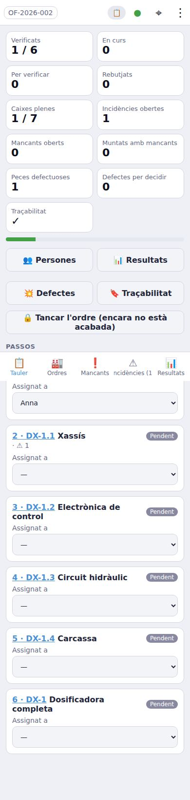

**Resultats.** Els indicadors de l'ordre:

- estat;
- verificats;
- **bé a la primera** (passos aprovats sense cap rebuig);
- rebutjos;
- temps de muntatge;
- incidències;
- el que ha fet cada persona.

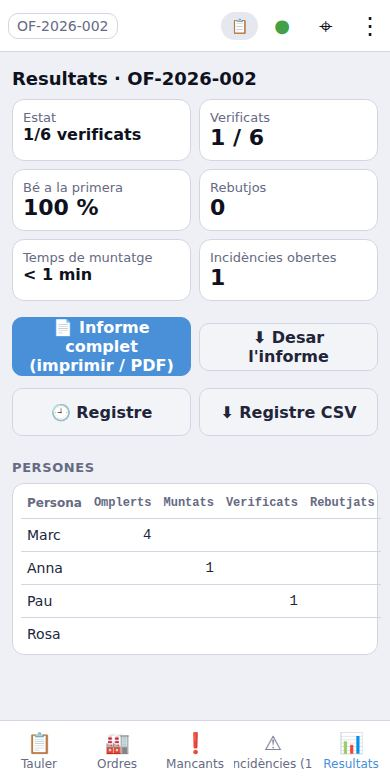

**📄 Informe complet** obre l'informe de l'ordre, llest per imprimir o desar en PDF (al diàleg d'imprimir, tria *Desa com a PDF*). Porta:

- la capçalera amb l'ordre, el número de sèrie i la versió del projecte;
- els indicadors;
- els passos, amb qui els ha fet i quant han trigat;
- els rebutjos i les incidències;
- les **peces defectuoses** amb la decisió presa;
- els **mancants** amb quan van arribar;
- el material mogut;
- les persones;
- el **registre de traçabilitat** complet;
- l'espai per signar.

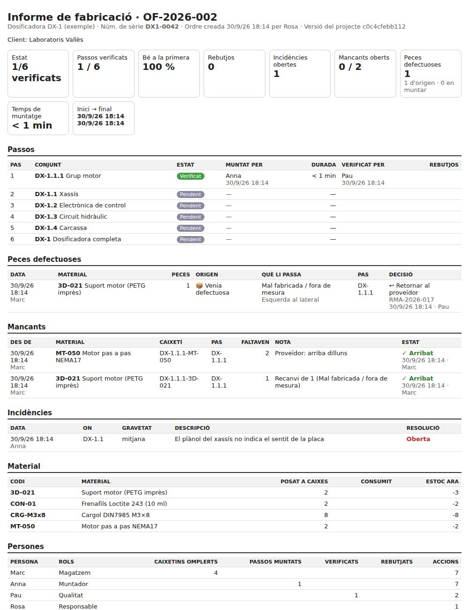

**Tancar l'ordre.** Al Tauler, **🔒 Tancar l'ordre**. Si queden passos per verificar, mancants o defectes per decidir, l'app ho avisa abans. Una ordre tancada **només es pot consultar**. Si cal, es pot **🔓 Reobrir**.

**Fabricar una altra unitat.** Crea una **ordre nova** (punt 6.2). El projecte és el mateix; el progrés comença de zero.

### 6.9 Treballar sense connexió

Si un aparell perd la Wi-Fi, el punt de la capçalera es posa 🔴 i l'app **continua funcionant**:

- Tot el que fas es guarda a l'aparell, amb el teu nom, i s'envia sol quan torna la connexió.
- Les fotos es guarden a l'aparell (amb una vora de punts taronja) i es pugen soles.
- Si dues persones han treballat alhora, no es trepitgen: cada acció s'aplica una sola vegada i l'estoc se suma.
- Si en tornar el servidor rebutja alguna acció (per exemple, perquè l'ordre s'ha tancat), l'app n'avisa amb el motiu.

### 6.10 Sense servidor (un aparell sol)

- Obre `muntatge.html` i toca **Projecte d'exemple**, o obre el fitxer `.fordre.json` del configurador (menú ⋮ › *Obrir fitxer de projecte*).
- El primer cop, l'app pregunta **el teu nom** (surt al registre) i el **rol**. Es pot canviar de rol en qualsevol moment tocant-lo a la capçalera.
- Tot es desa en aquell aparell. Des del menú ⋮ es pot **exportar el progrés** (JSON) per guardar-lo o passar-lo a un altre aparell.

---

## 7. Casos pràctics

### 7.1 Falta material en omplir les caixes

> En Marc omple el contenidor del Grup motor. Els motors NEMA17 no han arribat.

1. **Marc (Magatzem):** a la caixa `DX-1.1.1-C`, al caixetí `MT-050`, prem **⚠** › **No ha arribat** › *Quants n'has pogut posar?* `0` › nota `Proveïdor: arriba dilluns`. Omple la resta amb **Omplir-ho tot**.
2. **Marc:** a **Mancants**, prem **Compartir** i envia la llista a compres.
3. **Anna (Muntadora):** al pas *Grup motor* veu *«Falten peces que no han arribat: MT-050 ×2»*. Munta la resta i prem **✓ Muntar sense les peces que falten**. El pas queda *Muntat amb mancants* i el *Xassís* ja es pot començar.
4. **Dilluns, Marc:** escaneja l'etiqueta del caixetí `MT-050`. L'app diu *«Ha arribat · Mancant resolt»*.
5. **Anna:** al pas *Grup motor*, prem **✓ Completar**.
6. **Pau (Qualitat):** verifica i aprova el pas.

### 7.2 Arriba una peça defectuosa

> Un dels suports impresos `3D-021` arriba esquerdat.

1. **Marc:** caixetí `3D-021` › **⚠** › **Ha arribat defectuosa** › 1 peça › *Venia defectuosa* › *Mal fabricada / fora de mesura* › descripció *«Esquerda al lateral»* › **Registrar i demanar recanvi**.
2. Es demana el recanvi i el pas es pot muntar amb la resta.
3. **Pau:** a **Defectes**, prem **↩ Retornar al proveïdor** amb la nota del número de devolució.
4. Quan arriba el recanvi, es completa com al cas 7.1.

### 7.3 Es trenca una peça en muntar

> En collar, a l'Anna se li passa la rosca de 2 cargols M3×8.

1. **Anna:** al pas › **💥 Peça trencada o defectuosa** › tria `CRG-M3x8` › 2 › *Trencada en muntar* › *Trencada* › *«Rosca passada en collar»* › **Registrar i demanar recanvi**.
2. Si el pas ja estava muntat, torna a quedar pendent dels 2 cargols.
3. **Pau:** decideix **🗑 Ferralla**.
4. **Marc:** posa 2 cargols nous a la caixa (escanejant l'etiqueta).
5. **Anna:** **✓ Completar**. **Pau:** verifica.

### 7.4 Qualitat rebutja un pas

1. **Pau:** a la verificació, escriu el motiu (*«Falta la volandera del motor esquerre»*) i prem **✗ Rebutjar**.
2. **Anna:** el pas surt en vermell amb el motiu. Ho corregeix i torna a prémer **✓ Marcar el pas com a muntat**.
3. **Pau:** el torna a verificar. A l'informe, aquest pas no comptarà com a *bé a la primera*.

### 7.5 Ha canviat la llista de materials i hi ha ordres en marxa

1. **Rosa:** importa la llista nova al configurador. Revisa els canvis i quines caixes cal tornar a imprimir.
2. Imprimeix les caixes noves i torna a **publicar** el projecte.
3. Els mòbils mostren ⟳: cal tocar-lo per carregar el projecte nou.
4. L'informe de les ordres creades abans avisarà que *el projecte s'ha modificat després de crear l'ordre*. És una bona pràctica acabar les ordres en marxa abans de canviar el projecte, o obrir-ne de noves.

### 7.6 Diverses persones amb la mateixa tauleta

Menú ⋮ › **👤 Canviar de persona**. Si hi ha canvis sense enviar, l'app ho avisa. Els canvis de cada persona s'envien amb el seu nom encara que ja hagi entrat una altra.

### 7.7 Algú marxa o es perd un mòbil

**Rosa:** Tauler › Persones › la persona › **Donar de baixa**. Les seves sessions es tanquen a tots els aparells.

---

## 8. Resolució de problemes

| Què passa | Per què | Què fer |
|---|---|---|
| El mòbil no obre l'app del servidor. | No és a la mateixa Wi-Fi, o l'adreça no és correcta. | Connecta'l a la Wi-Fi del taller i obre l'adreça que mostra el servidor (o escaneja el QR). |
| Surt un avís de seguretat del navegador. | El certificat del taller no està instal·lat. | Instal·la'l (punt 2.7) o accepta l'avís (*Configuració avançada › Continua*). |
| Tot anava bé i de cop surt l'avís de seguretat a tots els mòbils. | El servidor ha canviat d'IP i ha fet un certificat nou. | Instal·la el certificat nou a cada aparell i dona una IP fixa al servidor (punt 2.4, pas 5). |
| L'escàner diu *«No es pot obrir la càmera»*. | Falta el permís de càmera, o no és una connexió segura. | Dona permís de càmera al navegador. Obre l'app per `https`, no per `http` ni amb doble clic. |
| L'escàner no llegeix el QR. | Poca llum, massa a prop o etiqueta petita. | Allunya't una mica, dona més llum, o escriu el codi a mà a la barra de sota. |
| *«Etiqueta d'un altre projecte o d'una versió anterior»*. | L'etiqueta és d'una versió anterior del projecte. | Torna a imprimir les etiquetes des del configurador. |
| *«Nom o PIN incorrectes»*. | PIN equivocat. | Torna-ho a provar. Després de 5 errors cal esperar un minut. El Responsable pot canviar el PIN. |
| *«El teu rol no permet aquesta acció»*. | La persona no té el rol necessari. | El Responsable li afegeix el rol (Persones). |
| *«No pots verificar un pas que has muntat tu»*. | Regla dels quatre ulls. | Que el verifiqui una altra persona de Qualitat. |
| *«Hi falten peces: no es pot aprovar»*. | El pas està muntat amb mancants. | El muntador l'ha de completar quan arribin les peces. |
| El punt de la capçalera està 🟠 o 🔴 molta estona. | El servidor no respon o l'aparell no té Wi-Fi. | Comprova la Wi-Fi i el servidor (`sudo systemctl status fordre`). Els canvis no es perden. |
| *«Aquest projecte no és al servidor»*. | S'ha obert un projecte que no s'ha publicat. | El Responsable l'ha de publicar (🏭 Taller › Publicar). |
| El servidor no arrenca: *«No es pot obrir el port 8443»*. | Hi ha un altre programa al port. | Atura l'altre programa o canvia el port (`--port 9443`). |
| El configurador mostra una caixa amb un avís *«sobresurt»*. | La peça és més alta que el caixetí. | Revisa les mides del material, puja la *Fondària màxima* o fes servir tapa (la tapa porta un marc més alt). |
| Les safates són massa grans per a la impressora. | La mida del llit no és la correcta. | ⚙ Configuració › Impressora › Llit X / Llit Y. |
| Les tapes a pressió van massa justes o massa fluixes. | El joc no està calibrat. | Imprimeix la peça de calibratge (punt 3.2). |

---

## 9. Annexos

### 9.1 Estats

**Estats d'un pas**

| Estat | Vol dir |
|---|---|
| Pendent | Encara no es pot començar o no s'ha començat. |
| Preparat | Els subconjunts estan muntats i les caixes plenes. |
| En curs | S'ha començat a muntar. |
| Muntat amb mancants | Muntat, però hi falten peces que no han arribat o s'han trencat. No bloqueja el pas següent. |
| Muntat | Complet i pendent de verificar. |
| Rebutjat | Qualitat l'ha rebutjat, i torna al muntador. |
| Verificat | Qualitat l'ha aprovat. |

**Estats d'una caixa**

| Estat | Vol dir |
|---|---|
| Buida | No s'hi ha posat res. |
| Omplint-se | S'hi ha posat una part del material. |
| Amb mancants | Hi falta material que no ha arribat. |
| Plena | Tots els caixetins estan plens. |
| En ús | El muntador ha agafat tots els caixetins. |
| Retornada | Ha tornat buida al magatzem. |

### 9.2 Permisos de cada acció

| Acció | 📦 Magatzem | 🔧 Muntador | ✅ Qualitat | 📋 Responsable |
|---|:-:|:-:|:-:|:-:|
| Omplir i buidar caixes, estoc | ✓ | | | ✓ |
| Marcar un mancant | ✓ | | | ✓ |
| Registrar una peça defectuosa o trencada | ✓ | ✓ | ✓ | ✓ |
| Agafar caixes, començar, muntar, completar | | ✓ | | ✓ |
| Tornar caixes | ✓ | ✓ | | ✓ |
| Verificar (aprovar o rebutjar) | | | ✓ | ✓ |
| Decidir què es fa amb una peça defectuosa | | | ✓ | ✓ |
| Resoldre incidències | | | ✓ | ✓ |
| Obrir incidències, fer fotos | ✓ | ✓ | ✓ | ✓ |
| Assignar passos, obrir i tancar ordres, persones, publicar | | | | ✓ |

### 9.3 Adreces útils (amb el servidor a `192.168.1.50`)

| Què | Adreça |
|---|---|
| Pàgina d'ajuda i certificat | `http://192.168.1.50:8080` |
| App del taller | `https://192.168.1.50:8443/muntatge.html` |
| App del taller, per rol | `https://192.168.1.50:8443/muntatge.html?rol=magatzem` (o `muntador`, `qualitat`, `responsable`) |
| Configurador | `https://192.168.1.50:8443/index.html` |
| Configurador amb una llista d'exemple | `https://192.168.1.50:8443/index.html?llista=exemples/plantilla_fordre.csv` |

### 9.4 Dreceres de teclat del configurador

| Tecla | Acció |
|---|---|
| `F` | Enfocar la selecció a la vista 3D. |
| `Inici` | Veure-ho tot. |
| `Supr` | Eliminar la selecció. |
| `Esc` | Tancar el diàleg obert. |

A l'app del taller, un **lector de codis USB o Bluetooth** funciona sense configurar res: escaneja i el codi es processa sol.

### 9.5 Fitxers i llicència

- Projecte: `.fordre.json`. Llistes: `.csv`, `.xlsx`. Caixes: `.stl`, `.3mf`. Etiquetes RFID: `.csv`.
- Codi font i demo: https://github.com/Bioquad/FOrdre
- Llicència: **CERN Open Hardware Licence v2 – Strongly Reciprocal** (fitxer `LICENSE`). Les llibreries de tercers (Three.js, qrcode-generator, SheetJS, jsQR) porten la seva pròpia llicència a `vendor/llicencies/`.
